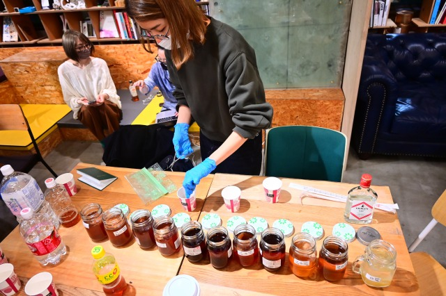
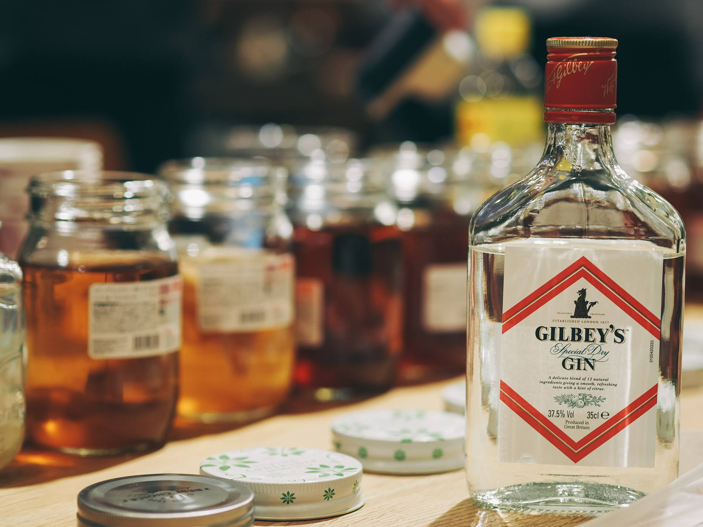

### 14th April, Thu

- **Those that are fermenting are changing color or becoming cloudy.** 

  
  
  
  
  
   
  ↑No.5 and 6 had not changed. 

   
  ↑The sphere is getting huge....!!

  
   
  ↑SCOBY is sticking with kelp tea.

  
  

- **Cellulose was produced in the bottles where fermentation was in progress.**

   
  ↑NO.7

   
  ↑NO.9

   
  ↑There was cellulose also in the bottle filled only with kelp tea! (NO.11)

- **Finally we tasted them!!** 
  NO.1, 2, 9 taste really good!! 
  It seems that NO.9 is combined with the droth. 

  
  
  
  

  On the other hand, bottles that had not fermented at all tasted quite bad.So, I added new SCOBY to them. 
   

  By the way, It's so good in a gin cocktail! 
   
