### 14th April, Thu

Those that are fermenting are changing color or becoming cloudy. 

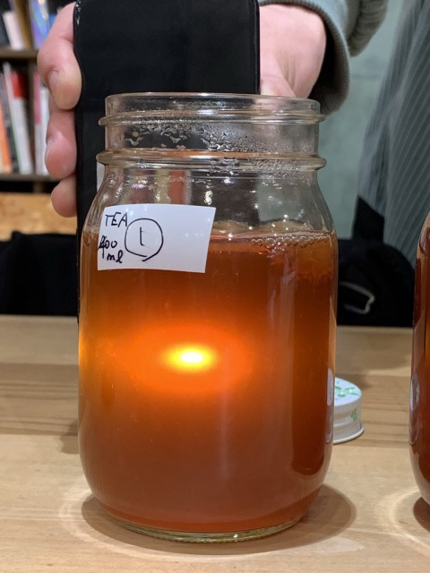
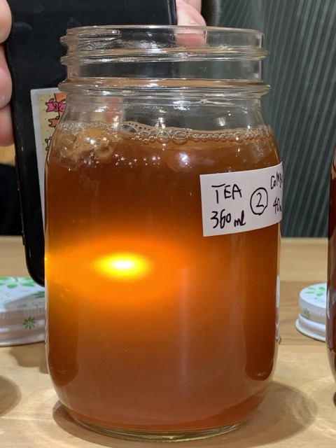
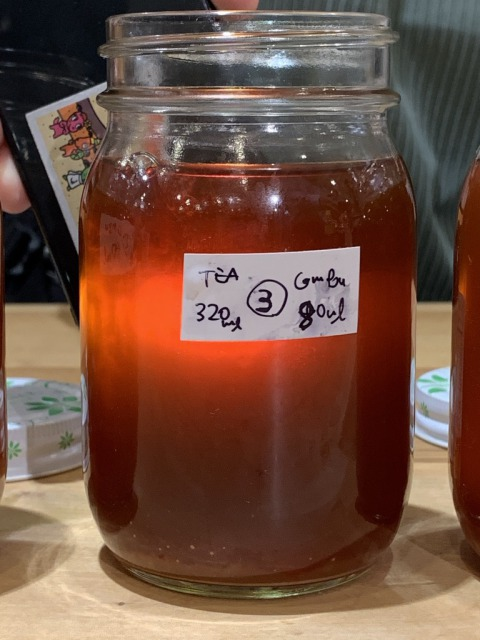
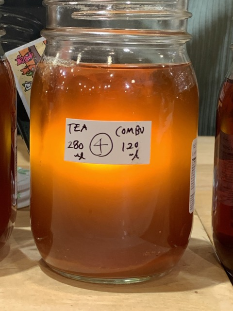
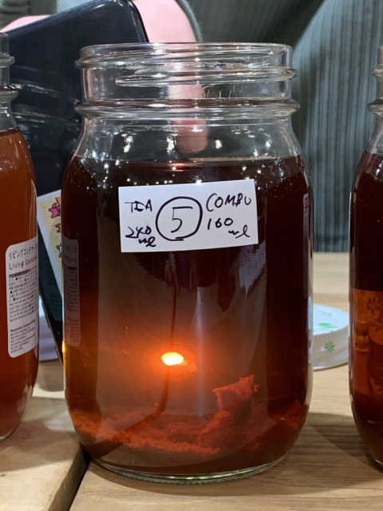
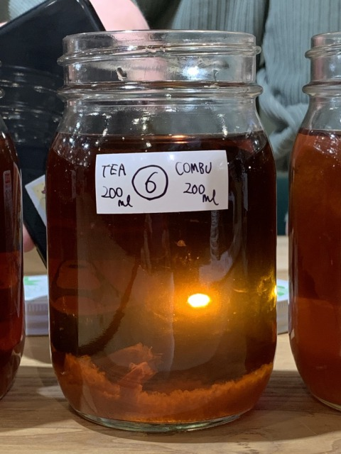 
↑No.5 and 6 had not changed. 

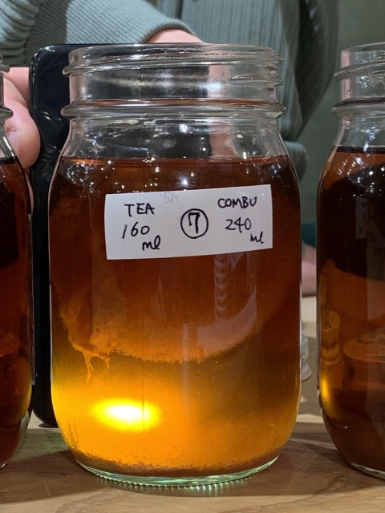 
↑The sphere is getting huge....!!

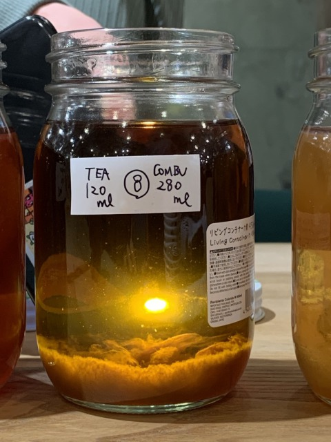
 
↑SCOBY is sticking with kelp tea.

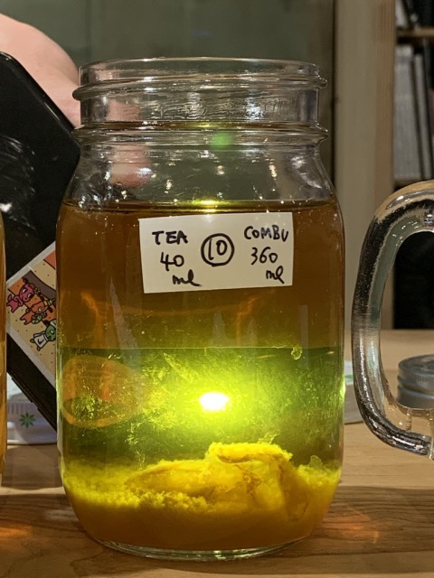
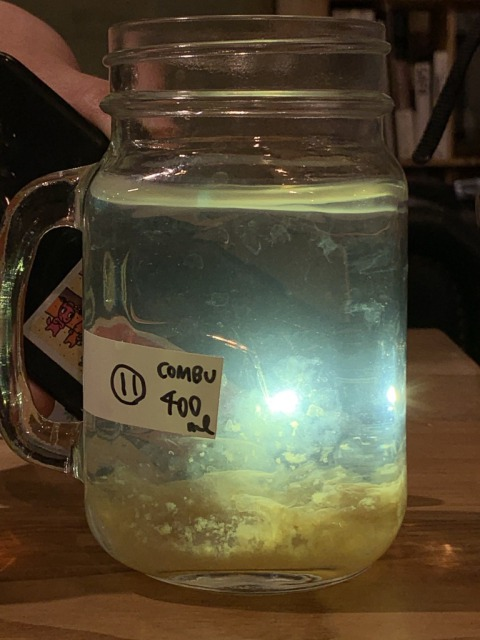

Cellulose was produced in the bottles where fermentation was in progress.

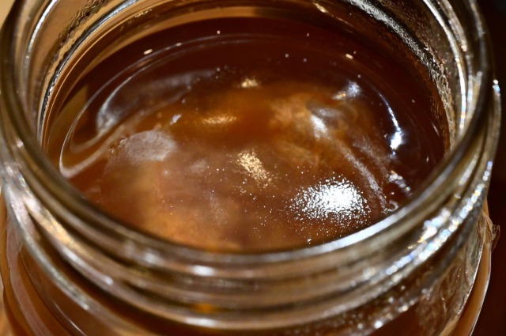 
NO.7

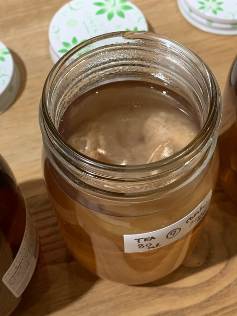 
NO.9
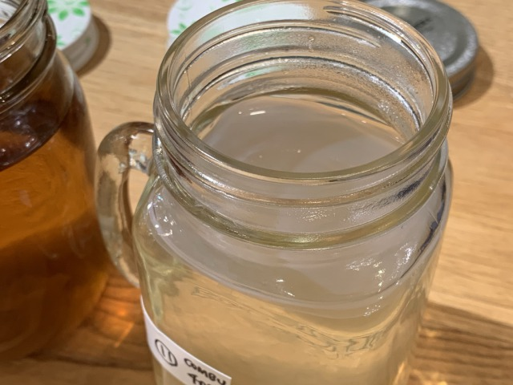 
↑There was cellulose also in the bottle filled only with kelp tea! (NO.11)

**Finally we tasted them!!**

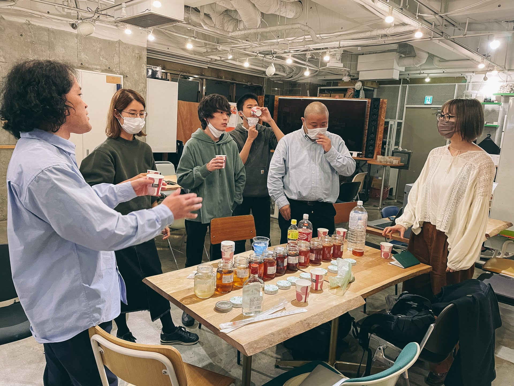
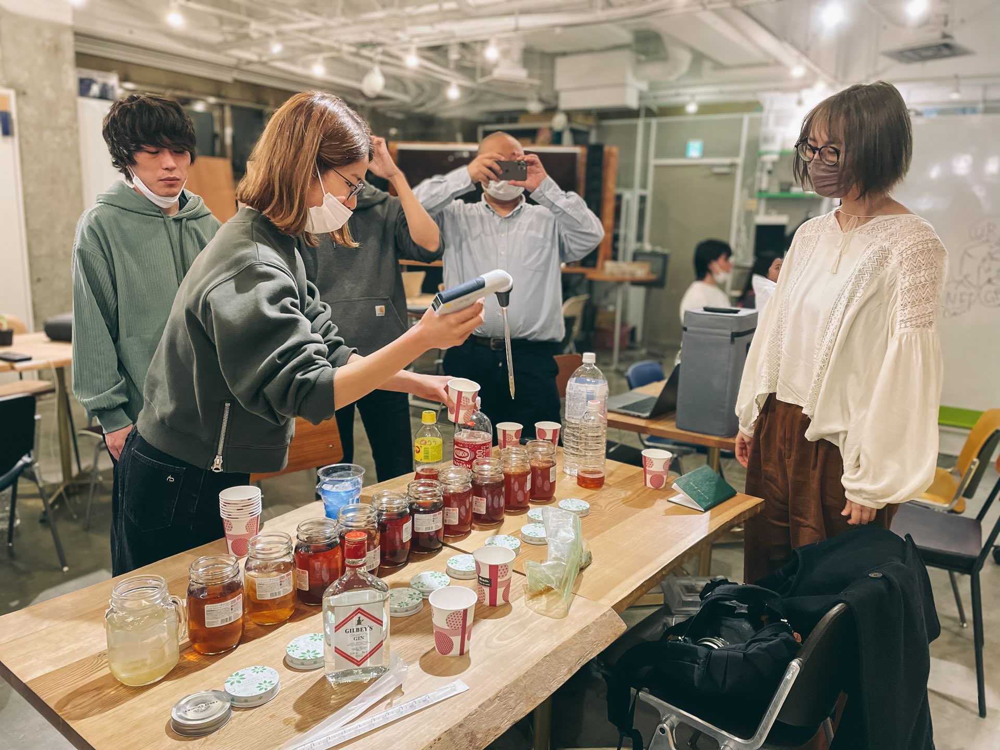
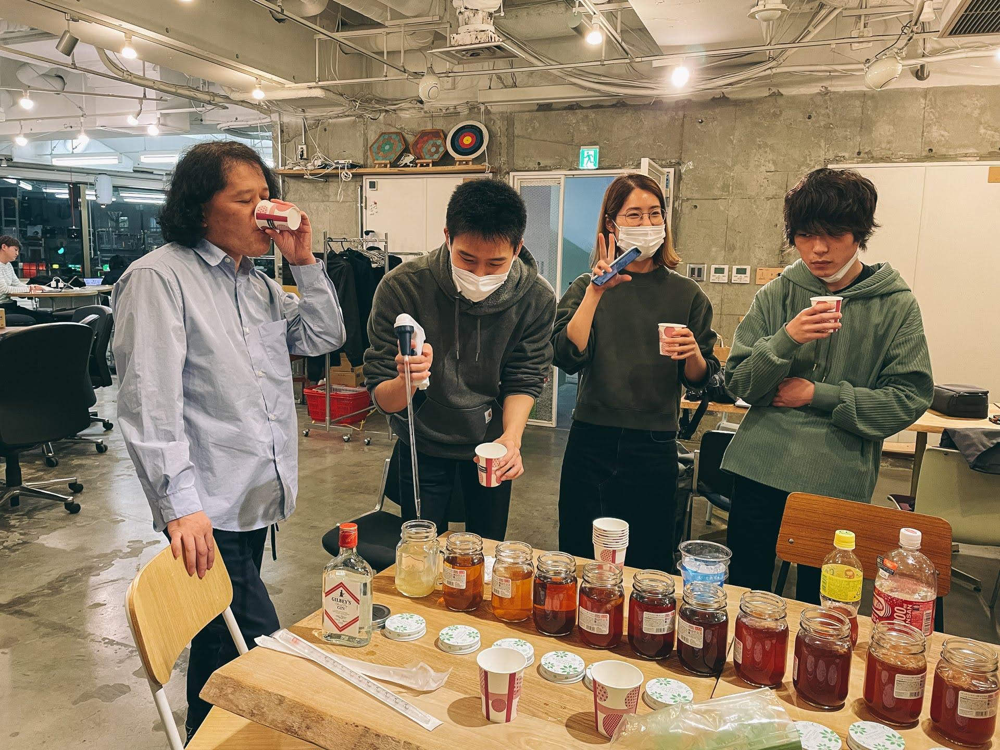
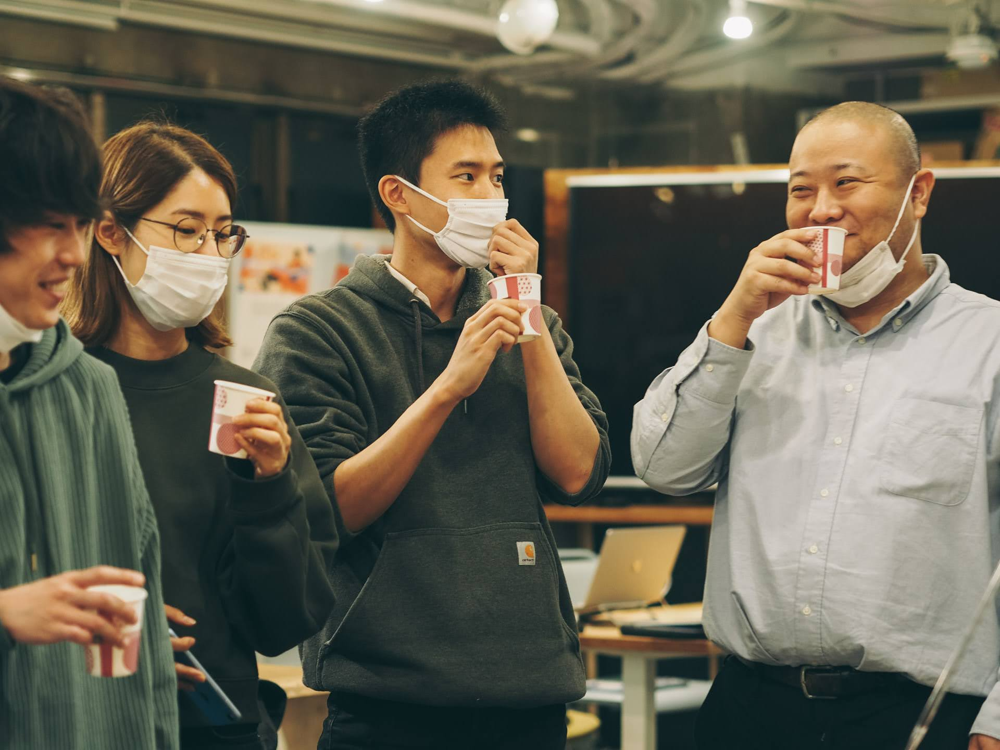
