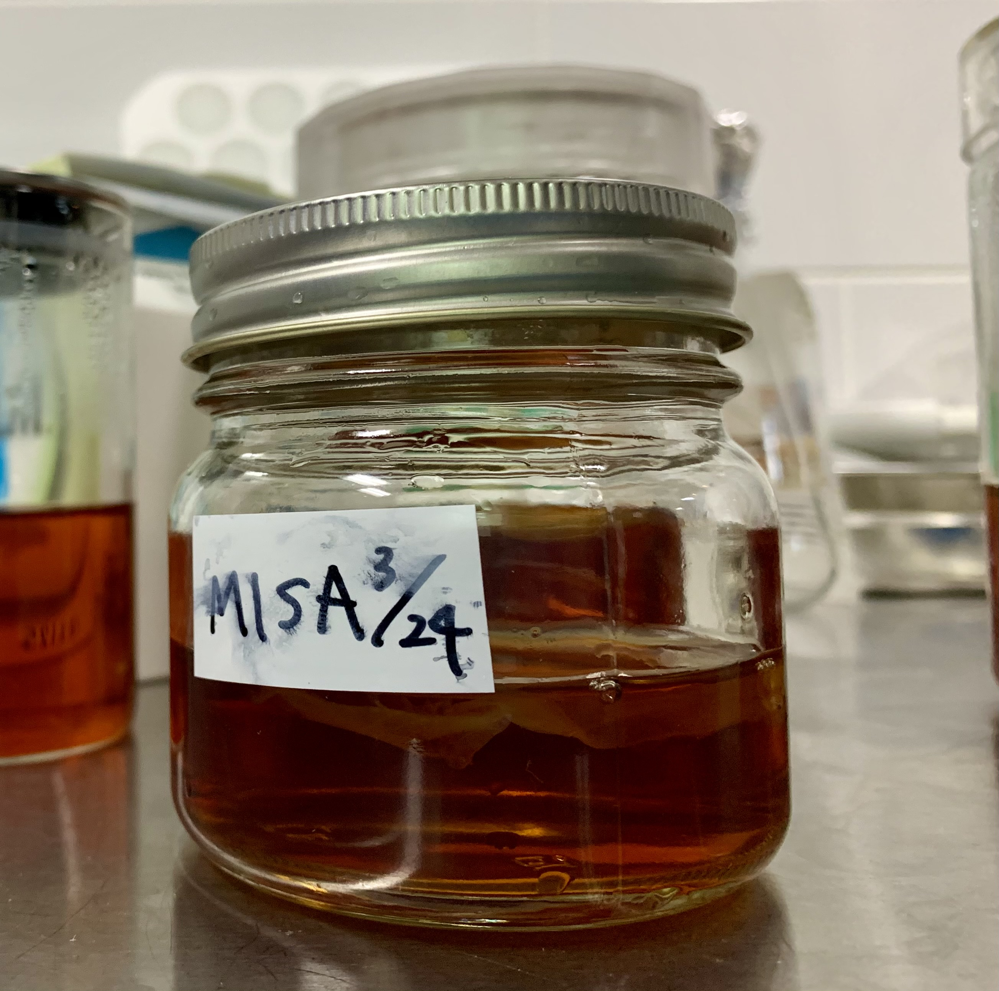
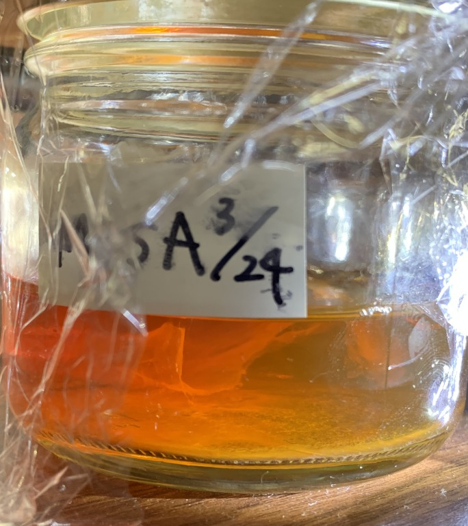
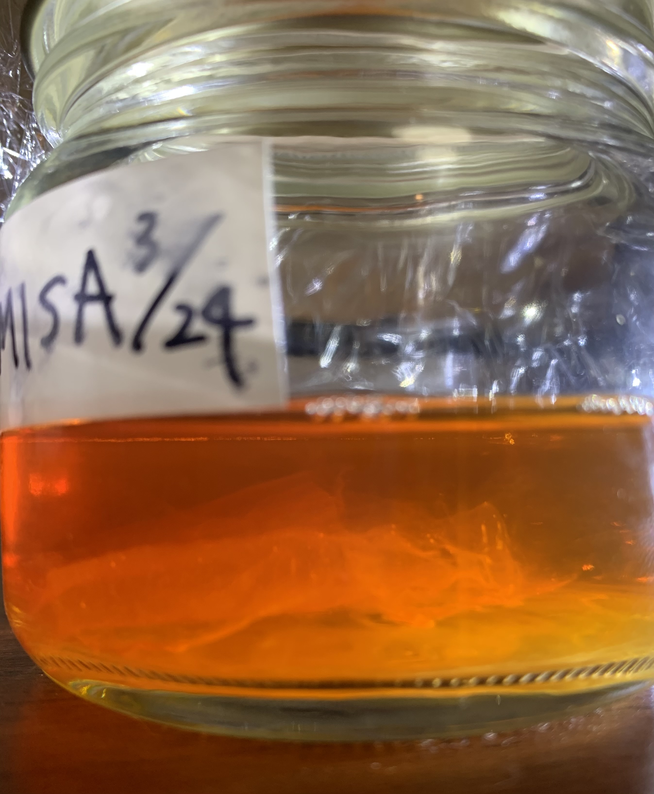
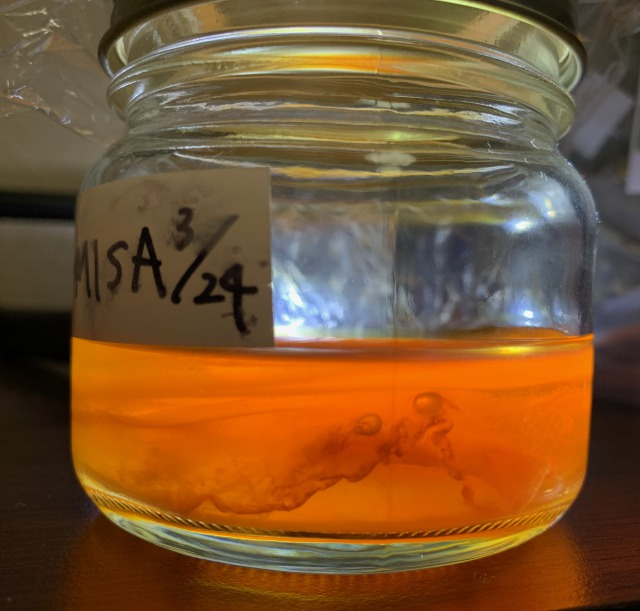
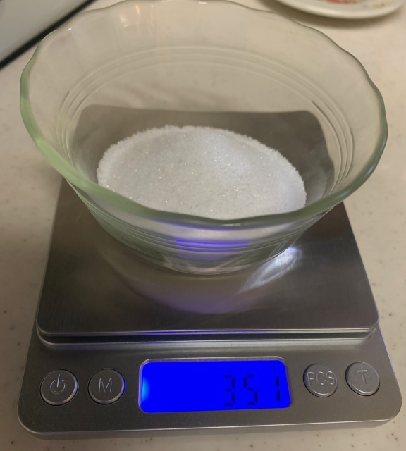
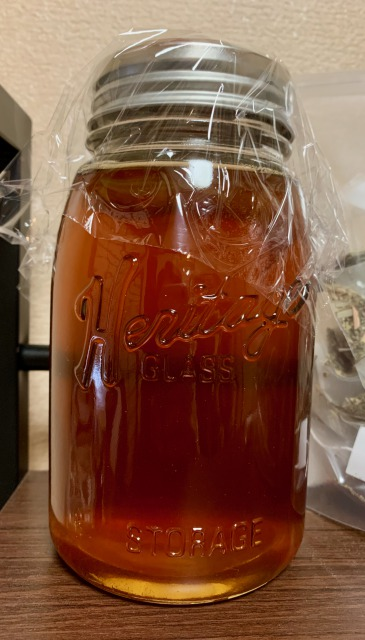

##  SCOBY @home 

- **24th March, Thu** 

- **28th March, Thu** 
 
It smelled still sweet.

- **31th March, Thu** 
 
It turned sour smell. 
Fluffy stuff seems to be growing.

- **14th April, Thu** 
 
It smells sour and tasty.

I want more so I moved it to a bigger jar.
  **Recipe**
  - water 700ml
  - sugar 35g
  - tea 2bags
  
 
 

