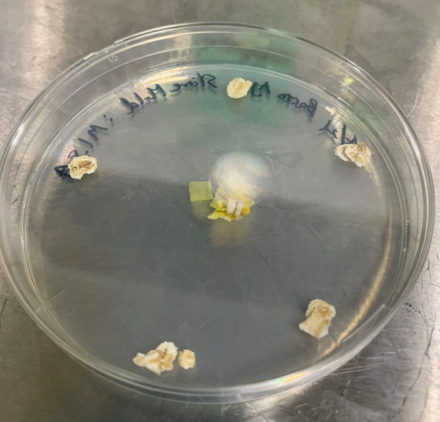
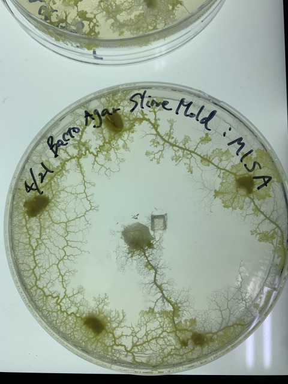
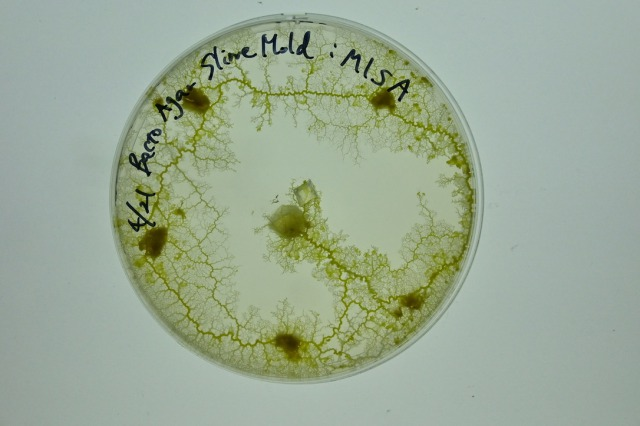
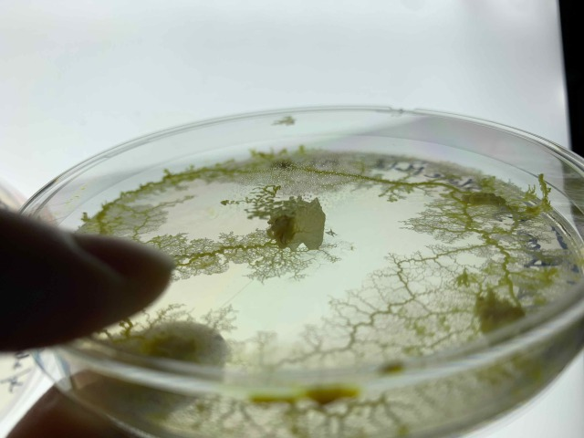
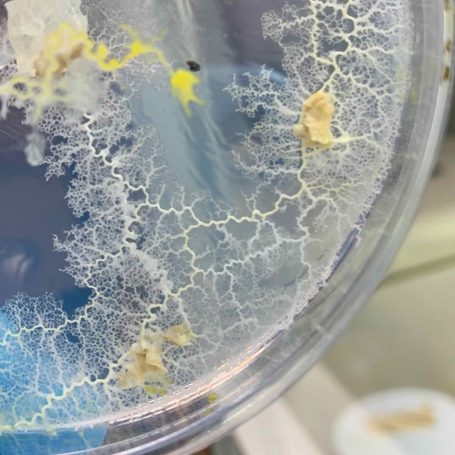
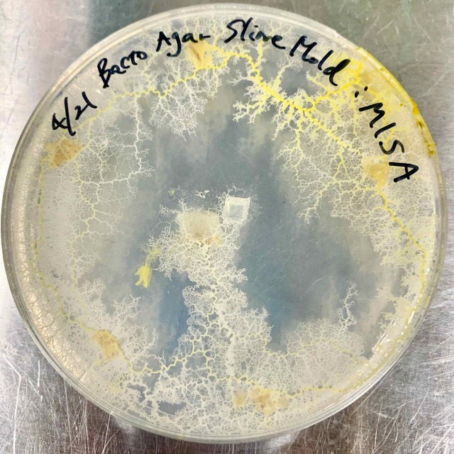
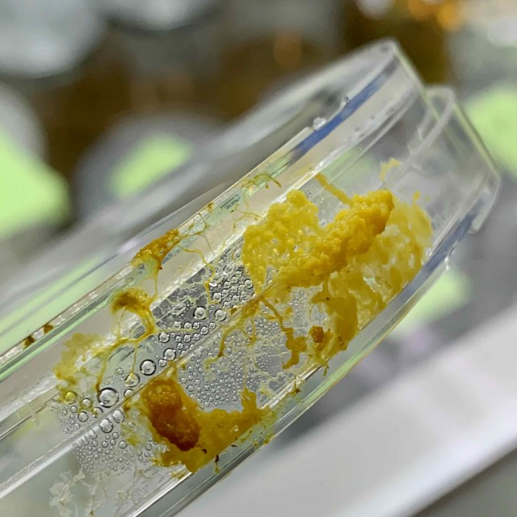
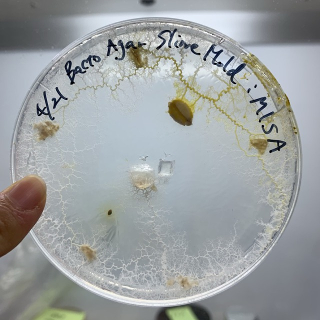
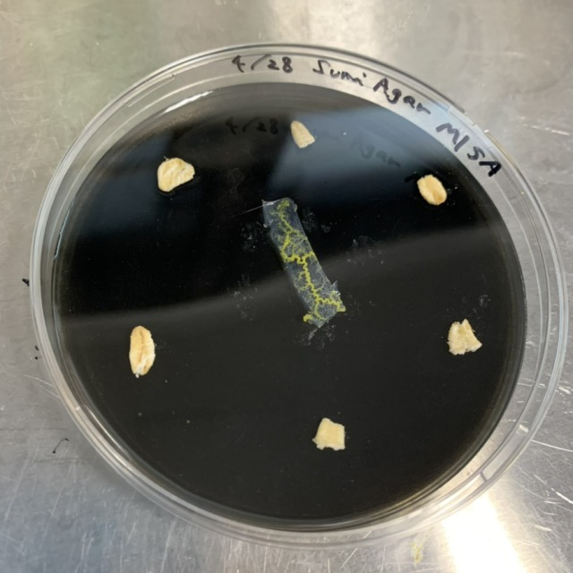

###  pattern1: pentagon 

- **21th April** 

- **25th April** 

- **26th April** 

- **27th April** 
It seems that they have eaten most of the first food I put down. 
They have escaped out of the petri dish. 

- **28th April** 
The escaped slime mold was transplanted into another petri dish. I chose a petri dish of NA agar, filled with black ink.

→Go to ["pattern9"](../9/index.md)