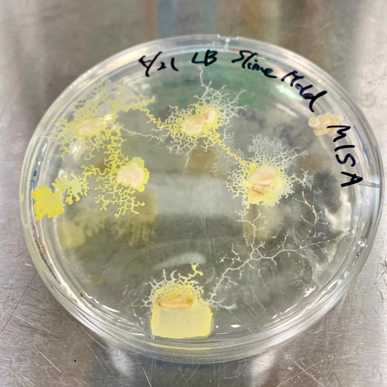
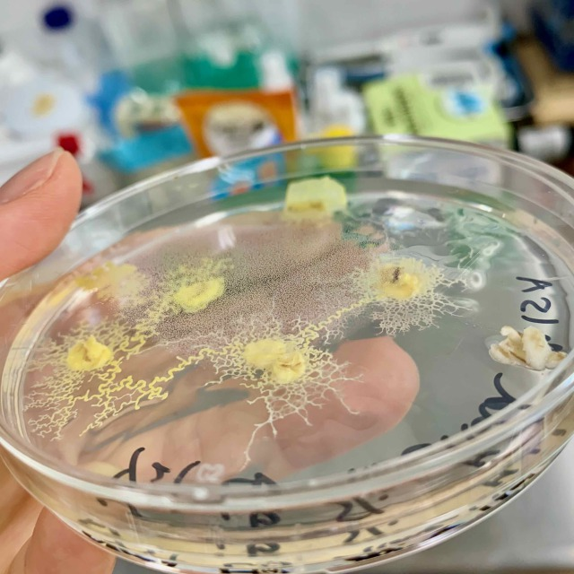

###  pattern2: the five feeds, in what order will they find? 

- **21th April** 

- **25th April** 

- **26th April** 

- **27th April** 
They found 4/5 of the feeds. 
Can they aldo find the feed on the right? 

In the case of the Gelrite medium, the slime mold appears to be eating very much into the medium. Are they eating the medium? 

- **28th April** 
