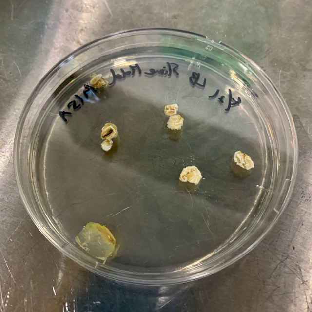
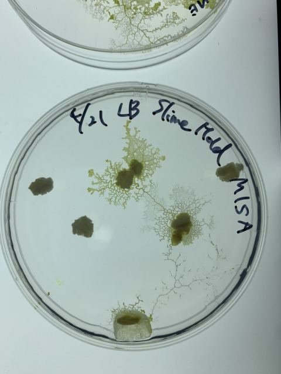

###  pattern2: The five feeds, in what order will they find? 

※Medium is not LB, but Gelrite.

- **21th April** 

- **25th April** 
They found the first feed. 

- **26th April** 
They found the second one. 

- **27th April** 
They found 4/5 of the feeds. 
Can they aldo find the feed on the right? 

  In the case of the Gelrite medium, the slime mold appears to be eating very much into the medium. Are they eating the medium? 
  

- **28th April** 
They seem to have gobbled up 4/5 of the feeds. They appear to be looking for other food. 

  Somehow, Gelrite has melted away. Is it because of their eating? 
  

- **30th April** 
They found the last feed and gobbled up all. 
Despite having taped it up, they peeled off the tape and escaped. 

- **2th May** 