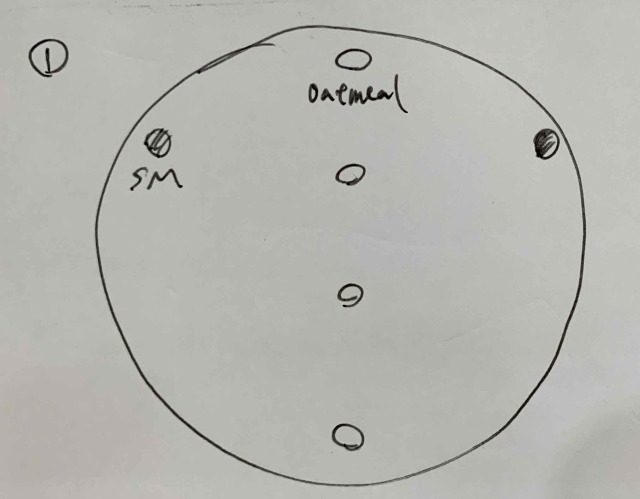
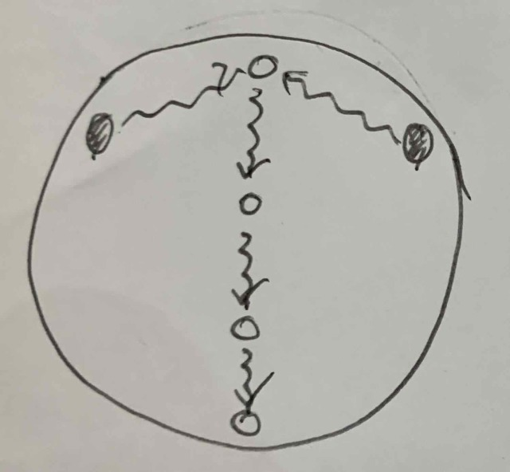
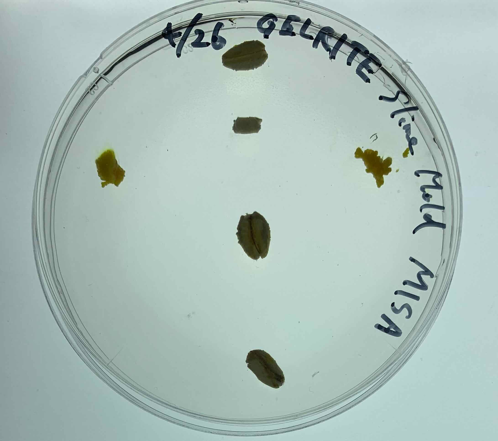
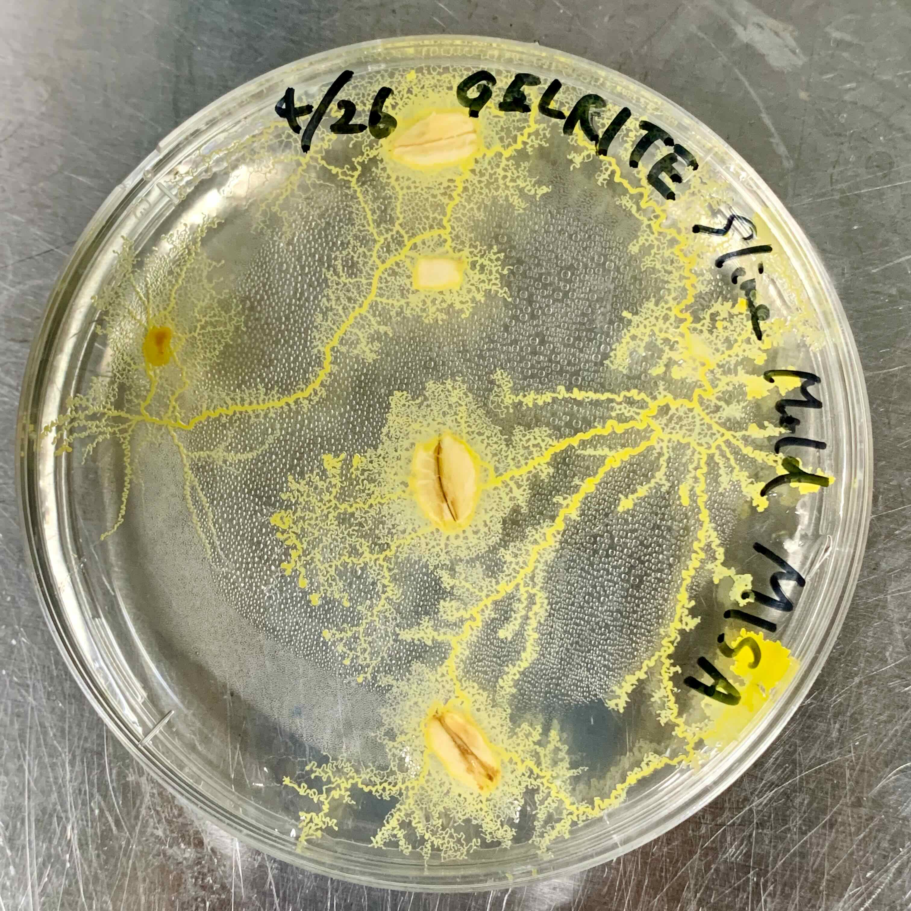
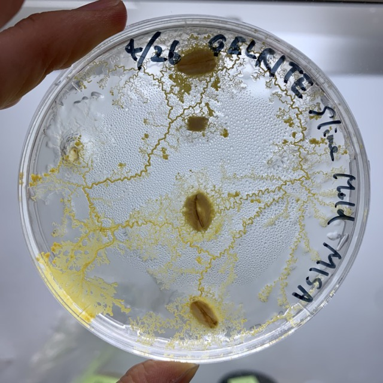
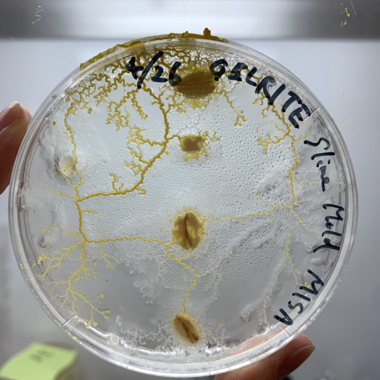
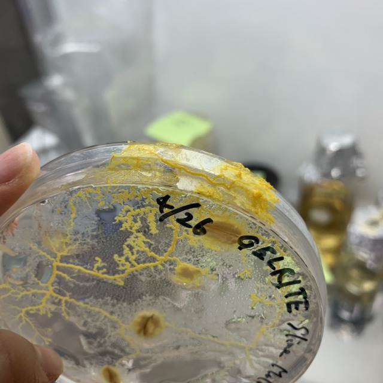

###  pattern3: Race between two 

- **26th April** 
  - My sketch 
  
  - My prediction 
  
  - How I put them down 
  

- **27th April** 
The slime molds on the left went to the top two and those on the right went to the bottom two. 

- **28th April** 
They seem to search other foods. 
I taped the petri dish to prevent them from escaping.

- **30th April** 
Despite having taped it up, they peeled off the tape and escaped.

- **2th May** 