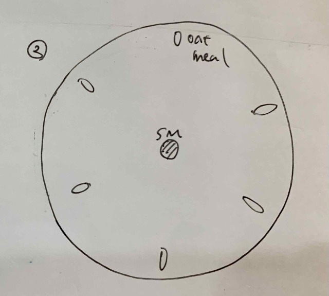

###  pattern4: Hexagon 

- **26th April** 
  * My sketch 
  
  * My prediction 
  
  * How I put them down 
  

- **27th April** 
They seem to have split up. 

- **28th April** 
After splitting up, both are heading up. They have not found the bottom feeder yet. 

- **30th April** 
Finally, they found all of the feeds. 
