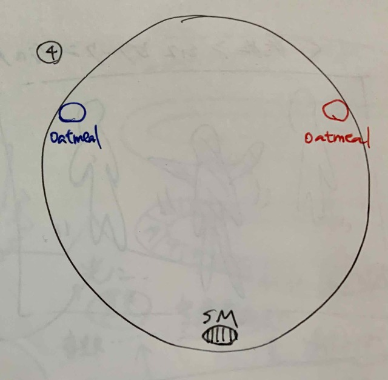
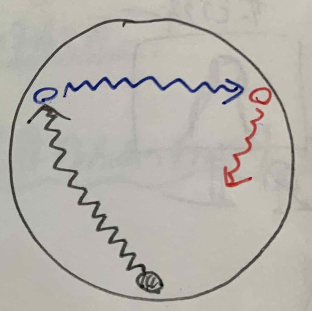
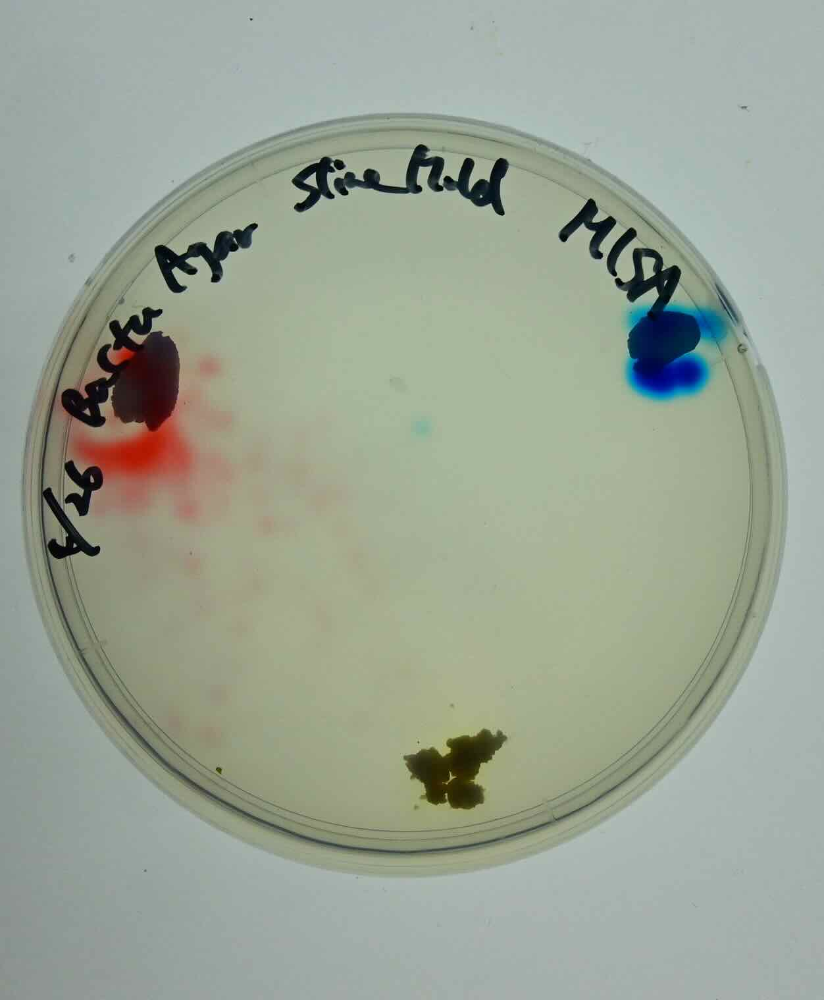
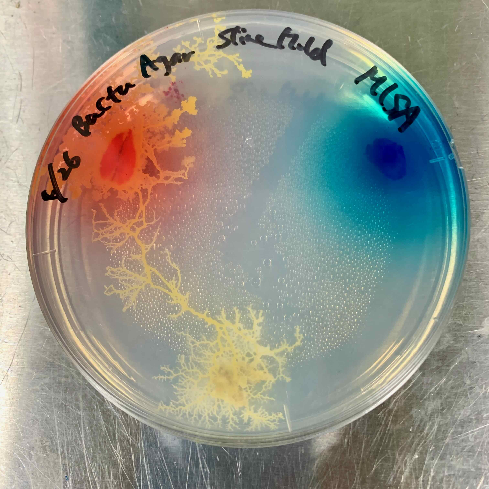
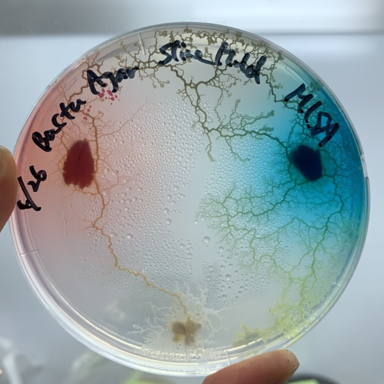
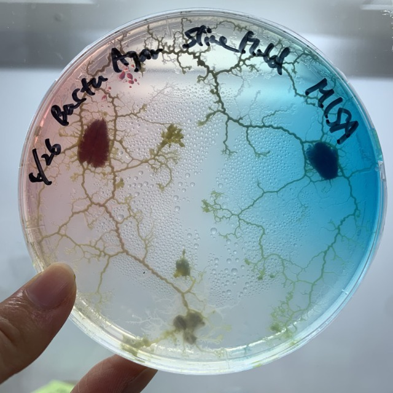

###  pattern5: Colored feeds 

The bait was colored red and blue. 
Will the color of the slime mold change when eaten? 
**Prediction: It will change to the color of the food it eats.**

- **26th April** 
  * My sketch 
  
  * My prediction 
  
  * How I put them down 
  

- **27th April** 
The color of the slime mold remained yellow and did not change after eating colored food. 

- **28th April** 
They reached red, then blue, and now they are trying to get back to where they started. 
The tips have turned a little blue, is it because they have eaten food? Is it because the medium has turned blue? 

- **30th April** 
They are spreading their bodies further apart and exploring for food. 

- **2th May** 
