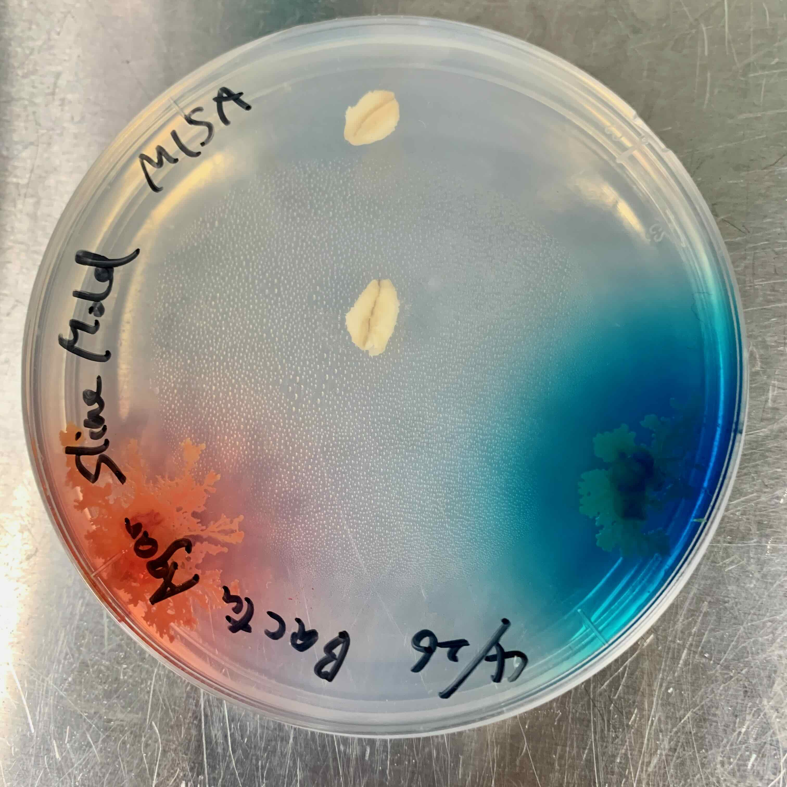
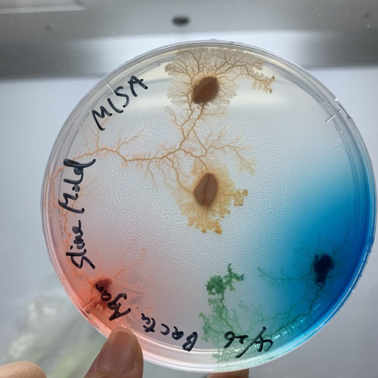
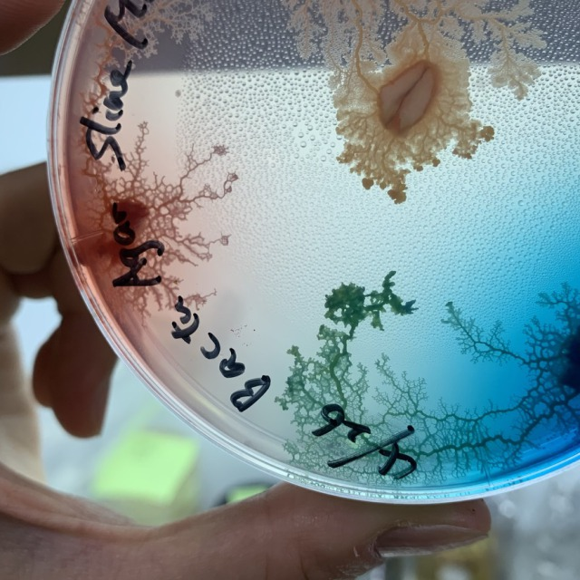
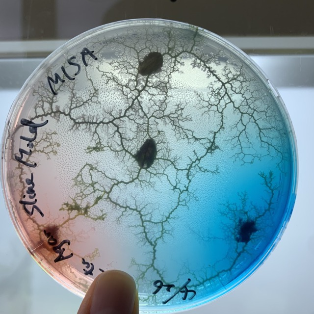
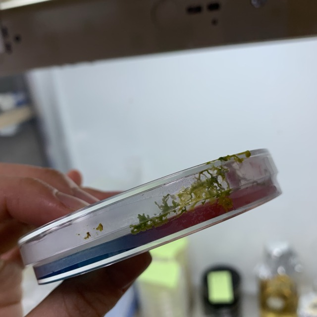

###  pattern6: Colored slime mold 

The slime mold itself was colored red and blue. 
When they mingle, will they separate as separate individuals, still blue and red respectively? Or will they merge into the same individual? 
**Prediction: They will coalesce and become purple.**

- **26th April** 
  * My sketch 
  
  * My prediction 
  
  * How I put them down 
  

- **27th April** 
Not sure how it will turn out yet. And despite the Bactu Agar it appears to be slow growing. 

- **28th April** 
Even when they grow up, their bodies are dyed red and blue. 
The red one reached the two feeders first. 

- **30th April** 
The whole area is turning blue. Have blue and red merged? 
The blue one broke out of the tape and escaped. 

- **2th May** 