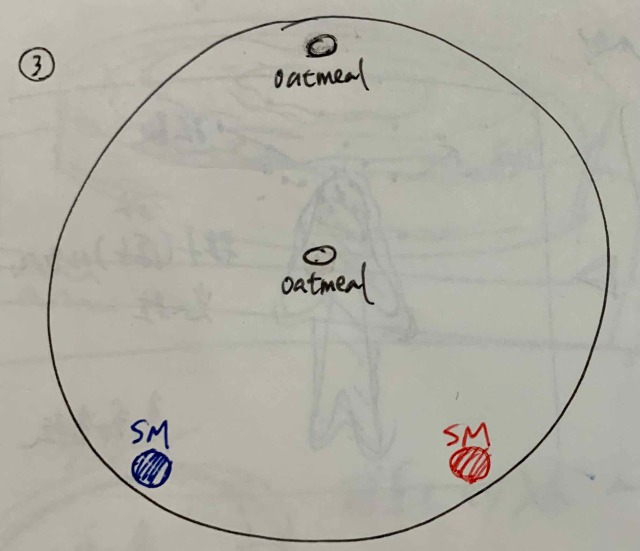
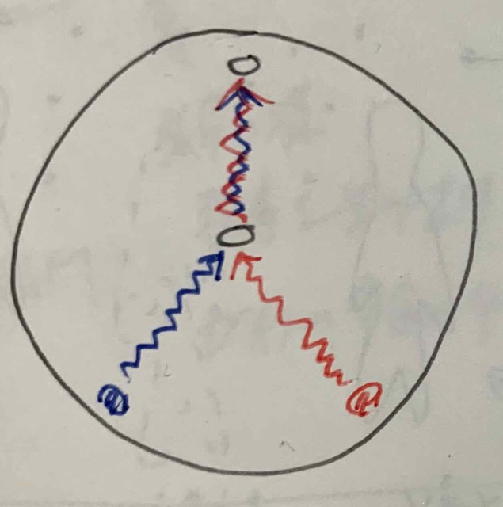
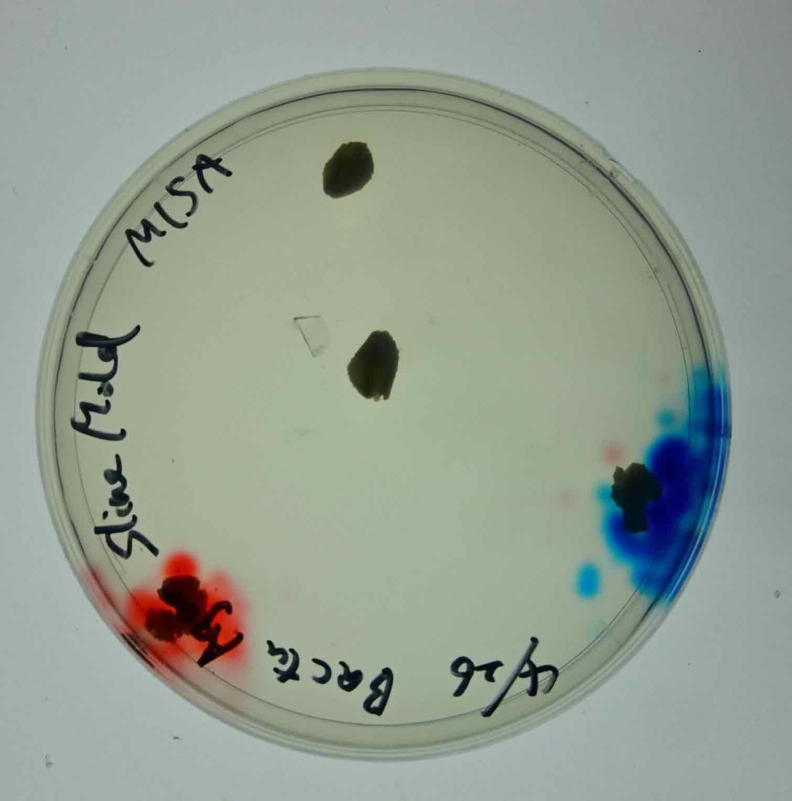

###  pattern6 

The slime mold itself was colored red and blue. 
When they mingle, will they separate as separate individuals, still blue and red respectively? Or will they merge into the same individual? 
**Prediction: They will coalesce and become purple.**

- 26th April 
  * My sketch 
  
  * My prediction 
  
  * How I put them down 
  

- 27th April 
