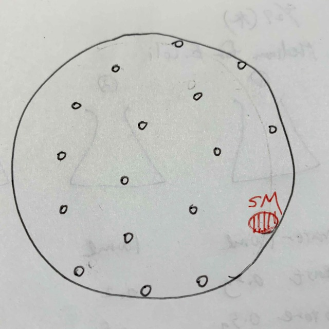
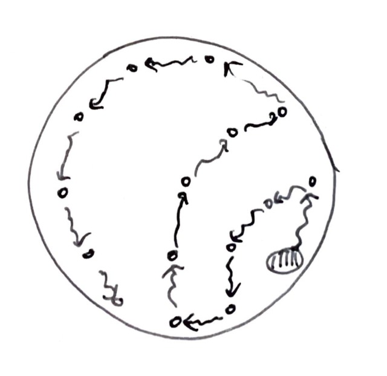

###  pattern8: Shape of a fan 

- **27th April** 
  * My sketch 
  
  * My prediction 
  
  * How I put them down 
  

- **28th April** 
They seems to have grown straight ahead and changed direction at a dead end. 

- **30th April** 
  It grew so much. 
  They circled around and came back to the first point. 
  
  

- **2th May** 
