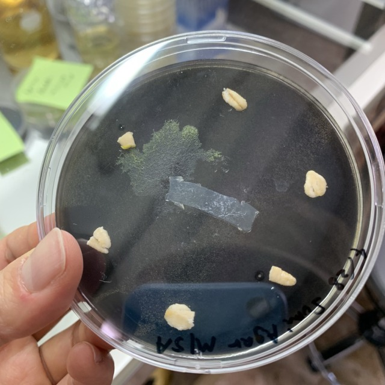

###  pattern9: Hexagon in black 

- **28th April** 
I put slime mold to a petri dish of NA agar, including 1% of black ink.

- **30th April** 
They moved away from the original place.

- **2th May** 