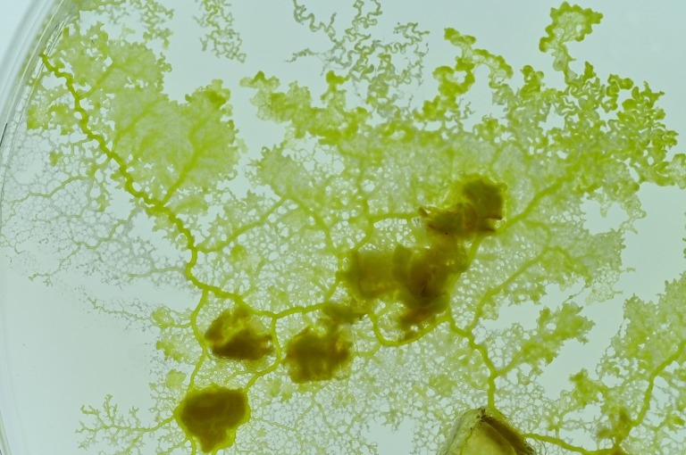

## Slime Mold

**[Overall Overview](../week8/3/3.md)**

- [pattern1: Pentagon](1/index.md)

- [pattern2: The five feeds, in what order will they find?](2/index.md)

- [pattern3: Race between two](3/index.md)

- [pattern4: Hexagon](4/index.md)

- [pattern5: Colored feeds](5/index.md)

- [pattern6: Colored slime mold](6/index.md)

- [pattern7: Double hexagon](7/index.md)

- [pattern8: Shape of a fan](8/index.md)

