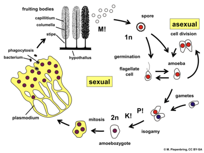
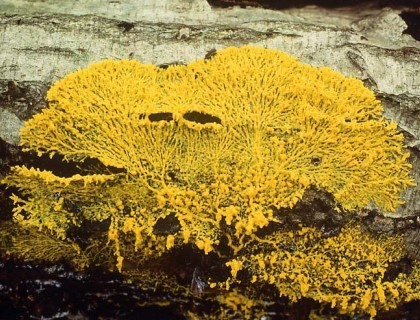
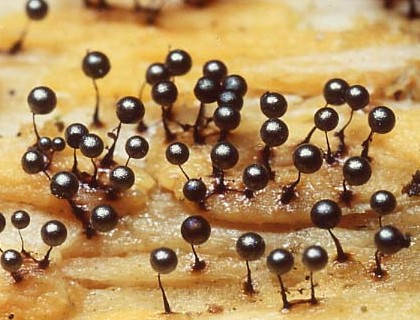

###  What is Physarum polycephalum? 

粘菌は、大きく２種類に分類される。細胞性粘菌と、真正粘菌である。 
そのうち真正粘菌は変形菌とも呼ばれ、モジホコリはこの変形菌の一種である。モジホコリは培養法も確立している。 

モジホコリの科学名はPhysarum polycephalumであり、英名だとMany-Headed Slimeである。 
なぜこの名前がついているか？それは１つの細胞の中に無数の核を持っているからである。 
変形菌はライフサイクルの中で、子実体になったり変形体になったりする。変形体の時、原形質は１メートルほどまで伸びることもある。 
しかしどんなに原形質が伸びても変形菌は１つの細胞であり、その中には無数に分裂した核が存在している。なので、たくさん頭があるスライム、と呼ばれている。 

Slime molds are classified into two main types. Cellular slime molds and Acellular slime molds. 
Acellular slime molds are also called myxomycetes, and Physarum polycephalum is one of these myxomycetes.The Physarum polycephalum culture method has also been established. 

Physarum polycephalum is called "Many-Headed Slime" in English. Why this name? This is because it has numerous nuclei within a single cell. 
During its life cycle, myxomycetes can become fruiting bodies or Plasmodium. When in the Plasmodium, the protoplasm may extend up to 1 meter. 
But no matter how much the protoplasm is elongated, myxomycete is still a single cell, with a myriad of divided nuclei within it. Therefore, it is called Physarum polycephalum.

 
*↑モジホコリのライフサイクル / lifecycle of Physarum polycephalum*

 
*↑変形体 / Plasmodium*

 
*↑子実体 / Fruiting bodies*