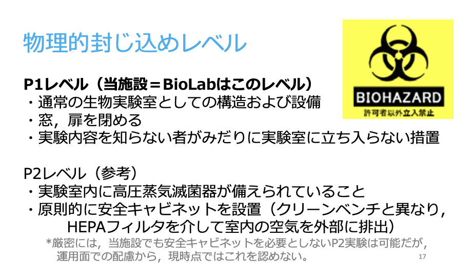
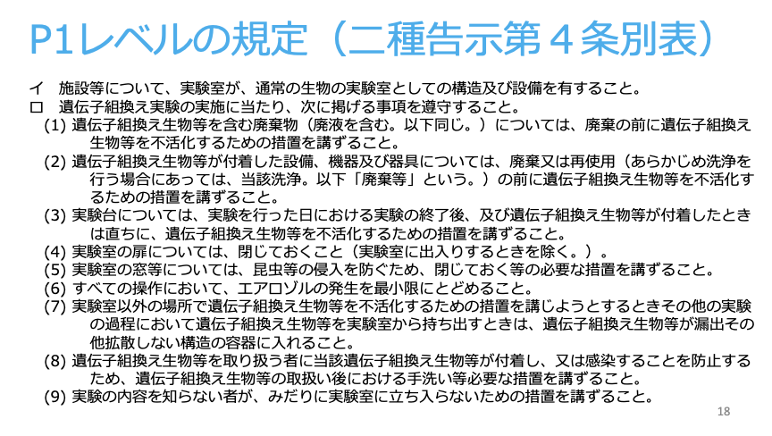
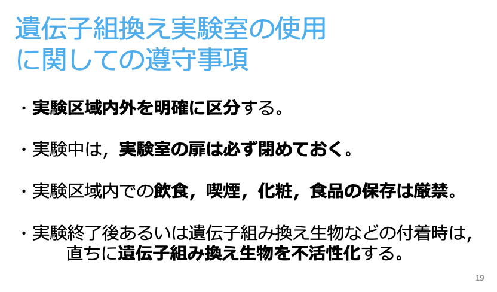
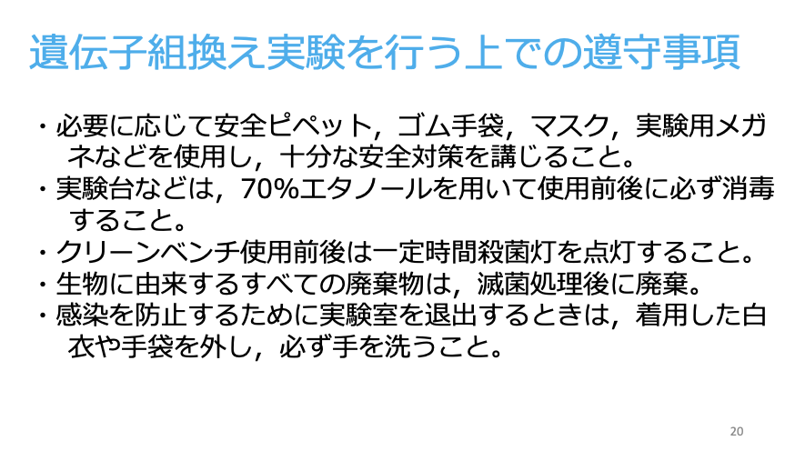
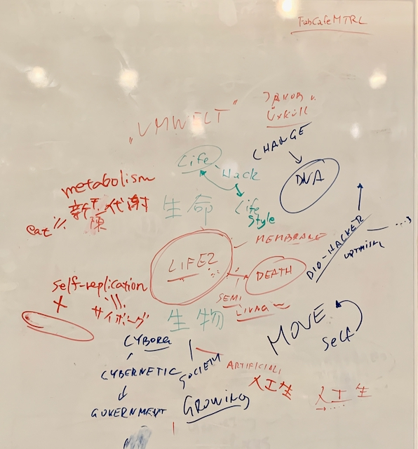

## week1: Introduction (2022/2/28~3/6)
1:Make a public documentation site 
→ here!

2:Make a About Page and introduce yourself 
→ This is my "[about page](../../about/index.md)". 

3:Start a final project page 
→ This is my "[final project page](../../finalproject/index.md)". 

4:Attend a bio safety lecture 
→ on 3rd March, we had a lecture from Hosotani-san. 
[文科省_遺伝子組換え実験の規制について](%E9%81%BA%E4%BC%9D%E5%AD%90%E7%B5%84%E6%8F%9B%E3%81%88%E5%AE%9F%E9%A8%93%E3%81%AE%E8%A6%8F%E5%88%B6%E3%81%AB%E3%81%A4%E3%81%84%E3%81%A6_%E6%96%87%E7%A7%91%E7%9C%81.pdf) 
[渋谷MTRL_バイオラボ講習会](渋谷FabCafe_MTRL_バイオラボ講習会資料20191008.pdf) 
 
 
 
 

3:Answer the following questions:
- What is Life? How would you define it, can you actually define it? 
→I think the conditions for being life can be listed, but not clearly defined. 

- What is BioHacking? What does it mean for you? 
→Bio Hacking means “do it yourself and think for yourself” for me. 
Through Bio Hacking, I want to change the way I see the world, especially to feel the wonder of life activity. 
I also want to deepen my own thinking about "what is life?".

- Why are you interested in Bio? 
→Because I learned that genetic modification is something that has been going on in nature ever since bacteria and other life forms were born (from "What is sex?" written by Lynn Margulis). 
 
I want to know what genetic modification is all about by seeing it with my own eyes and hands. 
I am also intersteed in  what happens to genes when a fertilized egg is formed in humans.