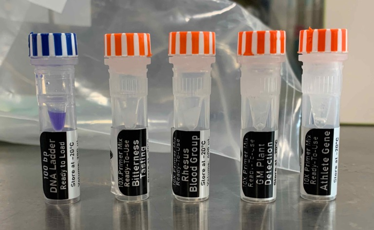

### PCR & Gel Running

[→BentoLab protocol](https://bento.bio/protocol/biotechnology-101/) 
※Before the experiment, you shold read the protocol and keep the track of th e flow.  
実験前に流れを把握しておくこと。

**- [PCR](pcr/index.md)** 
**- [Gel Running](gel/index.md)**

