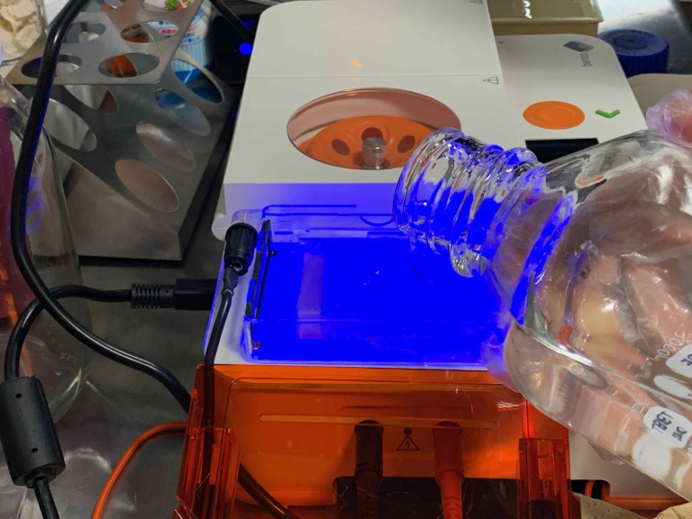

### 9th May, Mon : Running Gel

[→BentoLab protocol: Introduction to Gel Elecrophoresis](https://bento.bio/protocol/biotechnology-101/introduction-to-gel-electrophoresis/) 
[→BHA protcol Notion from Georg-san](https://trembl.notion.site/Gel-Elecrophoresis-bfd16c1e3aeb41f98af02ff48f6d0715) 
※Before the experiment, you shold read the protocol and keep the track of th e flow.  
実験前に流れを把握しておくこと。

**1. Prepare the buffer solution 緩衝液を用意する **
In gel electrophoresis, the buffer provides ions that carry a current through the gel, and to maintain a constant pH. There are a variety of buffers, and one of the most common for DNA separation is TBE buffer. TBE buffer is a buffer solution containing a mixture of Tris base, boric acid and EDTA. The Boric acid and Tris base helps the DNA stay soluble in water. The EDTA protects the DNA against enzymes degrades the DNA. 
TBE緩衝液が一般的に使われることが多い。pHの値を保ったり、DNAが水に溶けやすくしたり、DNAがダメになりにくくしてくれる。 
 

**2. Prepare the gel ジェルを用意する **
We used [this](https://www.mupid.com/gms/) kit. 
 
 
※the gel contians DNA stain, which can be toxic. So always wear gloves when working with gels. DNA stain will bind to the DNA and make it fluoresce. 
DNAステインを含んでいて、これは身体に毒なので、ジェルを扱うときは常にグローブをつけて作業すること。DNAステインはDNAをくっつけて、電気泳動の結果が見えるよう光らせてくれるもの。 

**3. Prepare the Gel Elecrophoresis box 電気泳動のボックスを用意する **
The orange lid seals the gel box when the voltage is applied and also functions as a filter for the transilluminator, to render the fluorescing DNA visible. The base has the red positive electrode, and the black negative one. Each of the electrodes is made of a thin platinum wire. 
オレンジの蓋を通してみることで、DNAの結果が光って見える。箱の赤い方がプラス電極・黒い方がマイナス電極。 
 
 
Because the DNA molecule has a negative charge, due to its chemical structure, when a voltage is applied, the DNA fragments are pulled towards the positive electrode. 
 

**4. Place the gel and pour buffer solution ボックスにジェルと緩衝液を入れる **
Place the gel so that the wells are toward the negative electrode. 
ゲルの穴が空いている方がマイナス電極の方になるように置く。 
 
 
Use prepared 0.5X TBE buffer solution, and pour it over the gel until the gel is fully covered. The buffer should reach about 2-3mm above the gel. 
ゲルの2-3mm上になるまで緩衝液を注ぐ。 
 
 
 

**5. Loading the gel ゲルにロードしよう！ **
Prepare DNA ladder and PCR products. 
ラダーとPCRしたDNAたちを用意。 
 
 
 
↑This is my PCR product. 

Make clear that which PCR product is which wells. 
誰のDNAがどの穴に入れるか明確にしておく。 
 
↑DNA ladder is always the left. It's gonna be a ruler. Also if you have an empty well, you can load pure water to check that the result will be nothing. 

It's time to load. This is a very delicate process. 
This time set the pipette to 5μl. 
The pipette should be oriented parallel to the hole. 
To make pipetting into the well easier, put both elbows on the table. You can also support the pipette with your second hand and use it to help guide the tip into the well. 
Also the button on the pipette should not be released to the outside of the hole. 
ローディングは繊細な作業。ピペットは5μlにする。プロダクトを穴に入れるとき、ピペットの向きが穴のならびに平行になるように。垂直ではなく。両肘をテーブルに固定して、もう一方の手でピペットを支えてあげると良い。ピペットのボタンは、穴の外までリリースしないこと。 
 
 
 
 

**6. Running the gel 電気泳動 **
Slide on the lid. Set the voltage to 50V, then set a timer to 40 min, and start the run. Then　bubbles will appear around the electrodes, indicating electrolysis. 
蓋を閉めて、電源を入れる。50Vで40分稼働。スタートすると、泡が出てくるのが動いてる証拠。 
 
 

**7. Result 結果 **
After the gel has run, you can pour away the buffer. It’s safe to discard in the sink. 
Place the gel onto the blue transilluminator surface of Bento Lab. (It's ok to plave it directly.) 
終わったら、緩衝液をシンクに捨てて、ジェルをイルミネーターの上におく。 
※Drain disposal of TBE running buffers is a standard waste disposal procedure followed by research labs. 
 
 

This is the reslut we got. Mine is the right one. 
これが得られた結果。私のは一番右。 
 
Your sample should correspond to one of these variations. 
 

1 – Ladder – 100 bp DNA Ladder 

2 – Result CT – Control (440 bp), C allele (328 bp), T allele (166 bp)
This result shows a person with a copy of both the T allele and C allele, so someone who is heterozygous. The ability to digest lactose is dominant, so the person is likely to be able to digest milk as an adult. 

3 – TT – Control (440 bp), T allele (166 bp) 
This result shows a person who has both copies of the T allele, so homozygous dominant. This person should be able to digest milk. 

4 – CC – Control (440 bp), C allele (328 bp) 
This result shows a person who has both copies of the C allele, so homozygous recessive. This person is likely to be lactose intolerant as an adult. 

※bp = base pairs 

I can drink milk now, but it seems like I have C allele gene! wow. 
私は今ミルク普通に飲めるけど、乳糖不耐性になる可能性が高い遺伝子みたい。ほんと？！