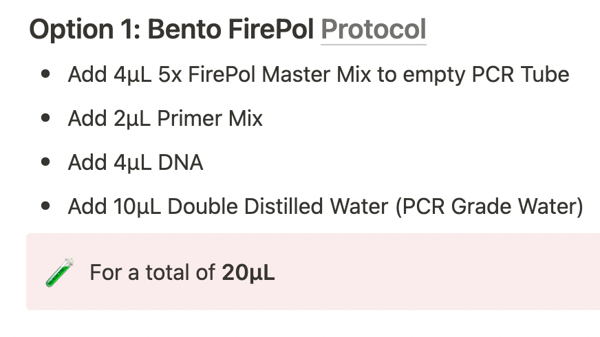
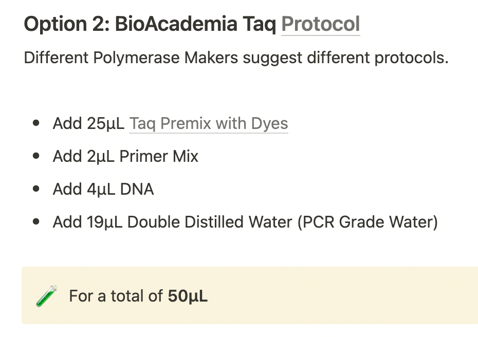
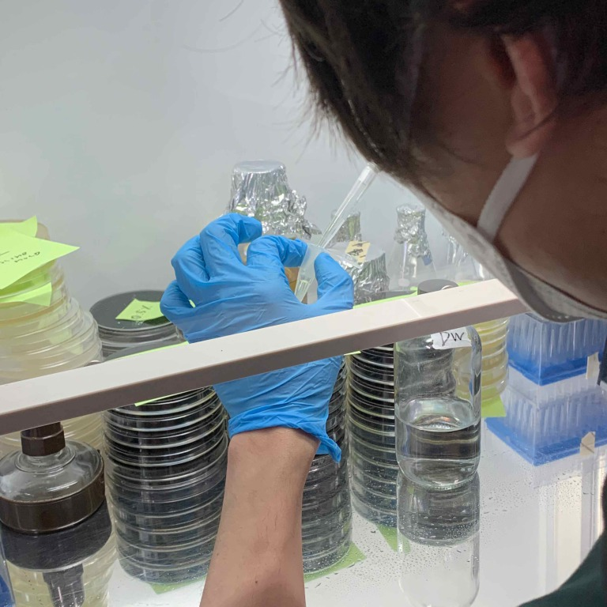
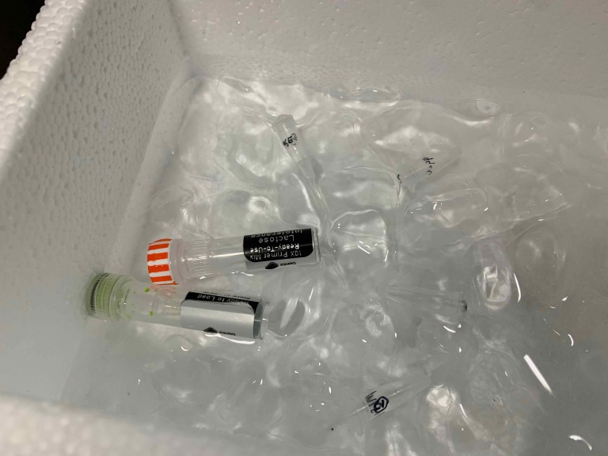
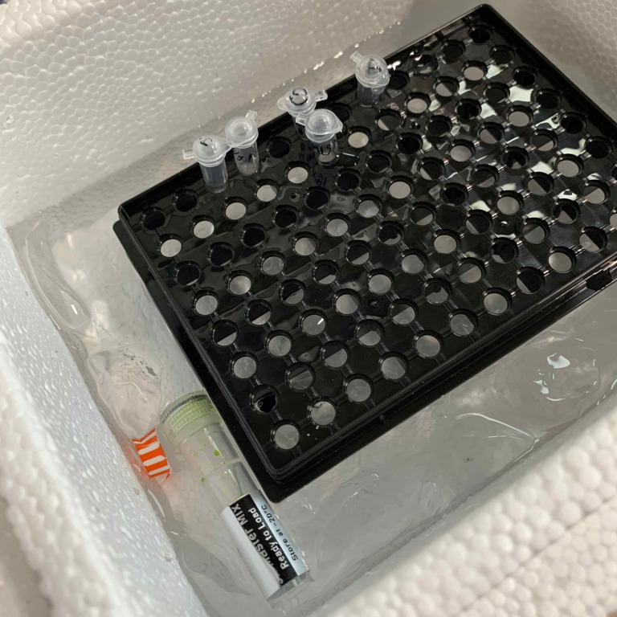
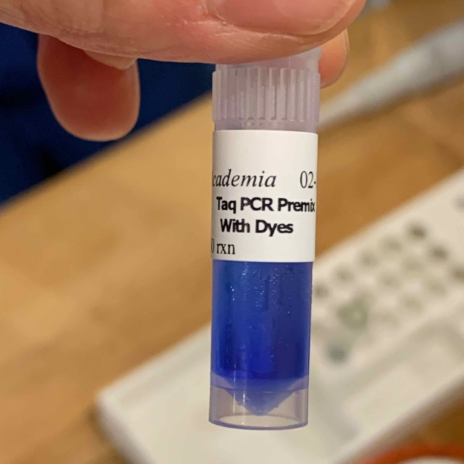
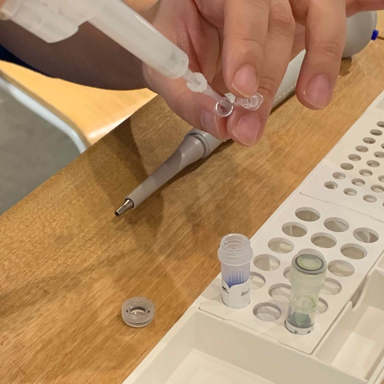
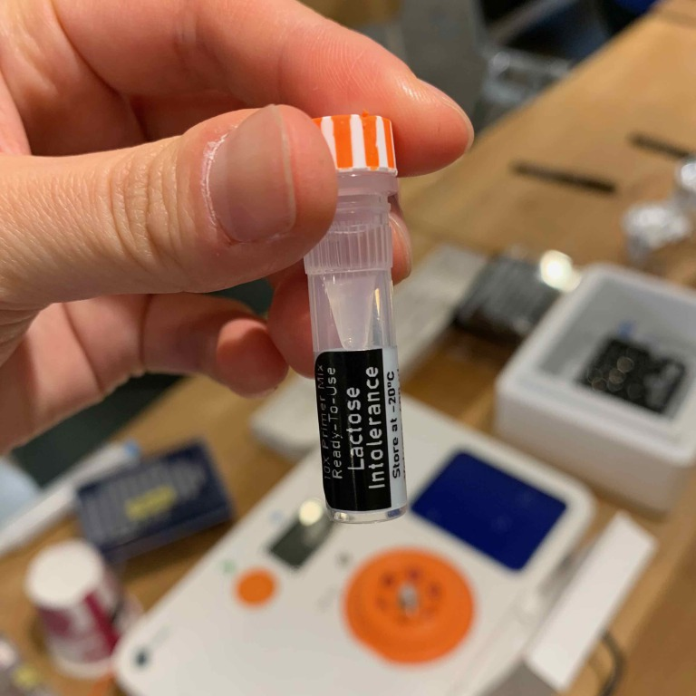
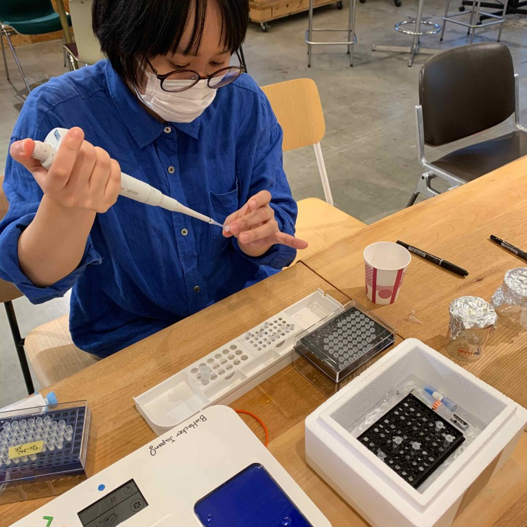

### 3th May, Tue : PCR

[→BentoLab protocol: Introduction to PCR](https://bento.bio/protocol/biotechnology-101/introduction-to-pcr/) 
[→BHA protcol Notion from Georg-san](https://trembl.notion.site/PCR-Basics-9f70bdb559f3467ea0f540e28e8bf2b6) 
※Before the experiment, you shold read the protocol and keep the track of th e flow.  
実験前に流れを把握しておくこと。

**< What we need >** 
**(1) DNA templete 増やしたいgene sequenceが入ったDNAのサンプル **
We've extracted each DNA from cheek cells and storaged them in the -20℃ freezer. 
**(2) primer **
This time we used "lactose intolerance" primer. 
[乳糖不耐性](https://www.shouman.jp/disease/details/12_01_001/#:~:text=%E4%B9%B3%E7%B3%96%E4%B8%8D%E8%80%90%E7%97%87%E3%81%A8,%E9%85%B5%E7%B4%A0%E6%B4%BB%E6%80%A7%E4%BD%8E%E4%B8%8B%E3%81%8C%E3%81%82%E3%82%8B%E3%80%82)(乳糖を消化できないので、下痢など症状が発生する。)が分かるプライマーを使う。 
※ミルクに含まれる糖質である乳糖をグルコースとガラクトースに分解する乳糖分解酵素（ラクターゼ: lactase）を作り出す遺伝子をLCTgeneという。このLCT geneの発現をコントロールするのがMCM6 gene。MCM6 geneがTtypeかCtypeかどうか、調べてみよう！ 
[→lactose intolerance primer protocol](https://bento.bio/protocol/biotechnology-101/lactose-intolerance/) 
**(3) polymerase **
- option1. Master Mix from BentoLab 
This time we used "[5x FIREPol® Master Mix Ready To Load](https://bento.bio/product/firepol-master-mix/)". This contains thermostable Taq DNA polymerase FIREPol®, dNTPs, 7.5 mM MgCl2, and loading dye, in a buffer. 
Taqポリメラーゼ、dNTPs、識別用の色素が含まれている。 
 
- option2. [Taq polymerase from BioAcademia](https://www.bioacademia.co.jp/en/html/upload/save_image/E02-102%20Taq%20Premix%20with%20Dyes.pdf) 
This time we also tries to Taq polymerase with dye from BioAcademia instead of master mix from BentoLab. 
マスターミックスの代わりに、BioAcademiaのTaqポリメラーゼも使ってみる。 
 
**(4) distilled water : 1000μリットル **
 

**1. Prepare the contents of the PCR tube PCRチューブの中身を用意する **
Primer, MasterMix and DNA should be cooled in ice water. 
プライマー、マスターミックス、使用するDNAは氷水で冷やしながらPCR作業を進める。 
 
 

This time I used Taq polymerase from BioAcademia. 
私は今回バイオアカデミアのTaqポリメラーゼを使用した。 
 

Add 25μl Taq polymesase, 2μl primer (it's transparent), 4μl DNA template and 19μl DW to PCR tube. It's gonna be 50μl as a total. 
ポリメラーゼ25μl、プライマー2μl、DNA4μl、純水19μlをPCRチューブにピペットで入れる。トータル50μlの溶液になる。 
 
 
 

2. 