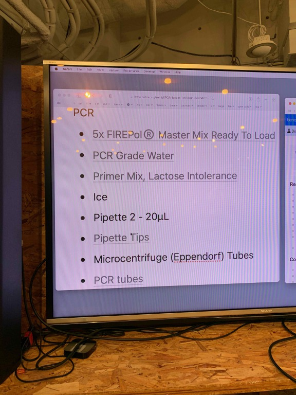

### 3th May, Tue
#### PCR

[→BentoLab protocol: Introduction to PCR](https://bento.bio/protocol/biotechnology-101/introduction-to-pcr/) 
※Before the experiment, you shold read the protocol and keep the track of th e flow.  
実験前に流れを把握しておくこと。

**< What we need >**
**(1) DNA templete 増やしたいgene sequenceが入ったDNAのサンプル **
We've extracted each DNA from cheek cells and storaged them in the -20℃ freezer. 
**(2) primer **
This time we used "lactose intolerance" primer. 
乳糖不耐性(乳糖を消化できないので、症状が発生する。)の遺伝子用のプライマーを使う。 
[→lactose intolerance primer protocol](https://bento.bio/protocol/biotechnology-101/lactose-intolerance/) 
**(3) polymerase master mix **
This time we used "[5x FIREPol® Master Mix Ready To Load](https://bento.bio/product/firepol-master-mix/)". This contains thermostable Taq DNA polymerase FIREPol®, dNTPs, 7.5 mM MgCl2, and loading dye, in a buffer. 
Taqポリメラーゼ、dNTPs、識別用の色素が含まれている。 
**(3)' Taq polymerase **
This time we also tries to Taq polymerase with dye from another brand instead of master mix from BentoLab. 
マスターミックスの代わりに、別のメーカーのTaqポリメラーゼも使ってみる。 
**(4) distilled water : 1000μリットル **
 

Primer, MasterMix and DNA should be cooled in ice water. 
プライマー、マスターミックス、使用するDNAは氷水で冷やしながらPCR作業を進める。 
 
 

