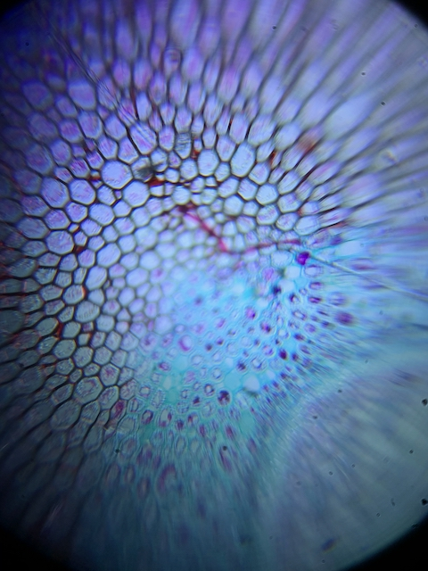
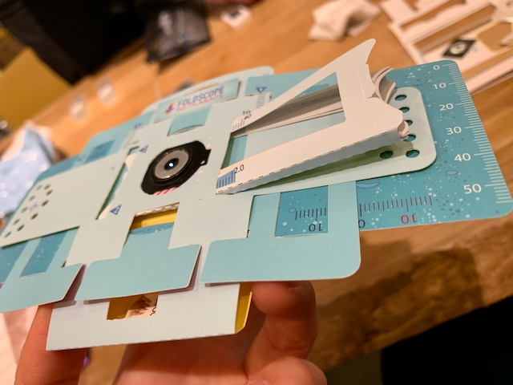
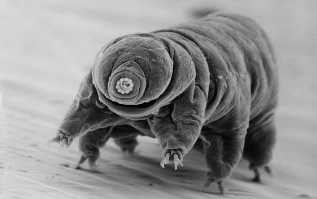
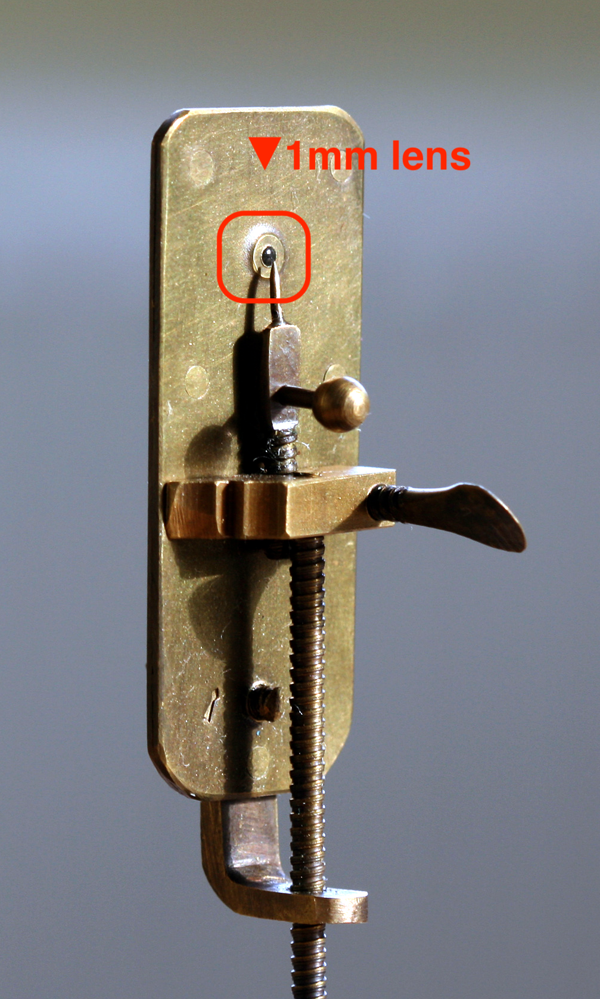
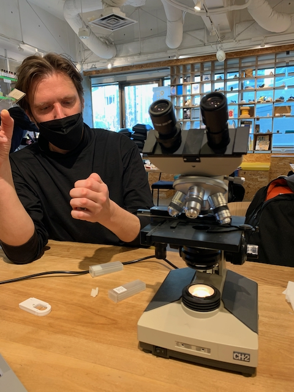
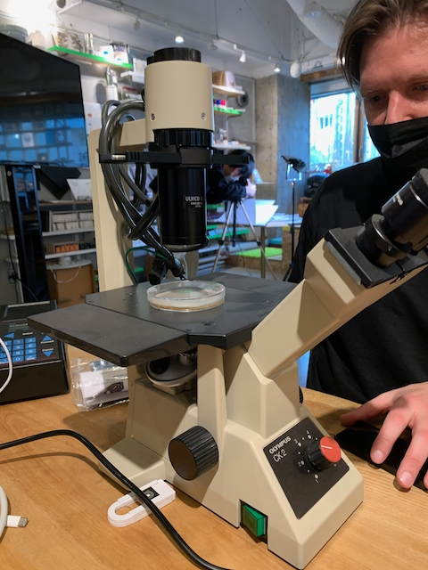

## week2: Deconstructing the Lab (2022/3/7~3/13)

### (1) I made a [FOLDSCOPE](https://www.foldscope.com/) 
[Manu Prakash](https://www.ted.com/talks/manu_prakash_a_50_cent_microscope_that_folds_like_origami?language=ja) developped this microscope made of paper.

* Cutting out parts 

* Assemble the parts 

* I observed a thin slice of fern. 
 
notes: When observing, z-axis adjustment is important. This time, it was observed beautifully in its thinnest state. 
 
by the way: He is water bear. The strongest organisms live in moss. 
[Kumamushi teacher](http://www.kids-event.jp/interview/10185/) 

### (1') About the microscope in the first place 
[Antonie van Leeuwenhoek](https://en.wikipedia.org/wiki/Antonie_van_Leeuwenhoek) made the first microscope. 
How was he able to create the microscopic lenses?
Many thought it was polished.
In reality, he produced beautiful lenses by heating and melting glass, then dropping it into water and letting it cool. 
 
There are two types of microscopes.
  1. Type viewd from top 
  Mainly used to observe fixed and immobile objects. Use slides.
  
  2. Type viewed from below 
  Mainly used to observe cells, bacteria, and moving objects in petri dishes. 
  (When viewed from above, it is difficult to see the evaporated water droplets. So look from the bottom) 
  

### (2) I made a pocketPCR
Polymerase Chain Reaction: A means of copying large quantities of DNA.
Purpose of PCR: By copying in large quantities, the DNA can be analyzed by electrophoresis. We can investigate what kind of DNA is present.
