###  2. Hands-on Group Work: Design and Make a CleanBox 
I made a cleanbench with Shiho and Ai. 

#### (1) Sketch a design image
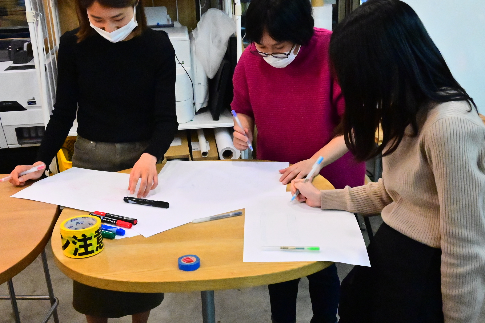 
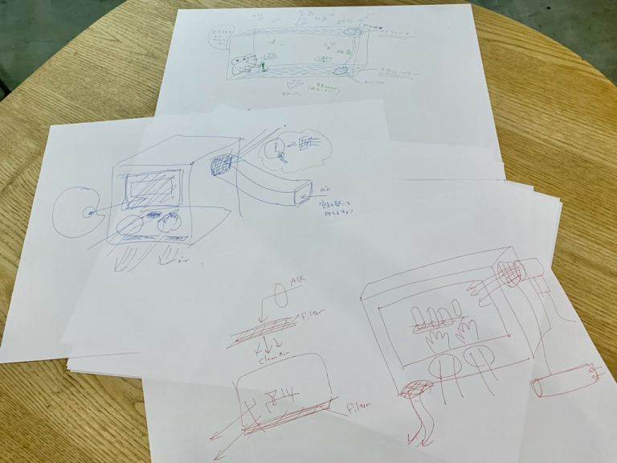 

#### (2) Production started
We tried to make holes to put your hands in, window to look in and holes and ducts for airflow (holes have filters).
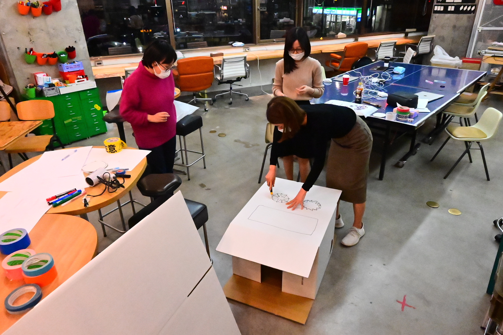 
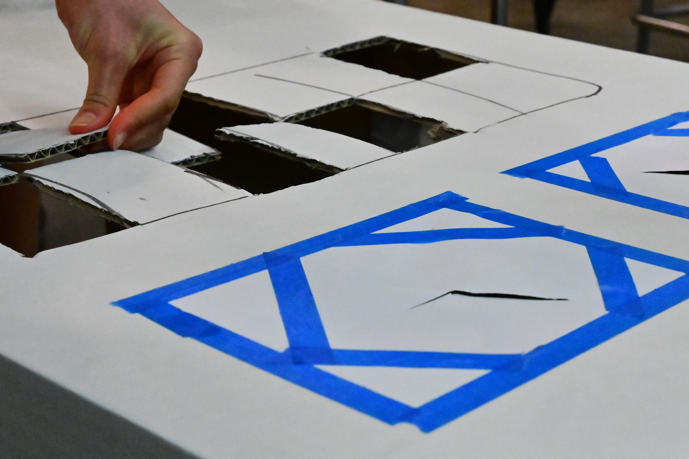 
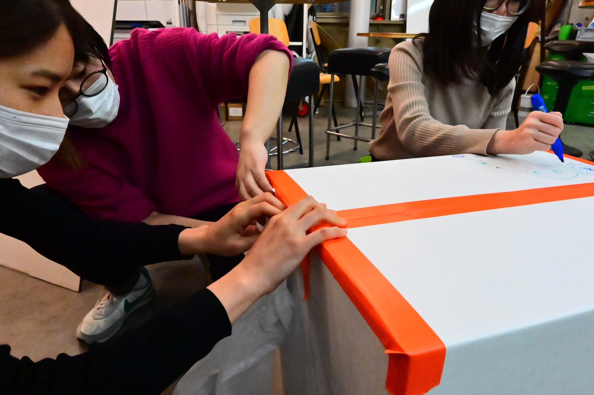 

#### (3) Done!!
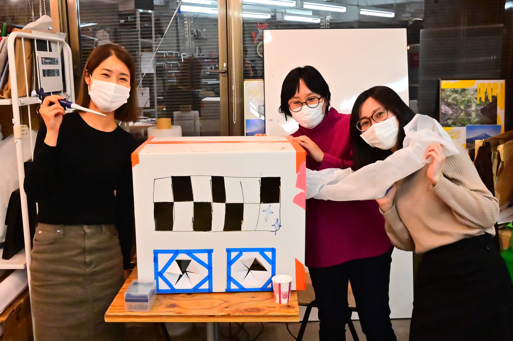 

#### (4) Trial by Hosotani-san
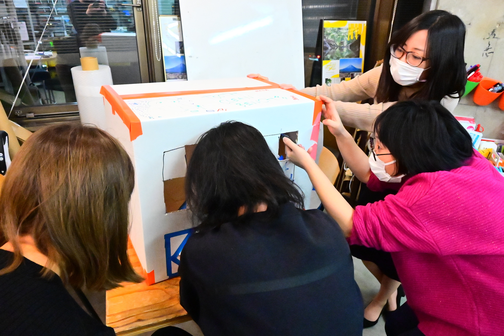 
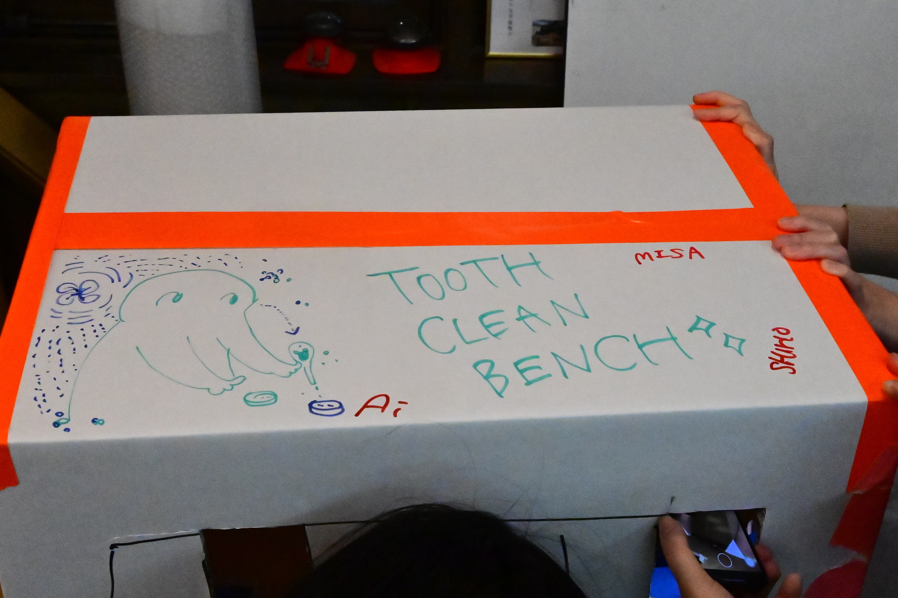 

#### Feedback we got
- The entrance for getting tools in and out should be larger. 
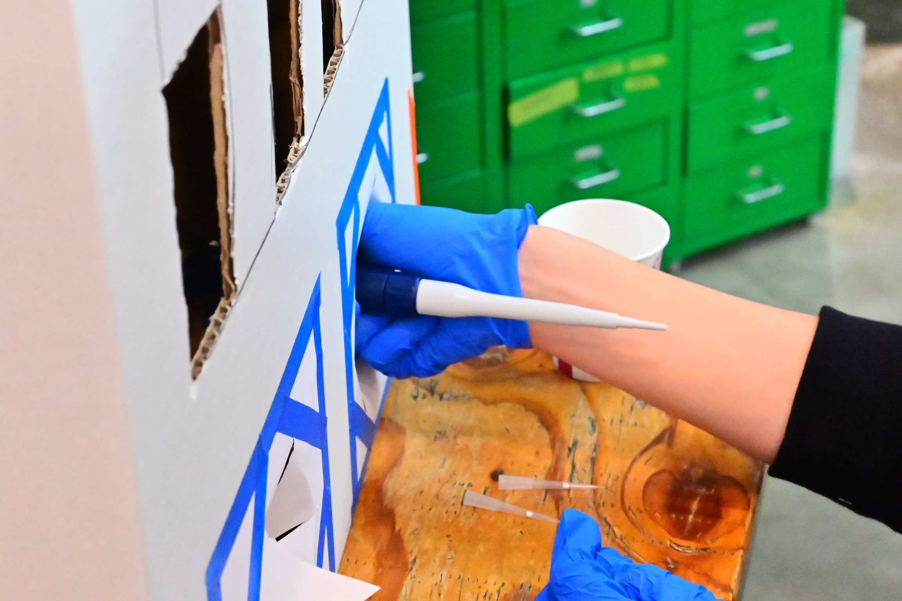 
- Need a light inside. 
※We lit the inside from the outside with our phone.
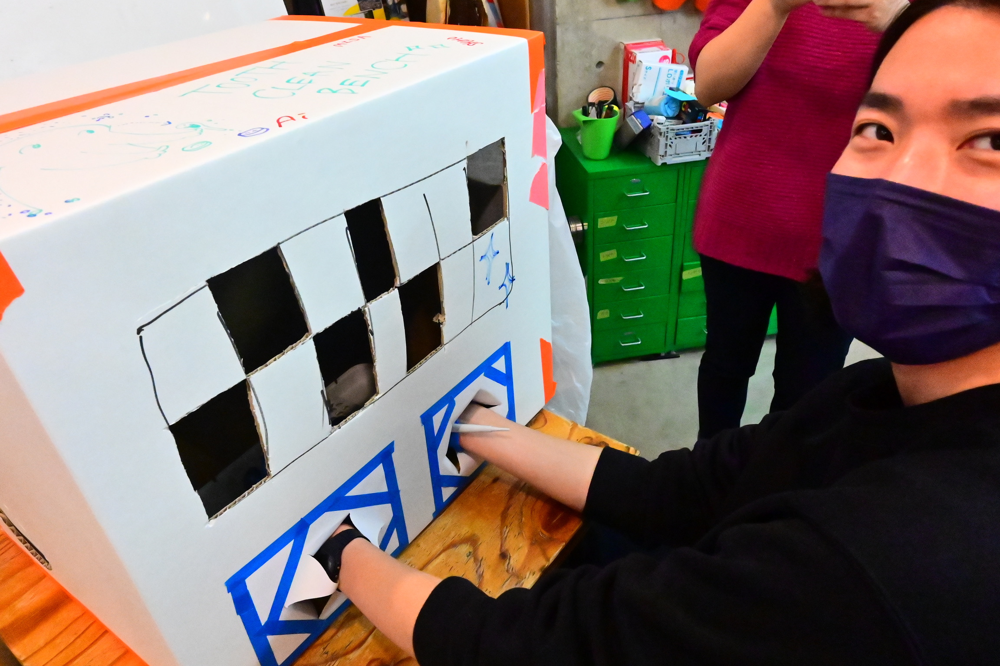 
- Inside the box, the floor must be flat.
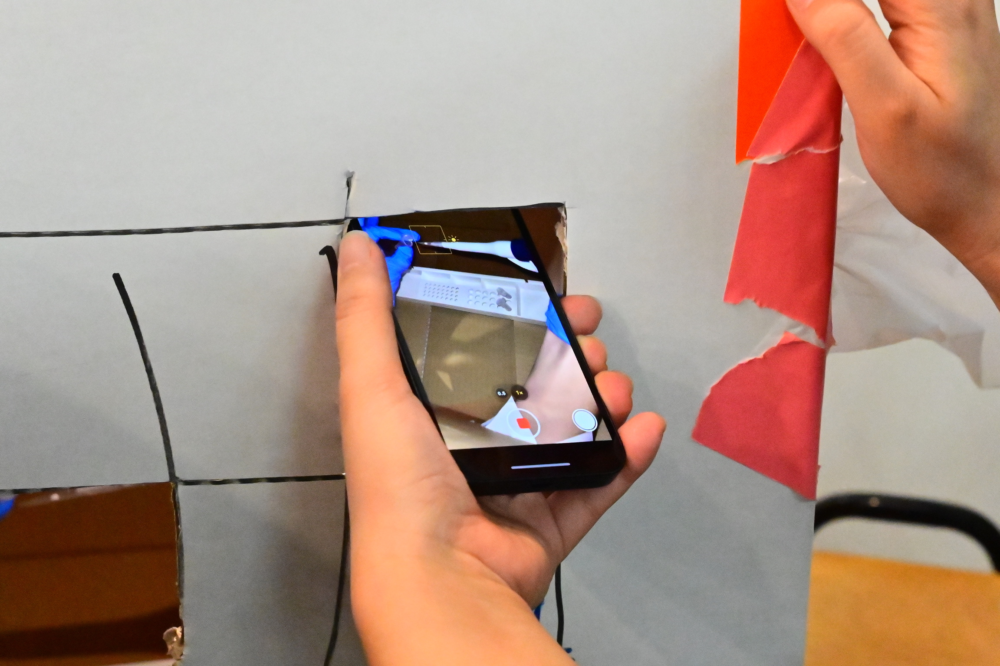 
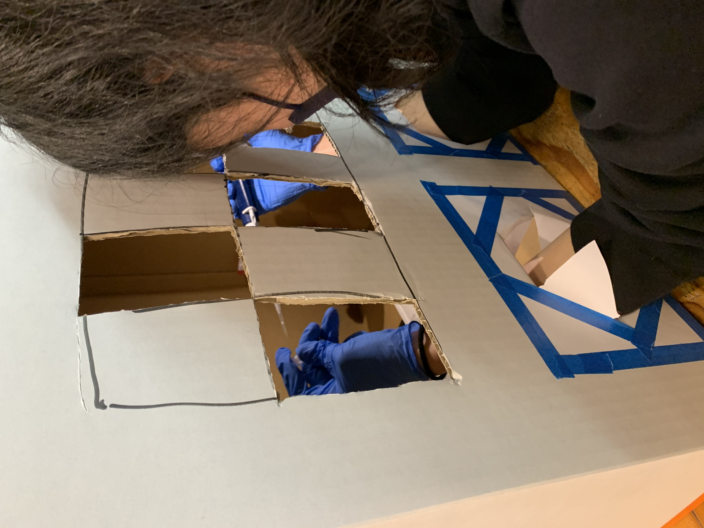
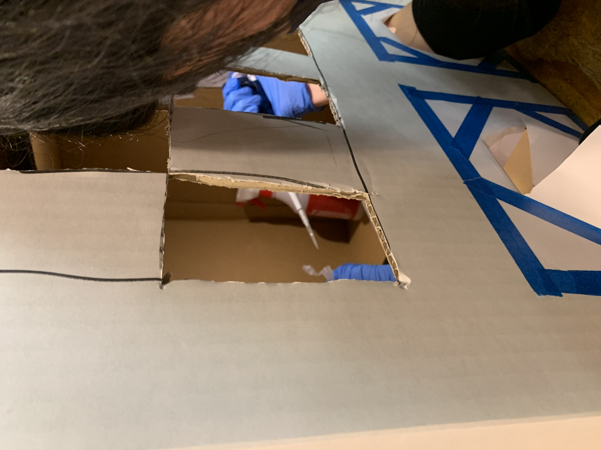 
- Need a place to dispose of used pipettes
- How about a cellophane window to look inside?
- Wind is better when the hole is large and flows slowly from above.

#### this is the real cleanbench
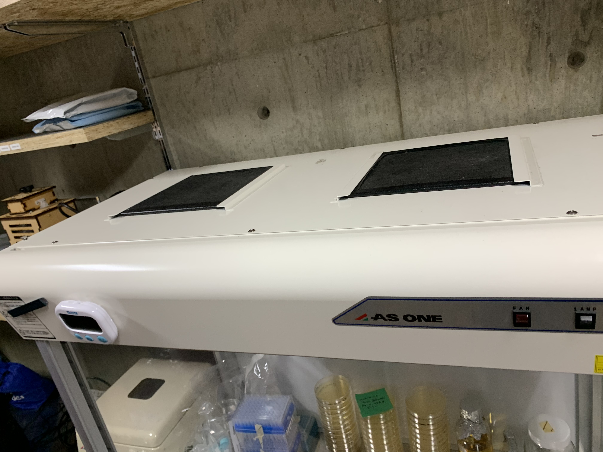 
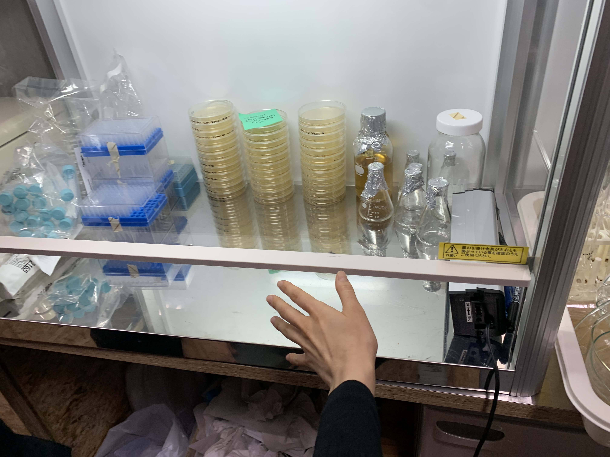 