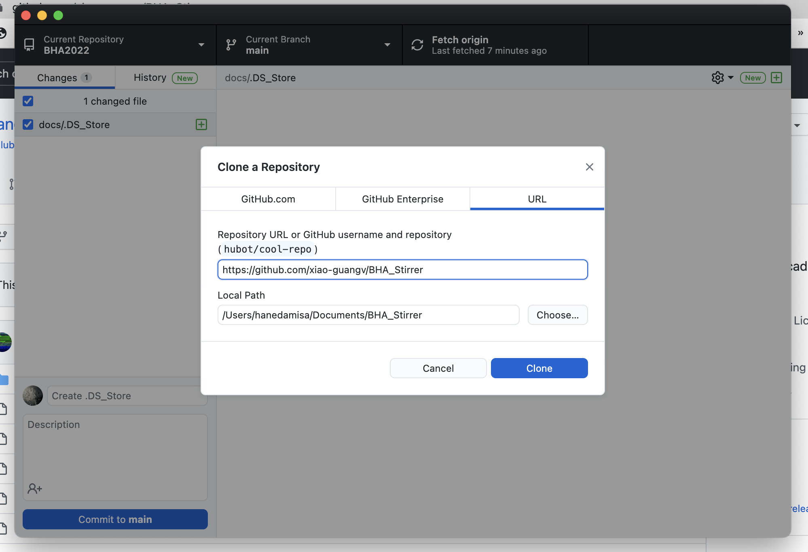
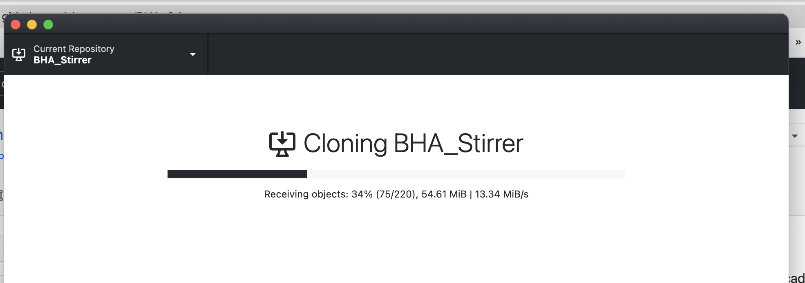
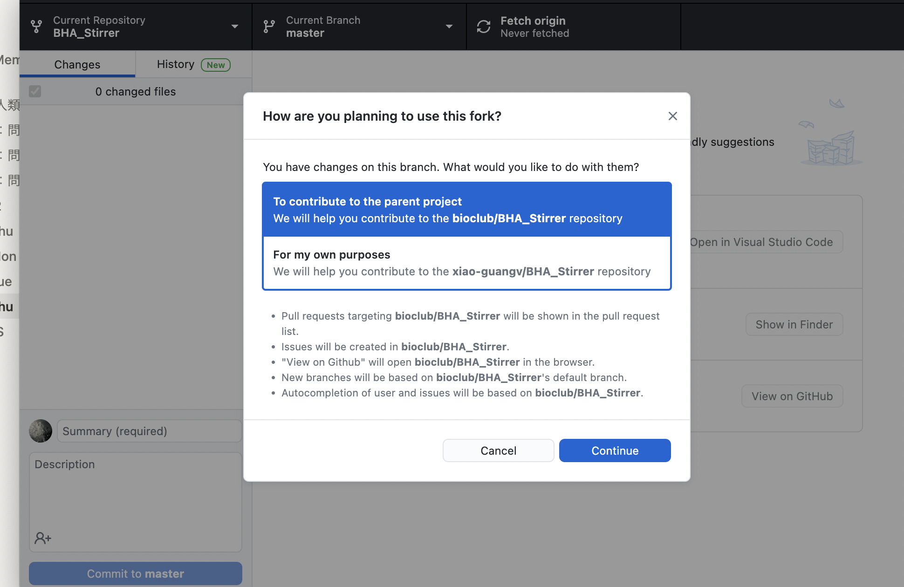
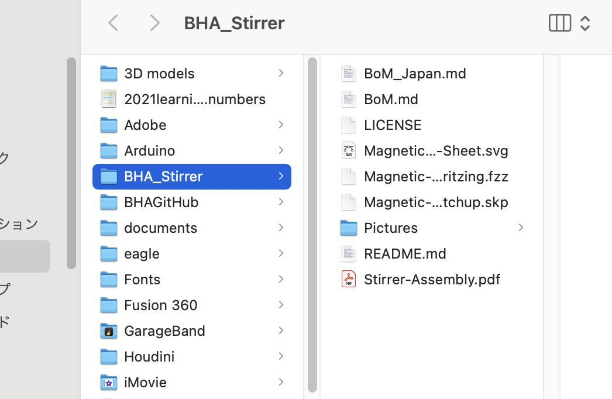
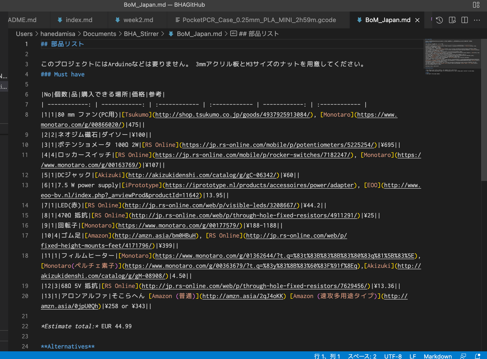
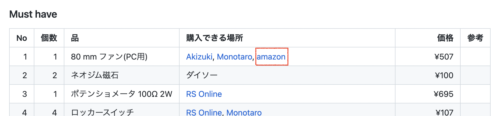

###  3. Fork and Change the BHA Stirrer Repo 
I cloned the Stirrer repository from [BHA GitHub](https://github.com/BioClub/BHA_Stirrer) to mine. 

 

I added amazon link to 80mm fan in "BoM_Japan.md" file. 

