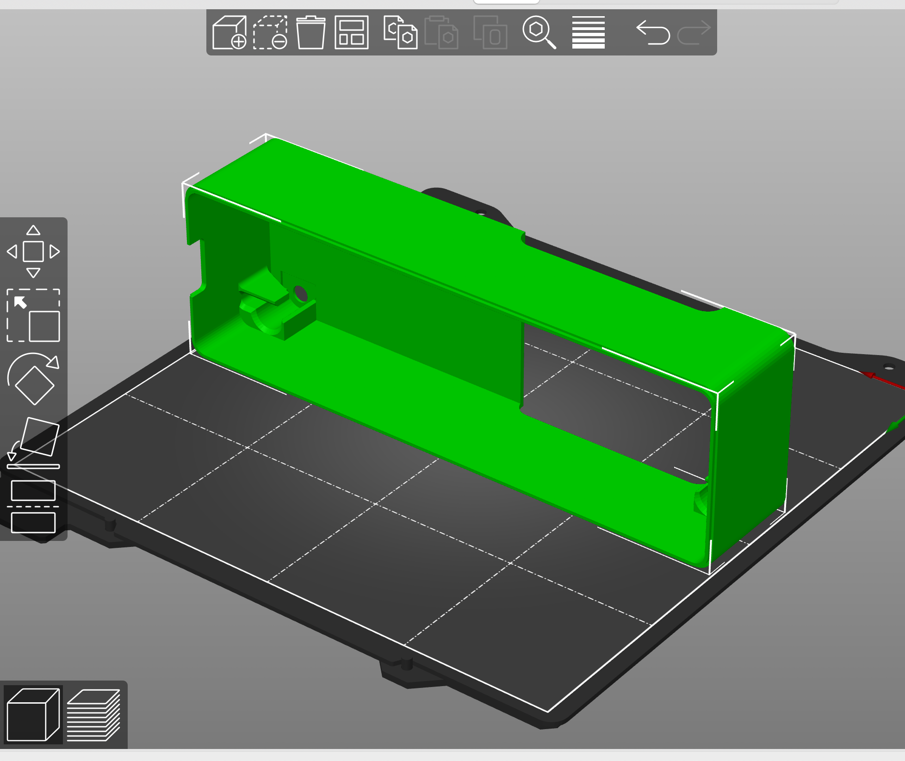
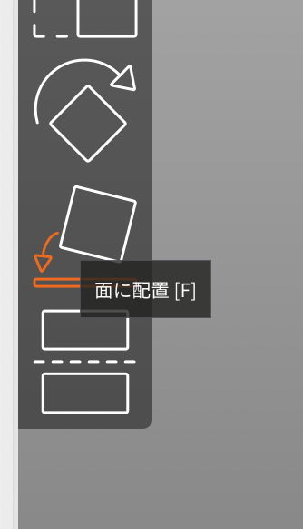
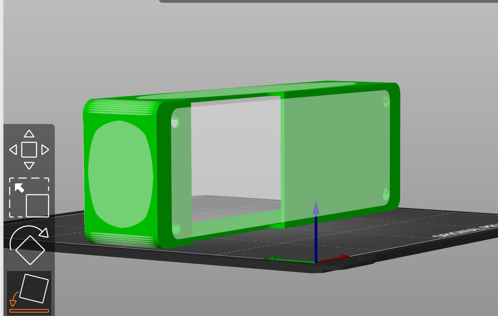
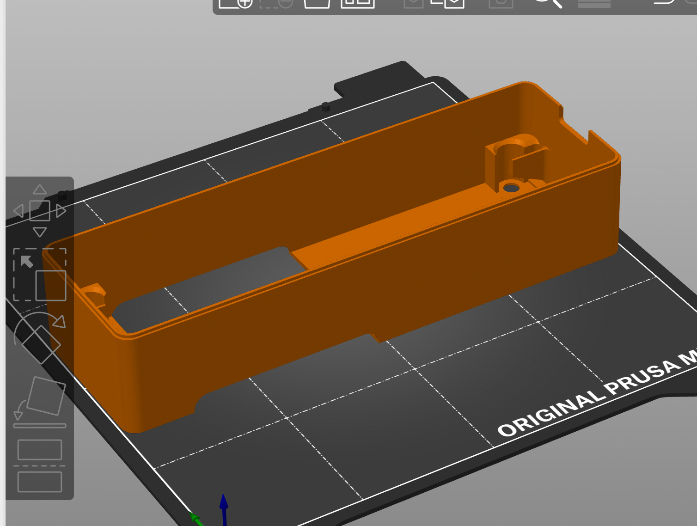
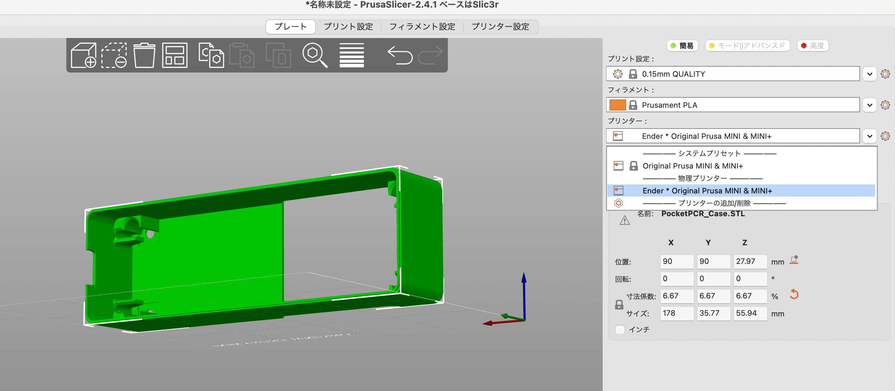
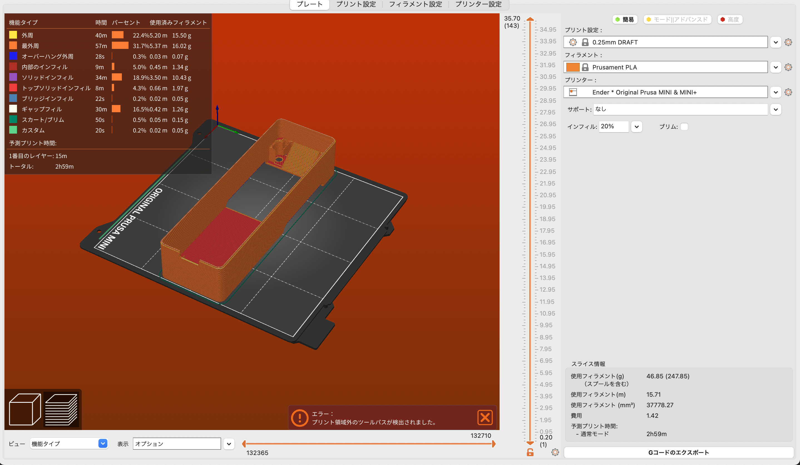
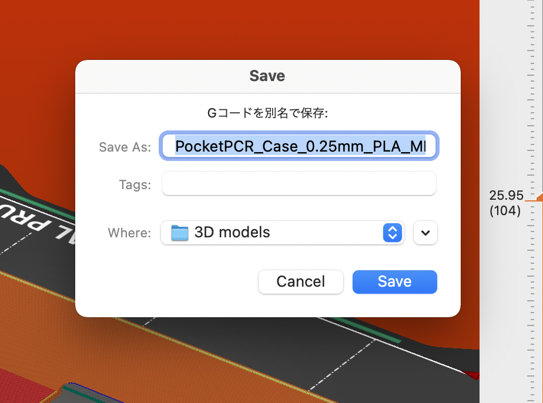
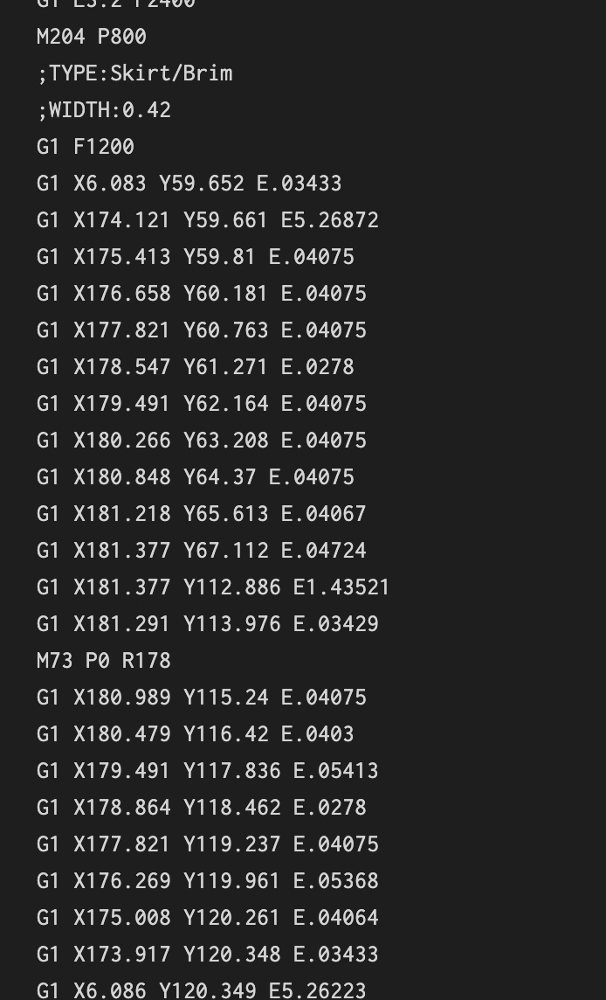
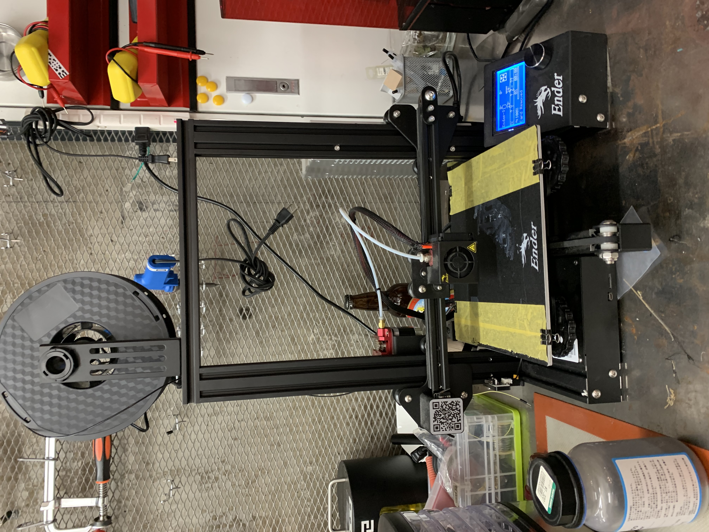
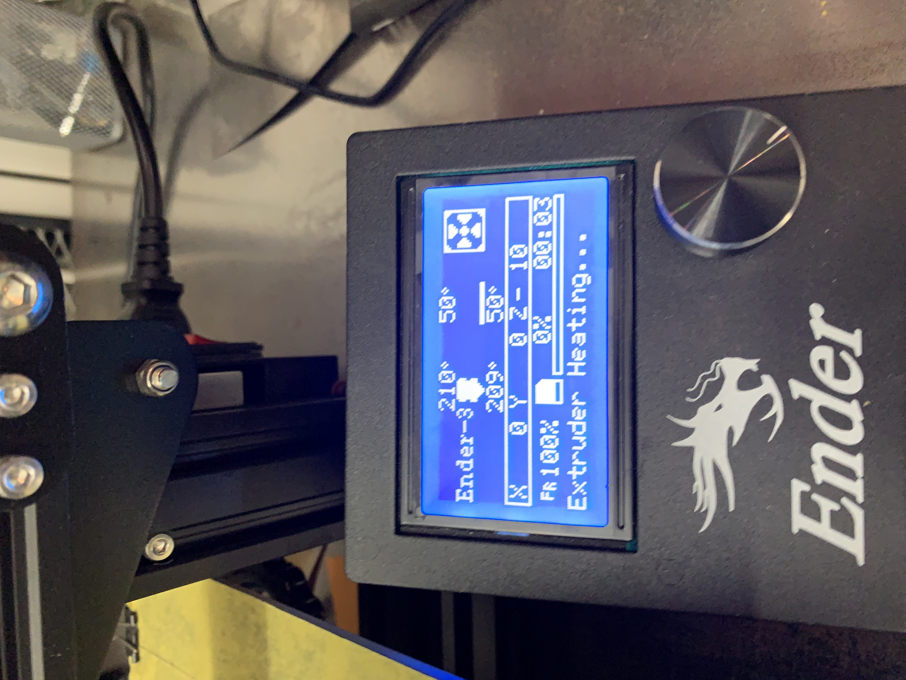

###  4. Prepare the PocketPCR Case for 3D Printing 
I downloaded "[purca slicer](https://www.prusa3d.com/page/prusaslicer_424/)" to load sliced 3D data into a 3D printer.

#### (1) Open PCR case data in purca slicer
 
#### (2) Rotate to change data orientation
Consider the orientation of the data so that the 3D printer can physically print it. 
 
 
 
#### (3) Select the 3D printer to use
However, no other options, such as ender, appeared among the choices.
 
#### (4) Execute 3D data slicing
 
 
The thinner the slice, the longer it takes to print.
#### (5) Get a G-code
 
 
Every 3D printer works with this code file.
#### (6) Put data into the 3D printer and run it.

 
The stage is 50 degrees and the Extruder is 210 degrees.