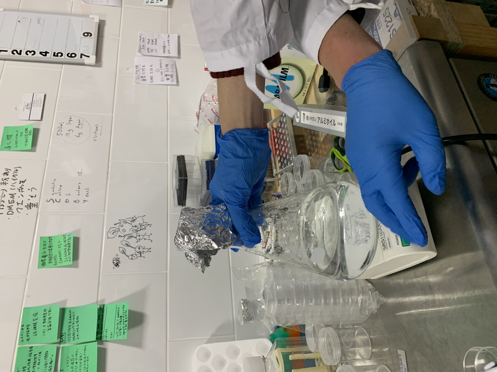
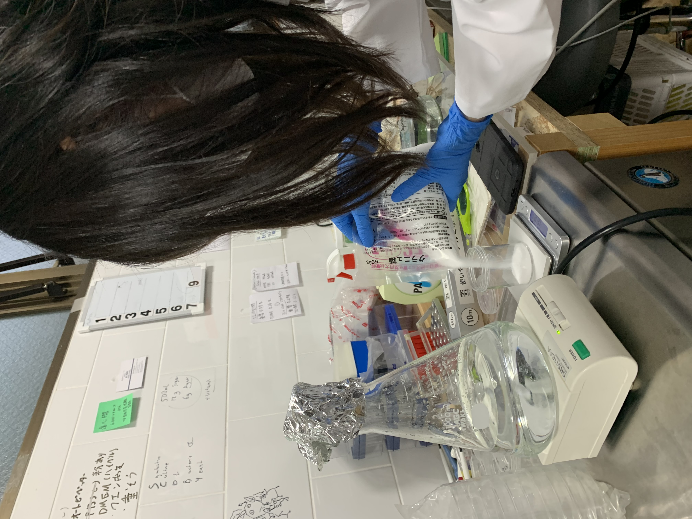
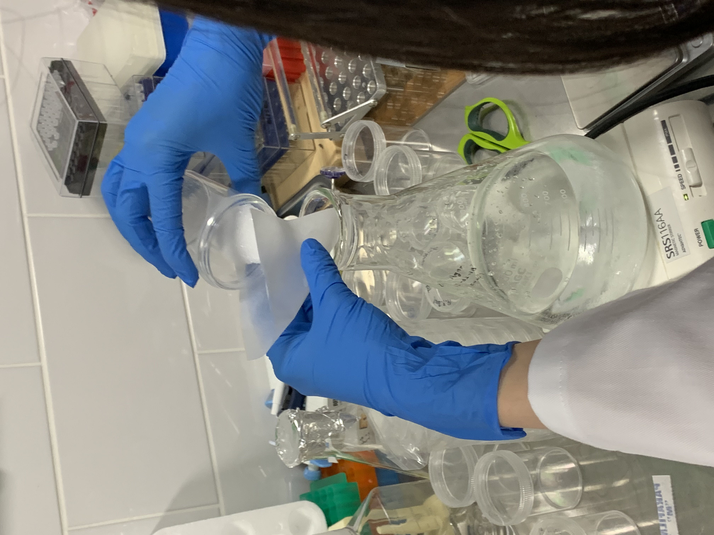
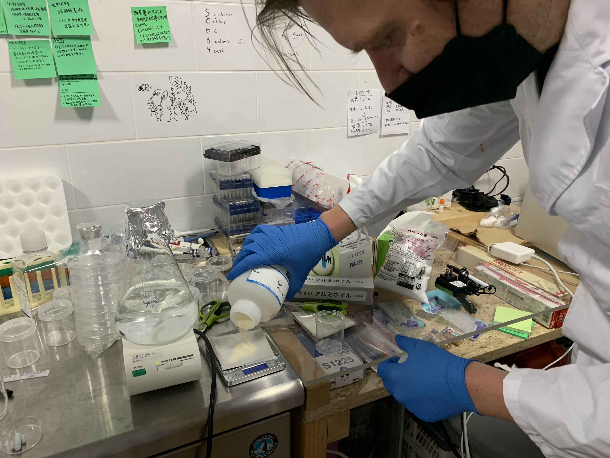
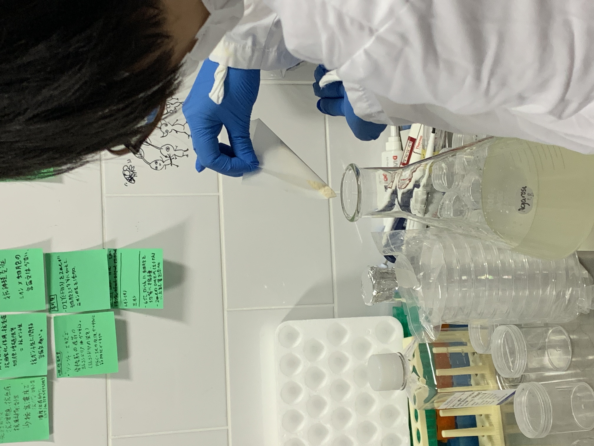
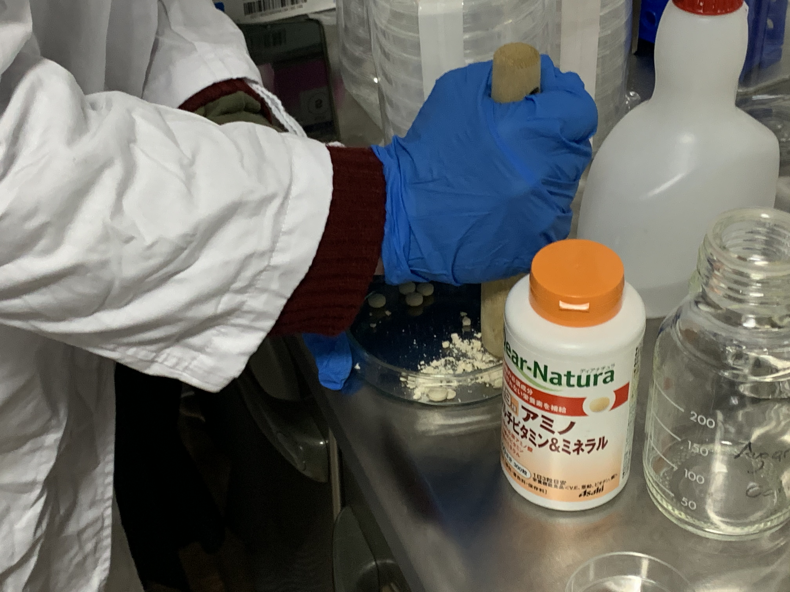
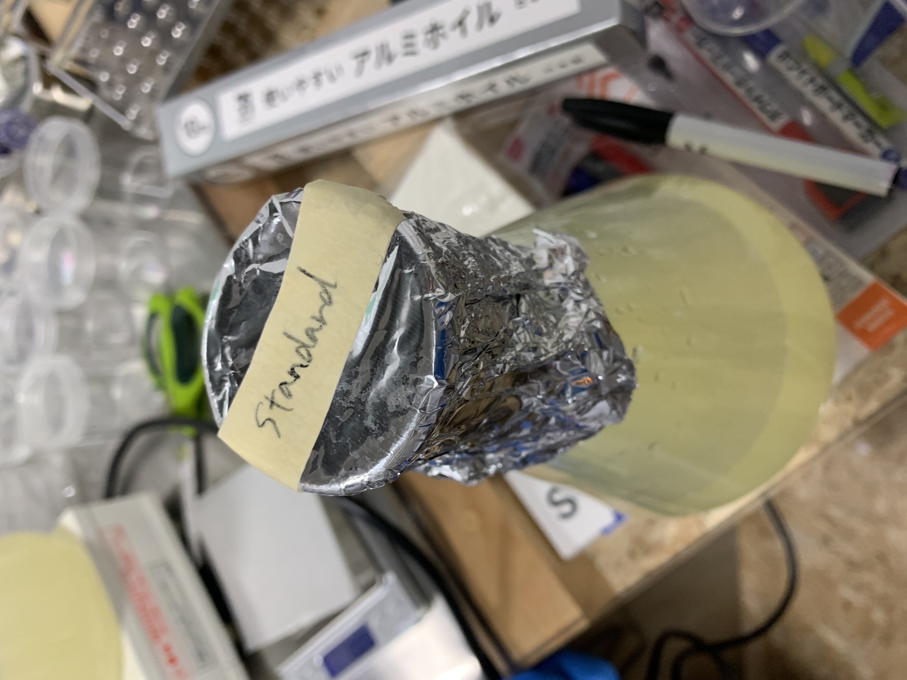
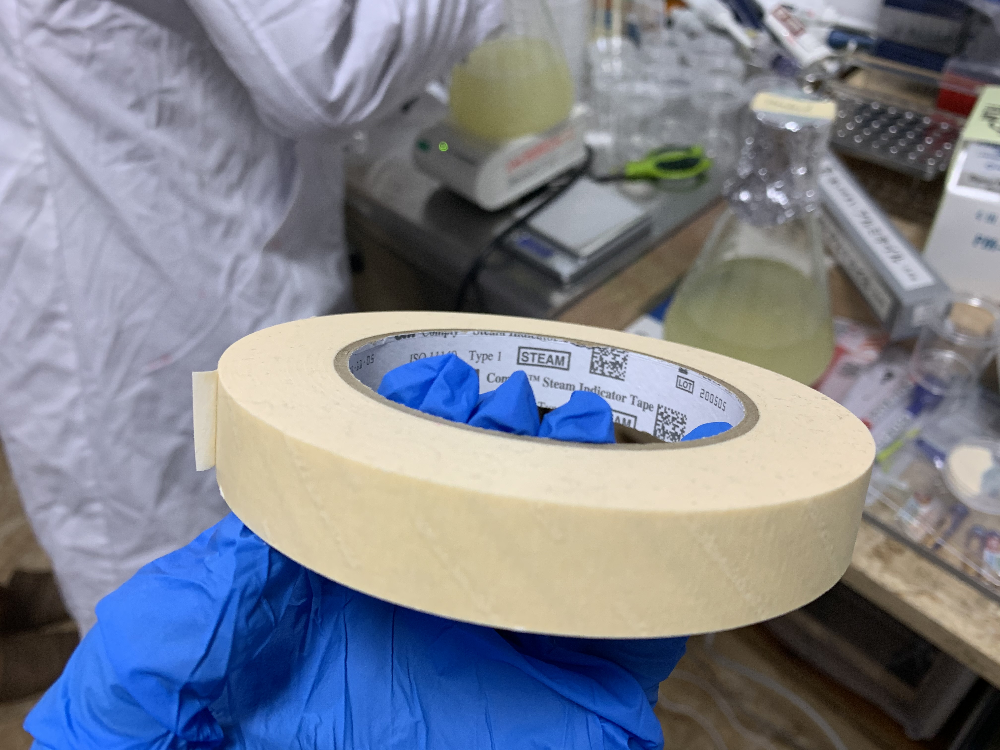

###  1. Make cultivation media for bacteria and plants 
■day1 - 22/3/2022 Tue : How to make and prepare medium 
**Recipes**
* 500ml purified water
* 12g sugar
* 6g Agar
* a little bit of Vitamin
※This is the basic recipe. It depends on the bacteria you want to grow. 
What bacteria like, humans like too. Vitamins, sugar, chicken soup, etc.

1. Measure water and set on the magnetic stirrer
To prevent spills, the amount of liquid should be about half of the bottle.

2. Measure sugar and add it into water
To prevent contamination, if you take out more than your portion, do not put it back in the original bag.

3. Measure agar and add it into water
Add the agar slowly, as it will clump up when added all at once.

4. Add crushed vitamin tablets

5. Close the bottle lid and apply the indicator sticker

6. 