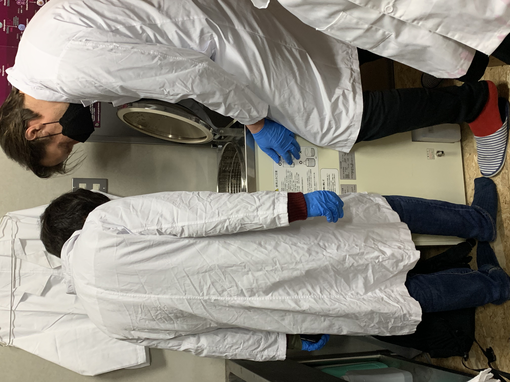
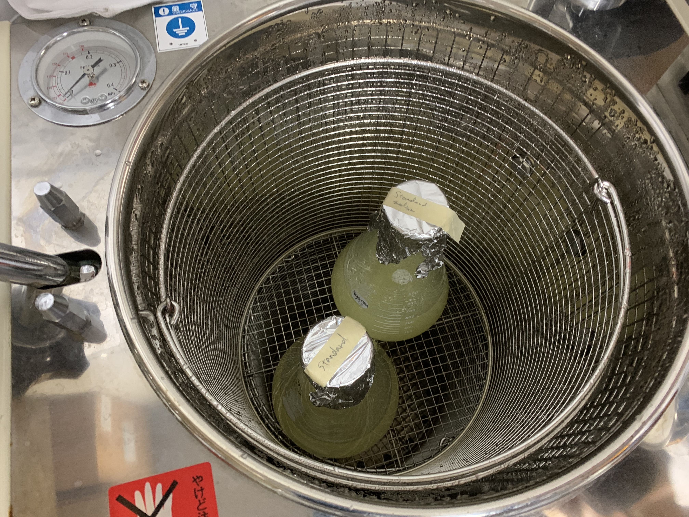
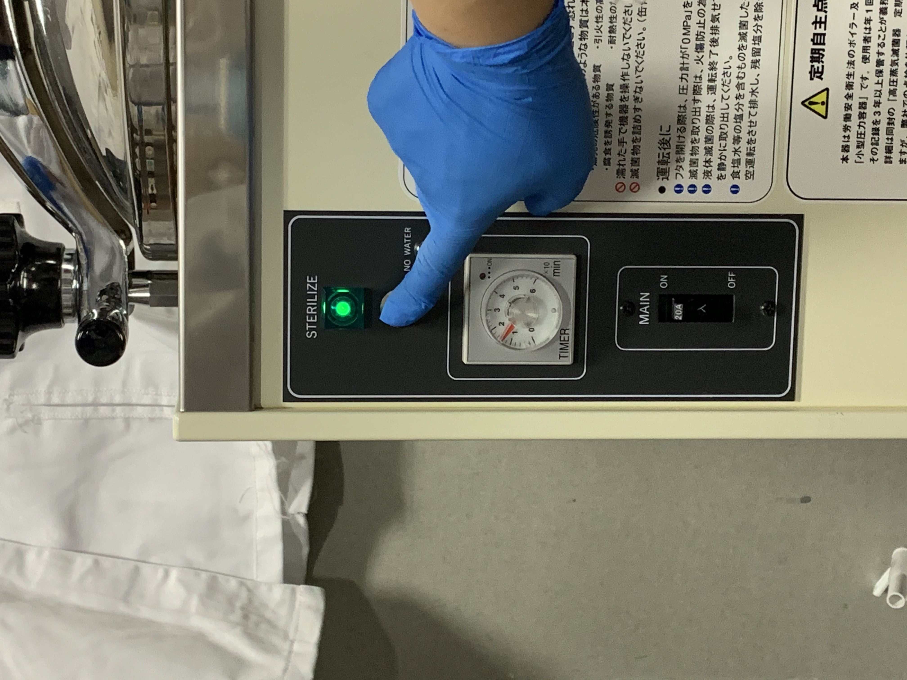
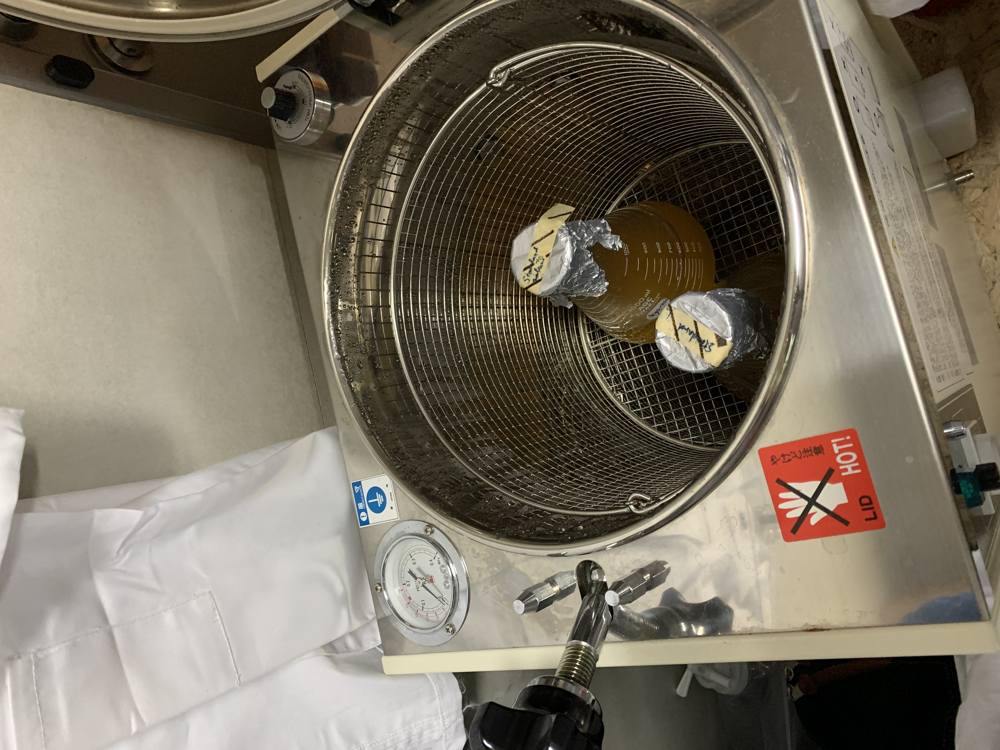
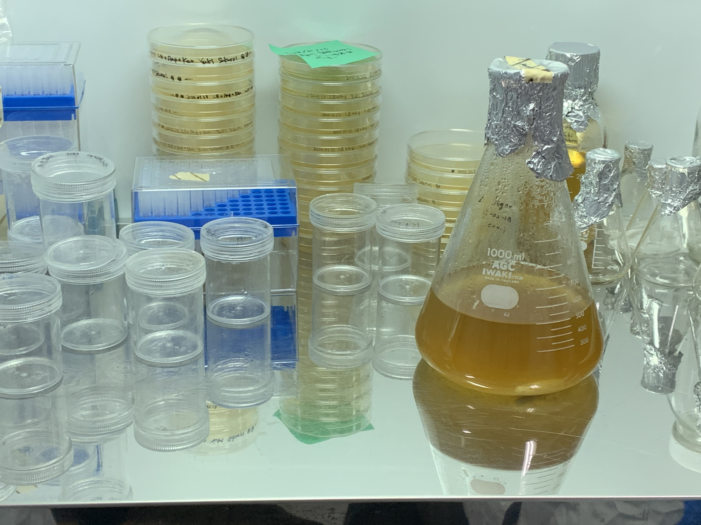
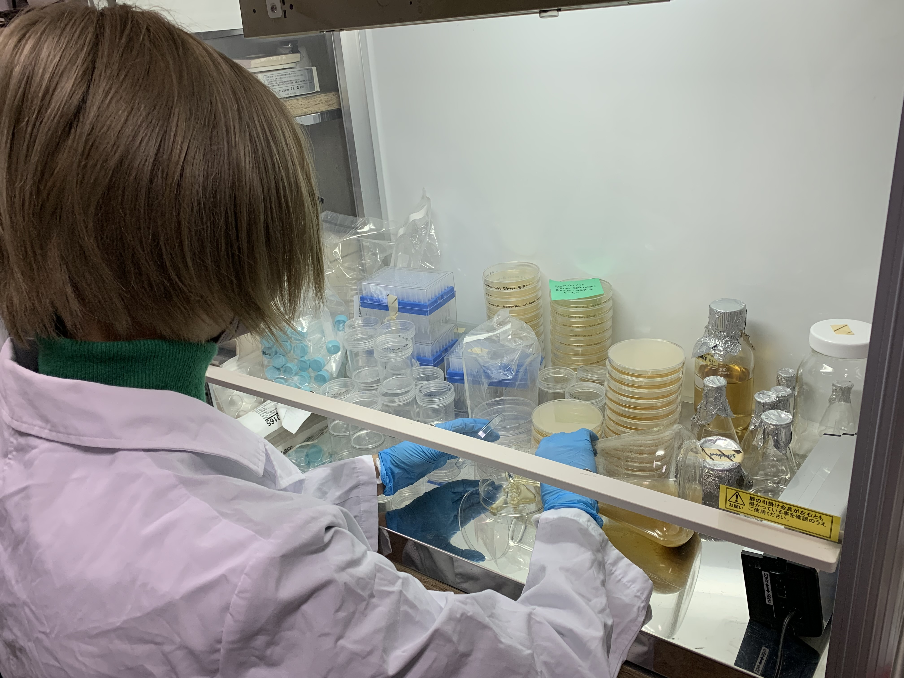
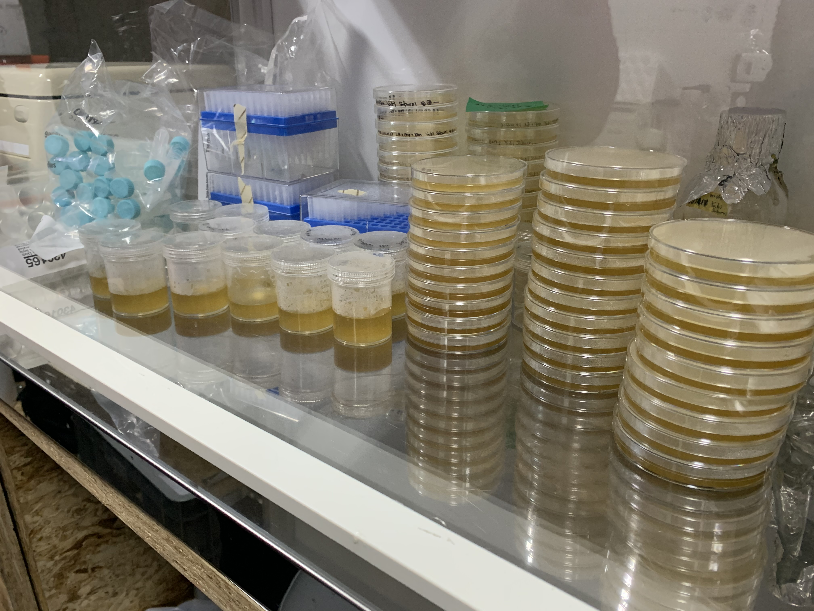

###  1. Make cultivation media for bacteria and plants 
**■day1 - 22/3/2022 Tue : How to make and prepare medium **

**Recipes**
* 500ml purified water
* 12g sugar
* 6g Agar
* a little bit of Vitamin 
※This is the basic recipe. It depends on the bacteria you want to grow. 
What bacteria like, humans like too. Vitamins, sugar, chicken soup, etc.

**1. Measure water and set on the magnetic stirrer **
To prevent spills, the amount of liquid should be about half of the bottle. 

**2. Measure sugar and add it into water **
To prevent contamination, if you take out more than your portion, do not put it back in the original bag. 

**3. Measure agar and add it into water **
Add the agar slowly, as it will clump up when added all at once.

**4. Add crushed vitamin tablets **

**5. Close the bottle lid and apply the indicator sticker **
The lid should not be completely closed.

**6. Set the bottle in the autoclave and start pressurization **
Make sure the bottom of the autoclave is properly filled with water. 
You can't steam without water. 
Kick and if it makes a wave, it's OK! 
※If there is no water in the bottle, add purified water. 

**7. Done!!**

**8. Pour the liquid into a petri dish **

