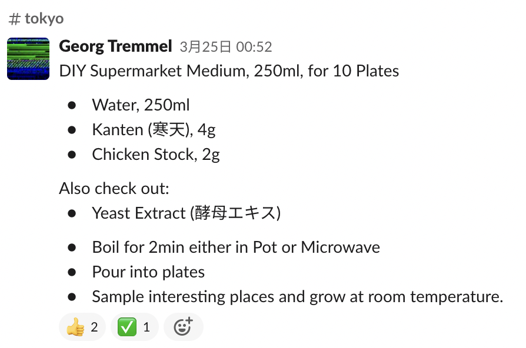
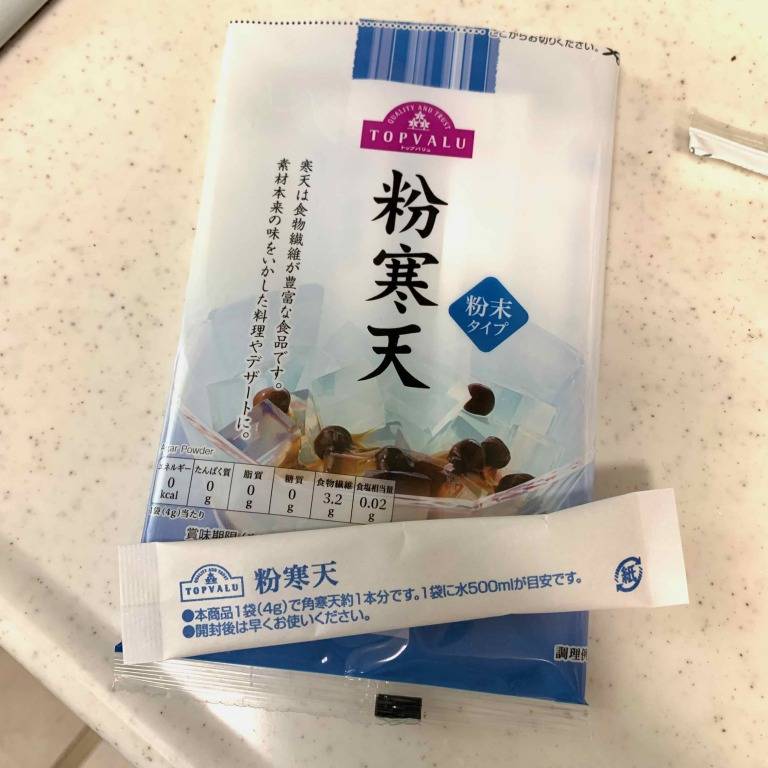
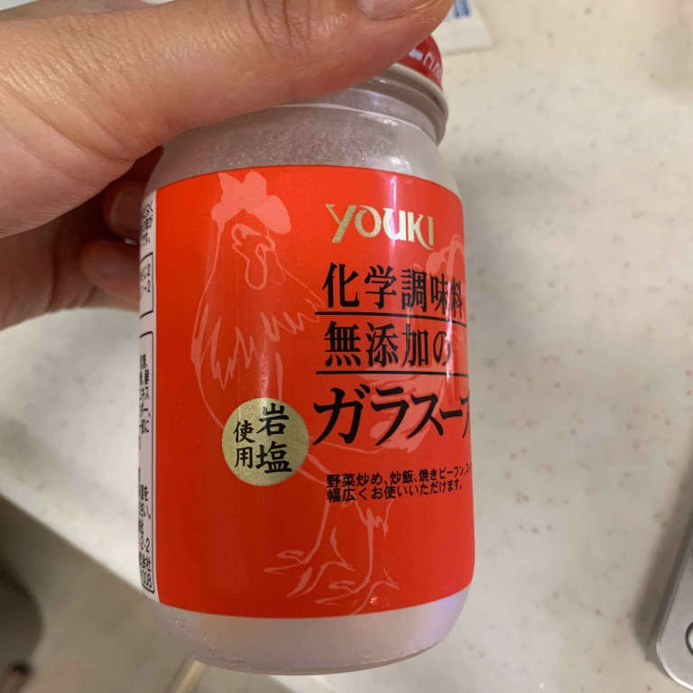
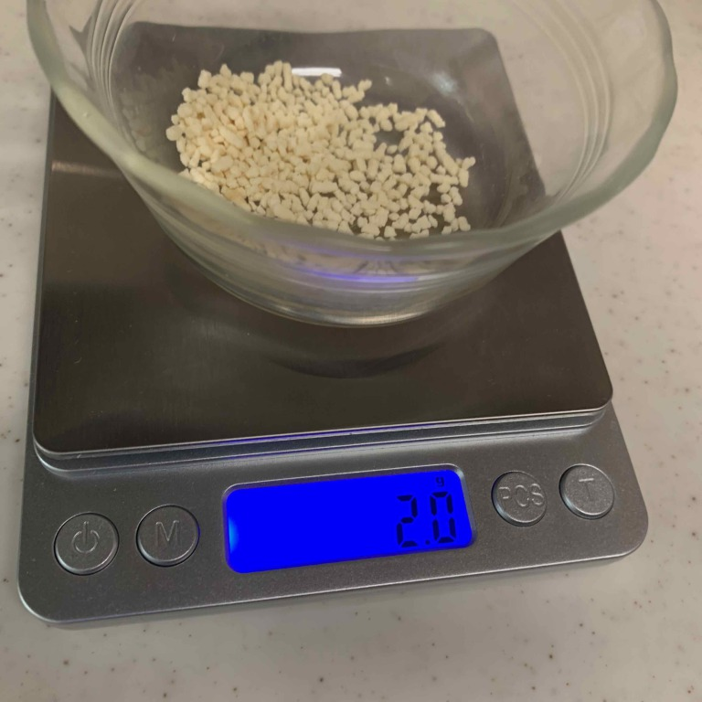
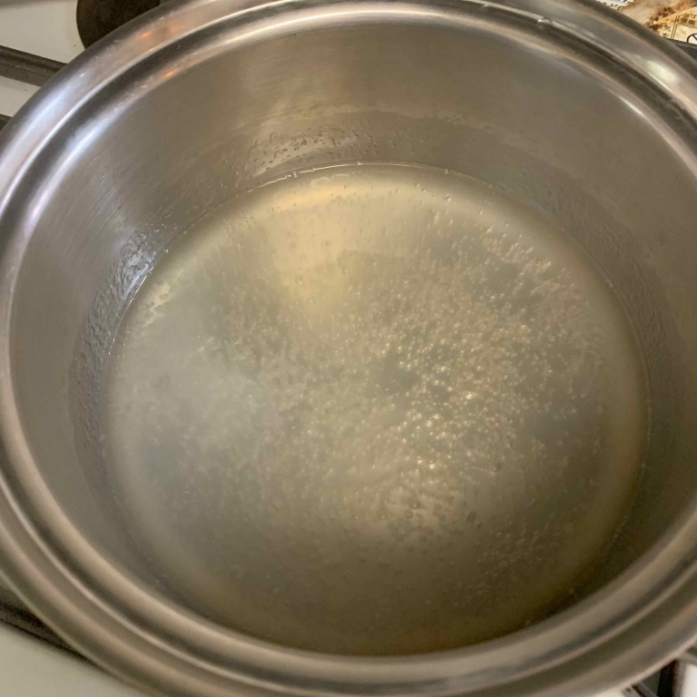
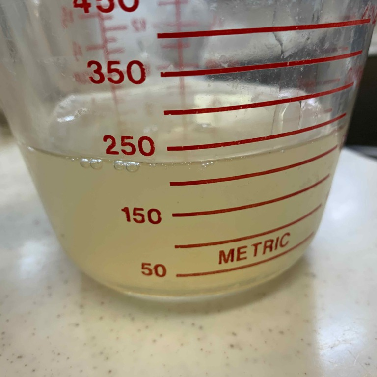
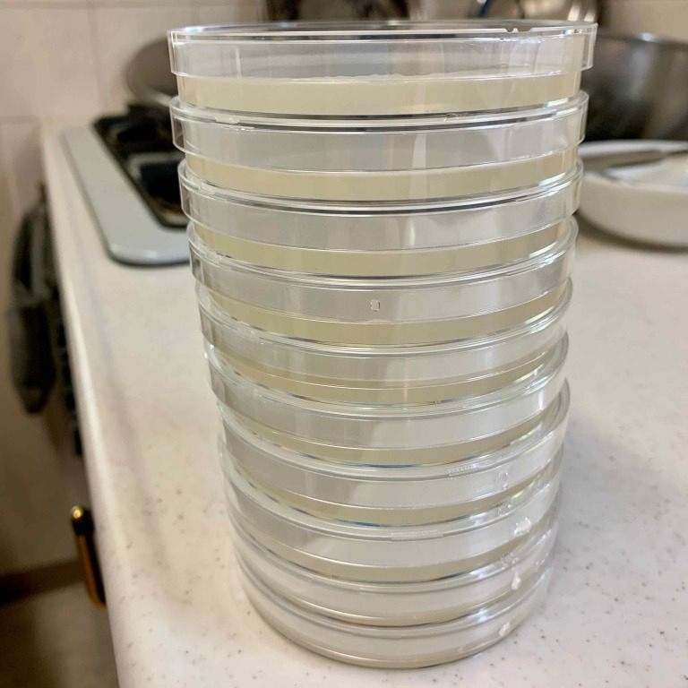

##  3. Make media at home and grow something 

**Recipes** 
* 250ml water
* 4g agar
* 2g chicken stock
 
 
 
 

Boil for 2min. 
 

The total amount was a little less, but enough for 10 plates. 
 

DONE!! 
 

I felt like that I've cooked for microbes in my kitchen. 