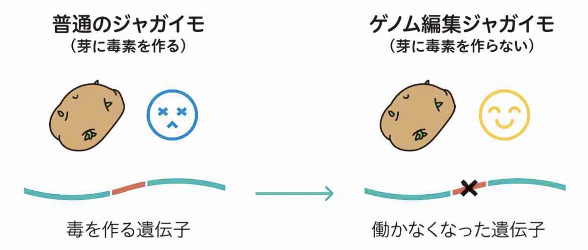

##  Solanum tuberosum disrupted-SSR2 

 

### ＜概要＞ Overview 
2021年4月5日、理化学研究所は、ゲノム編集技術により食中毒の原因となる天然毒素を大幅に減らしたジャガイモ（バレイショ）について、文部科学省に報告書を提出し、受理された。ゲノム編集作物・食品の監督官庁への情報提供・届出は、2020年12月に行われたGABA高蓄積トマトに続き国内で2例目。今回の報告は産業利用ではなく研究利用のためのものであり、研究利用では国内初。このゲノム編集ジャガイモの生育特性を評価するため、2021年4月下旬から2022年1月にかけて栽培実験が行われる予定。 

On April 5, 2021, RIKEN submitted a report to the Ministry of Education, Culture, Sports, Science and Technology (MEXT) on a potato (Barreisho) whose natural toxins that cause food poisoning have been significantly reduced by genome editing technology, and the report was accepted. This is the second case in Japan of a genome-edited crop or food product being reported and provided information to regulatory authorities, following the GABA hyperaccumulator tomato in December 2020. This report is for research use, not industrial use, and is the first in Japan for research use. In order to evaluate the growth characteristics of this genome-edited potato, cultivation experiments are scheduled to be conducted from late April 2021 to January 2022. 

### ＜特徴＞ Traits 
世界4位の生産量を誇る食用作物であるジャガイモはナス科に属する野菜。食用にできるのは地下にできる茎で塊茎（かいけい）と呼ばれる部分だが、日光を浴びて緑化した塊茎の皮の周辺と塊茎から出る芽に、「ステロイドグリコアルカロイド（SGA）」と総称される有毒物質が高濃度に蓄積される。これは、摂取すると食中毒の原因となる物質。SGAは加熱しても毒性が失われにくいことから、長い間ジャガイモの食用利用における問題となってきた。このSGAの量をゲノム編集で減らしたジャガイモを開発した。 

Potatoes, the world's fourth largest food crop, belong to the eggplant family. The edible part is the underground stem, called the tuber, but toxic substances collectively called steroidal glyco-alkaloids (SGA) accumulate in high concentrations around the skin of the tuber and in the shoots that emerge from the tuber after it has greened in the sun, and these substances can cause food poisoning if ingested. SGA has long been a problem in the edible use of potatoes because it does not lose its toxicity when heated. The amount of SGA has been reduced by genome editing. 

### ＜方法＞ Modification methods 
使用したゲノム編集方法：プラチナTALENシステム / Platinum TALEN system 

SSR2 (Sterol Sidechain Reductase 2)と呼ばれる酵素が機能しないようになっている。SSR2はジャガイモなどナス科植物にだけにあり、コレステロールを生成する酵素。SGAはコレステロールが原料になっている。ゲノム編集ジャガイモでは、このSSR2を働かなくしたため、コレステロールの生成量が減少し、SGAの含有量が大きく減少した。 

The enzyme SSR2 is disabled. This enzyme found only in eggplant plants such as potato that produces cholesterol. SGA is made from cholesterol. In the genome-edited potato, SSR2 was disabled, resulting in a decrease in cholesterol production and a significant decrease in SGA content. 

[→ more information about this project: report of experimental plan](https://www.lifescience.mext.go.jp/files/pdf/n2263_01.pdf) 

***References*** 
[https://bio-sta.jp/news/administration/2403/](https://bio-sta.jp/news/administration/2403/) 
[https://www.mhlw.go.jp/content/11130500/000657810.pdf](https://www.mhlw.go.jp/content/11130500/000657810.pdf)