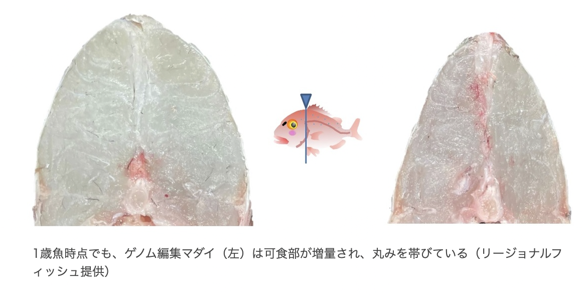

##  Increased edible portion sea bream 

 

### ＜概要＞ Overview 
2019年9月、京都大学と近畿大学は、ゲノム編集技術を応用して作出した「可食部増量マダイ」について、厚生労働省と農林水産省への届出を完了した。なお、このマダイは、国の手続を経て上市する、世界で初めてのゲノム編集動物食品となる。外部から遺伝子を導入しているわけではないため、安全性は品種改良と同等とされ、厚労省の専門家会議で問題がないと判定された。リージョナルフィッシュ株式会社が流通、販売する。まずはクラウドファンディングで190食分の予約受付けを開始し、10月より順次発送する。 

In September 2019, Kyoto University and Kinki University completed the notification to the Ministry of Health, Labour and Welfare and the Ministry of Agriculture, Forestry and Fisheries regarding the "edible portion-enhanced sea bream" created by applying genome editing technology. This fish is the world's first genome-edited animal food product to be put on the market through national procedures. Since no genes are introduced from the outside, the safety of the product is considered equivalent to that of improved breeds, and the Ministry of Health, Labor, and Welfare's expert panel has determined that there are no problems. Regional Fish Corporation will distribute and sell the product. First, the company will begin accepting reservations for 190 servings through crowdfunding, with shipments beginning in October. 

### ＜特徴＞ Traits 
通常のマダイよりも可食部を増やしているため、養殖の際の飼料利用効率を向上させる。受精卵の段階で筋肉細胞の成長を抑える遺伝子をゲノム編集で破壊した。成長すると一般のマダイに比べ、筋肉の量が最大1.6倍、平均1.2倍になり、可食部が大幅に増えている。 

The edible portion of the fish is increased compared to normal sea bream, which improves feed utilization efficiency during aquaculture. A gene that suppresses the growth of muscle cells at the fertilized egg stage was destroyed by genome editing. When grown, the fish has a maximum of 1.6 times more muscle mass and an average of 1.2 times more edible portion than regular sea bream. 

### ＜方法＞ Modification methods 
マイクロインジェクション法によって、受精卵にCas9 mRNA 及びマダイミオスタチン遺伝子の配列の 20塩基を特異的に標的とした gRNA を移入。ゲノム中のミオスタチン遺伝子の特定の場所を切る。すると、ミオスタチン遺伝子から14個の塩基が失われ、遺伝子として働かないようになる。注入したツールは細胞中で自然に分解される。 

Transfer of Cas9 mRNA and gRNA specifically targeting 20 bases of the sea bream myostatin gene sequence into fertilized eggs by microinjection method. The specific location of the myostatin gene in the genome is cut. Then 14 bases are lost from the myostatin gene and it no longer works as a gene. The injected tool is degraded spontaneously in the cell. 

 

[→ more information about this project: press release](hhttps://prtimes.jp/main/html/rd/p/000000008.000060432.html) 

*References* 
[→　company web site](https://regional.fish/genome/) 
[→　cloud funfding site](https://camp-fire.jp/projects/view/400934)