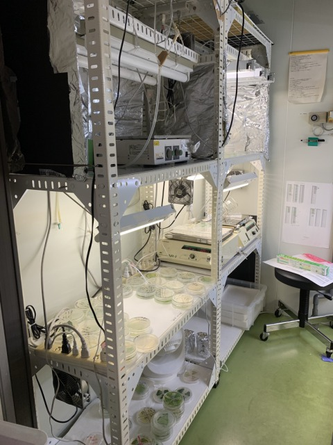
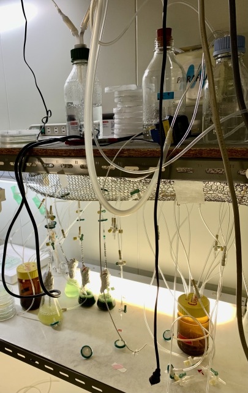

##  1. Visit Metaphorest in Waseda on 4th April 

### - Differences from our lab @ Shibuya 
(1)Security guards at the entrance, strictly controlled 
  Indicate your name and receive a guest card. 

(2)Several units of the same type of equipment 
  ※Some are even not in use. 

*Autoclaves* 
 
*Incubators* 

 
The temperature depends on the type of cyanobacteria, but in this laboratory it is kept at about 30 degrees Celsius. 

Incubator with strict control of light intensity 

Liquid media have the advantage of being able to culture full numbers.
The air is sent through a tube, but because it dries out quickly if sent as is, water vapor is passed through the air once. A filter is also passed through to prevent bacteria.

(3)

### - Commonalities with our Lab @ Shibuya 
(1)