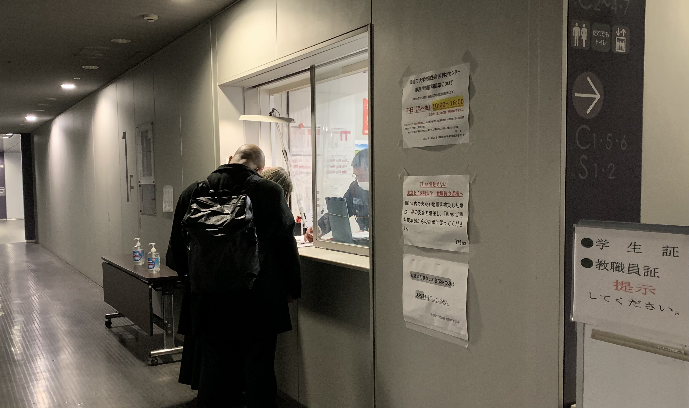
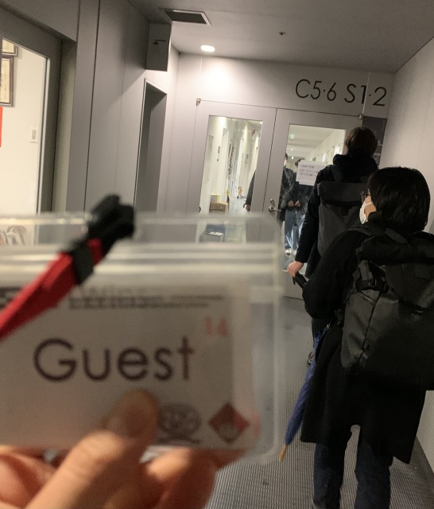
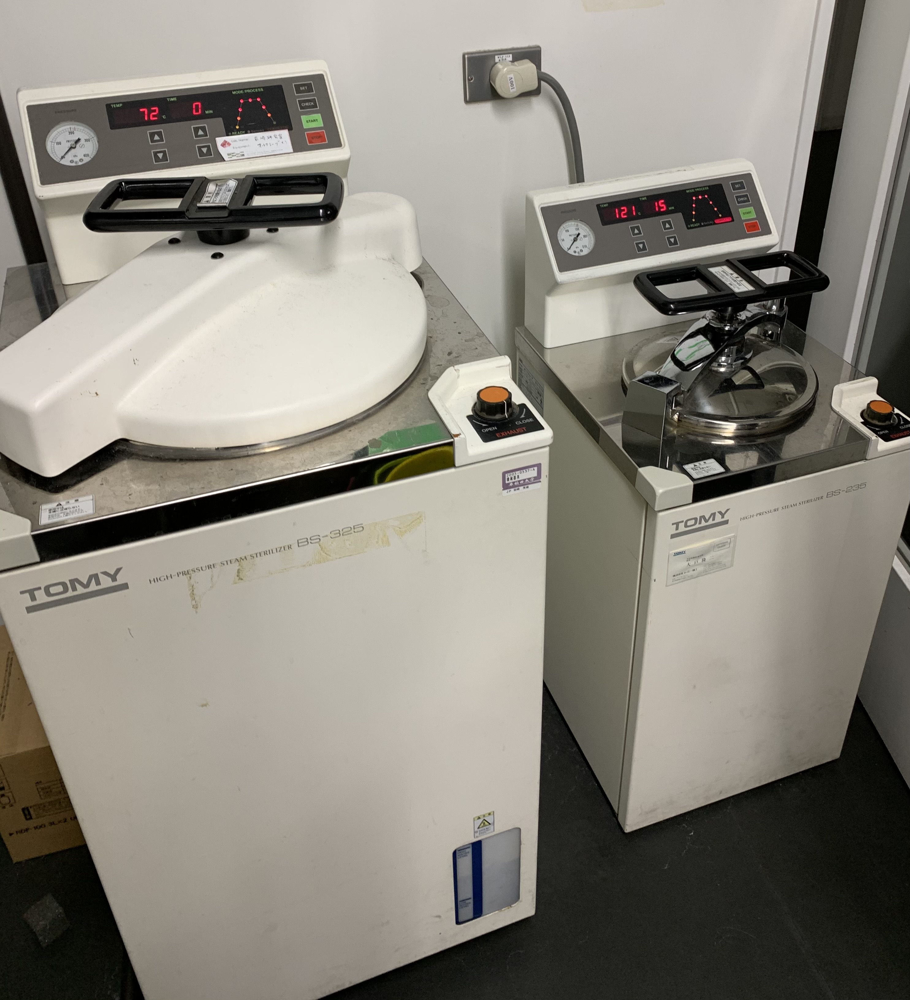
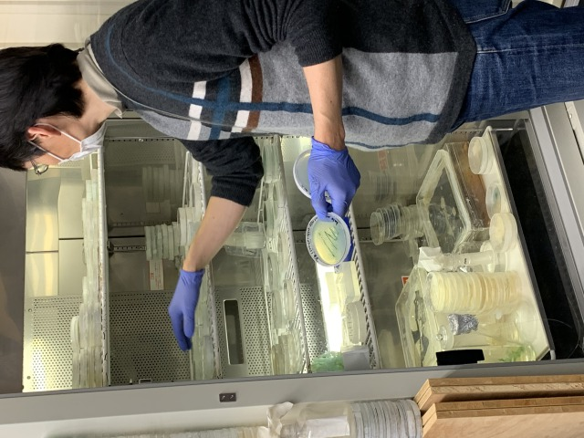
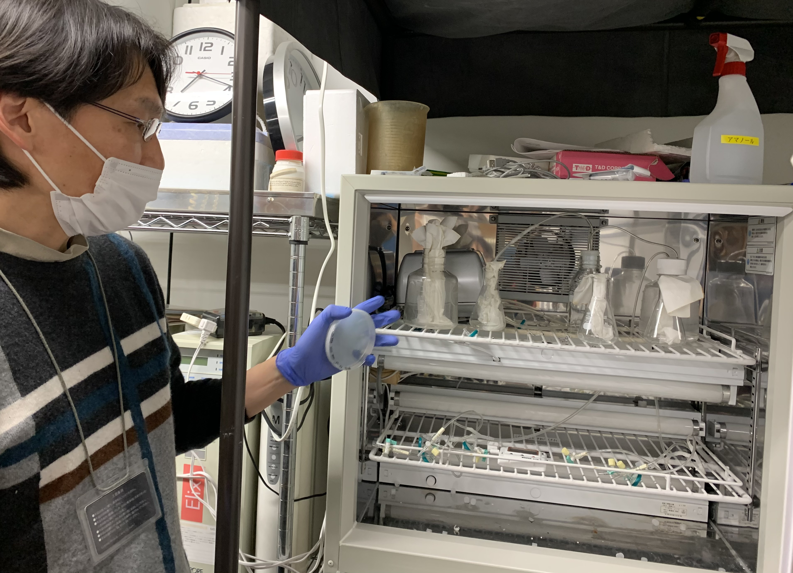

##  1. Visit Metaphorst in Waseda on 4th April 

### Differences from our lab @ Shibuya 
(1)Security guards at the entrance, strictly controlled 
  Indicate your name and receive a guest card. 

(2)Several units of the same type of equipment 
  ※Some are even not in use.
*Autoclaves* 

*Incuvators* 

