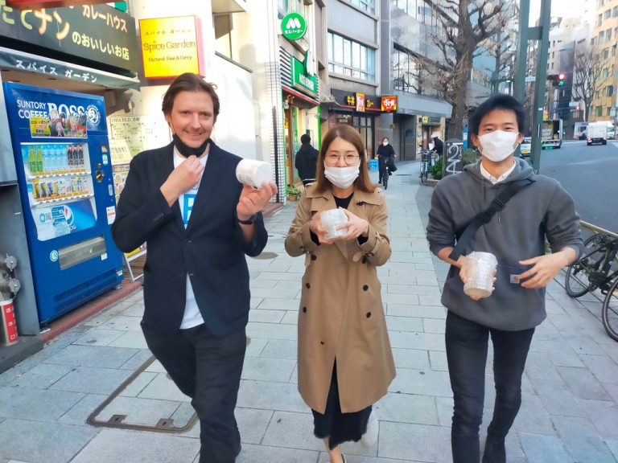
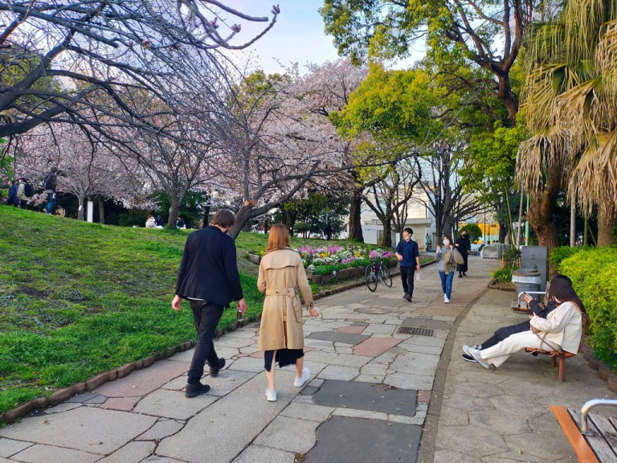
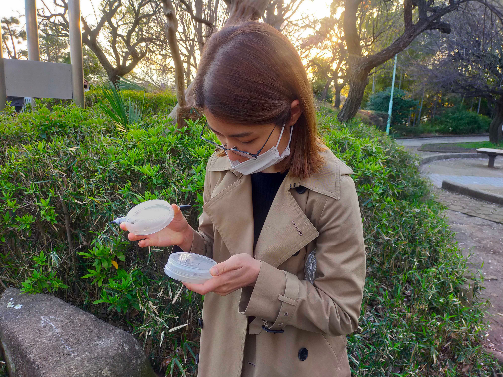
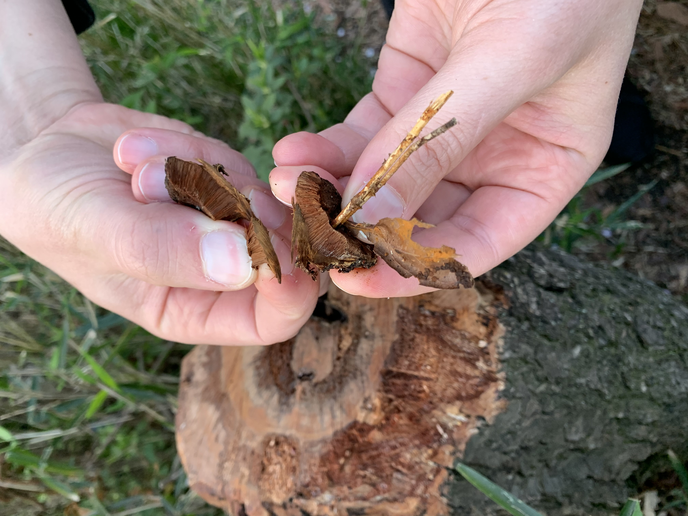
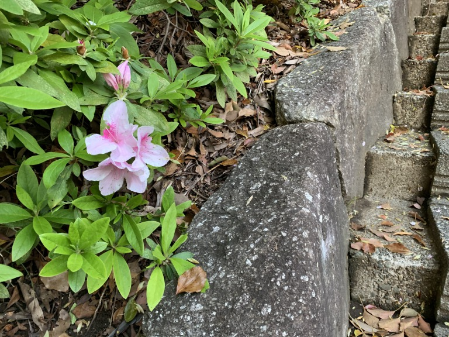
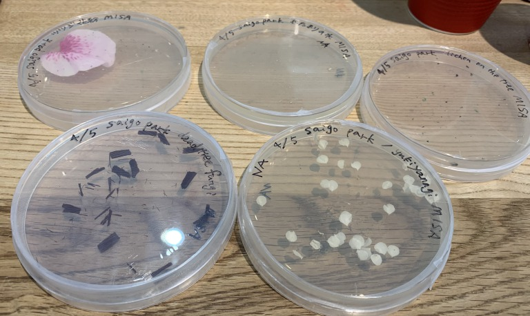
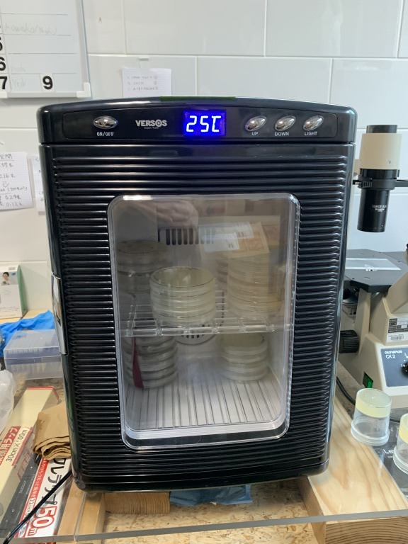

##  2. Bacteria hunting at the park 

We went to collect bacteria using the medium we had made.

- Puddle of water after rain 

- Fungi 

- Azalea pollen and petals 

Put them into the incubator and see what will happen. 

