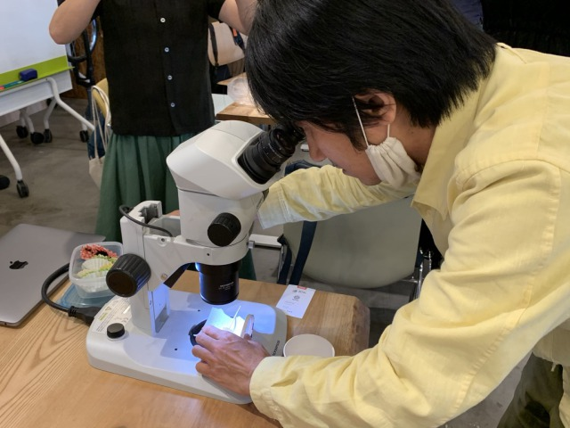

### 12th April, Tue

We had guests. 
Together we tasted and observed miso by age.

The older it gets, the more intense the flavor, the more watery, and the finer the grain.

 
↑2 years 

 
↑6 years 
