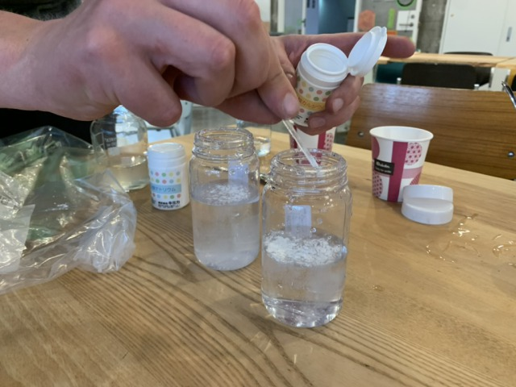
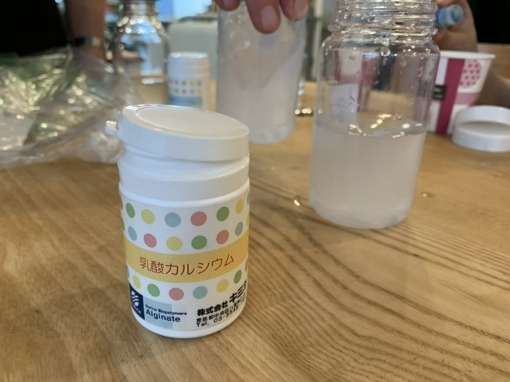
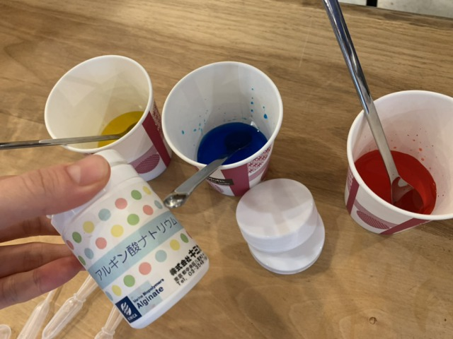
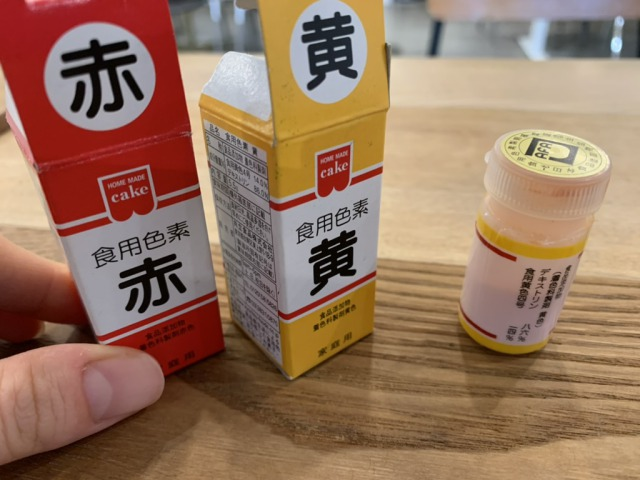
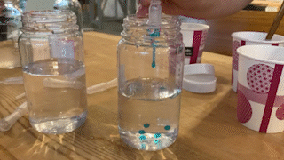
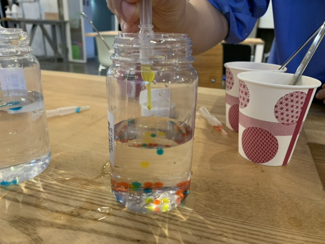
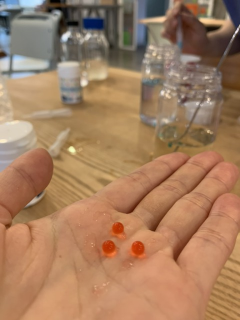
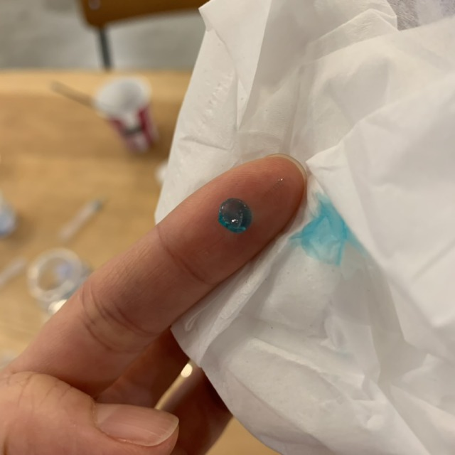

### 19th April, Tue

We made artificial colorful Ikuras!! (Spherification)

**Recipe**
- 乳酸カルシウム calcium lactate : 1 or 2 spoonfuls 
※Ingredient also found in xylitol gum.
- アルギン酸ナトリウム Sodium alginate : 1 or 2 % 
※An ingredient extracted from seaweed. One of the dietary fibers. When dissolved in water, it becomes a highly viscous aqueous solution.
- 食用紅 edible colors

 
↑Preparing calcium lactate

 
↑Preparing sodium alginate and adding colors

Dropper drop by drop of alginate, and they go straight into spheres! They look cute! 

They really look like Ikura. 
Not only do they look similar, but they also feel quite similar.
When crushed, it crushes like real Ikura. 

