### 19th April, Tue

We visited Miraikan to see "Microbes actually are all around". 
→[セカイは微生物に満ちているweb site](https://www.miraikan.jst.go.jp/news/general/202204072408.html)

**■感じたこと** 
展示の世界観に示されていたような、微生物の多様性を積極的に人間の生活にと入り入れるような社会になって欲しいと思ったし、私もそういう世界に住みたいと共感した。 
**What I felt :**  
I hoped for a society that would actively incorporate the diversity of microorganisms into human life, as shown in the worldview of the exhibition, and sympathized with the idea. I would like to live in such a world. 

**■理由** 
今は、住宅メーカーがエネルギー効率を優先して、窓を閉め切って密閉された生活空間を推奨したり、おそらく多くの人が除菌や清浄さを追い求めることに価値があると思っているけれど、私はそういう他の生物を排除する世界に住みたくないし、それで幸せになれると思えないから。 
**Why I felt that way :** 
Nowadays, homebuilders prioritize energy efficiency and recommend enclosed living spaces with closed windows, and probably many people think there is value in the pursuit of sterilization and cleanliness. But I don't want to live in a world that excludes those other creatures, and I don't think it would make me happy. 

- **Planting** 
Plants were installed 3 weeks ago and brought from Mie and Yokohama prefectures. 
There is no drainage system, so I mist the leaves morning and night and water them in a bucket set up under the tree. 

  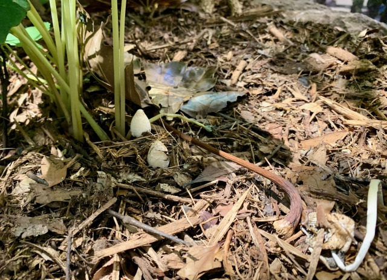 
  ↑Mushrooms that weren't there three weeks ago

  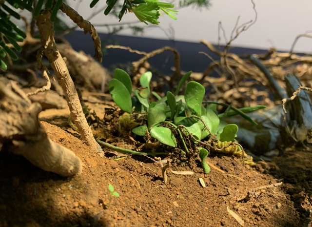 
  ↑New buds are sprouting

  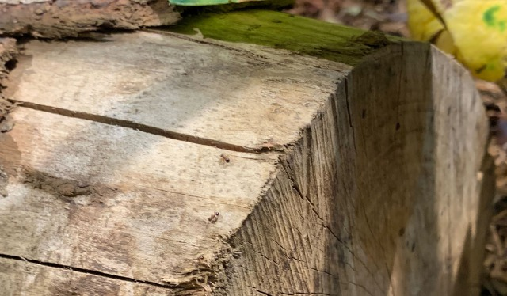 
  ↑Ants are walking around

  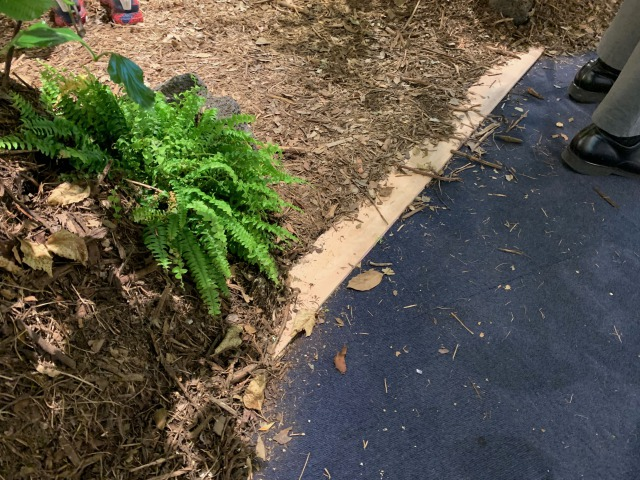 
  ↑The spread of wood chips on the floor can be said to be the spread of microorganisms

- **Nukabot** 
The reactions are cute and fun to talk to. 
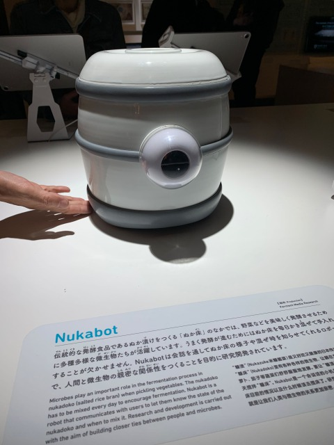

- **About the diversity of microbes** 
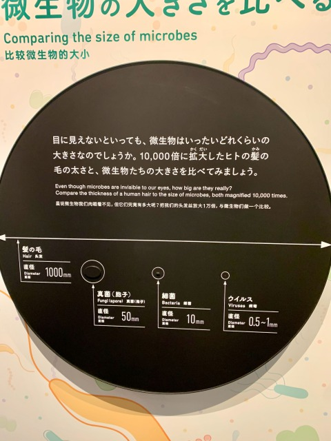 
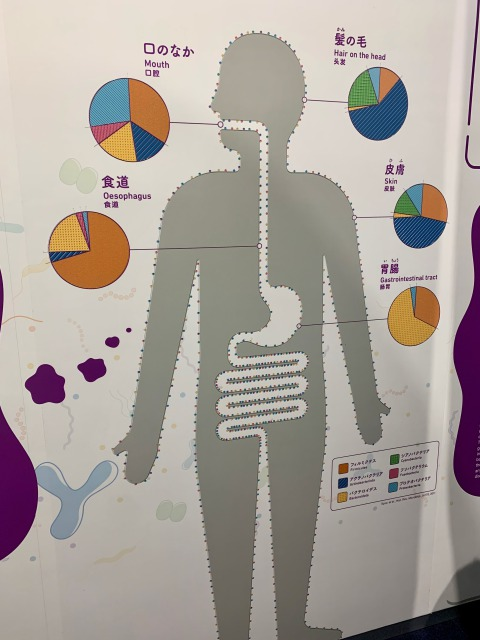 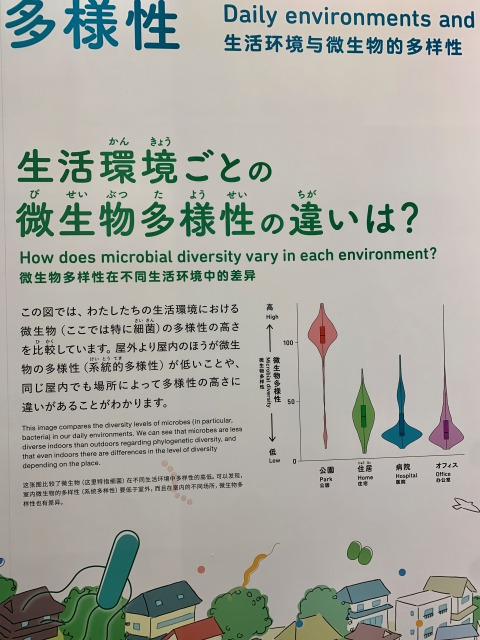

- **New Lifestyle Proposal** 
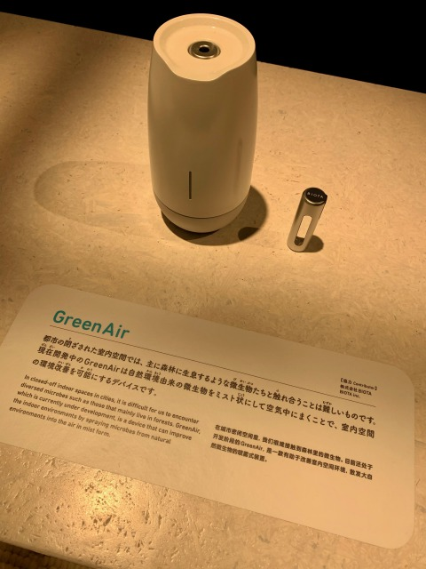
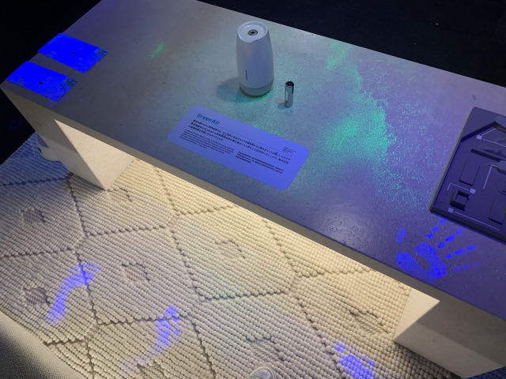

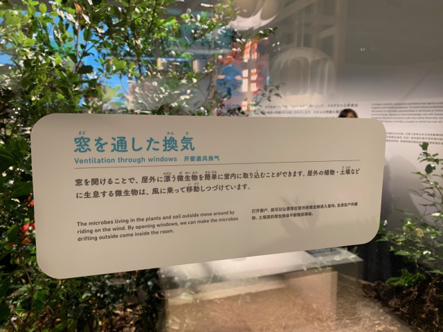
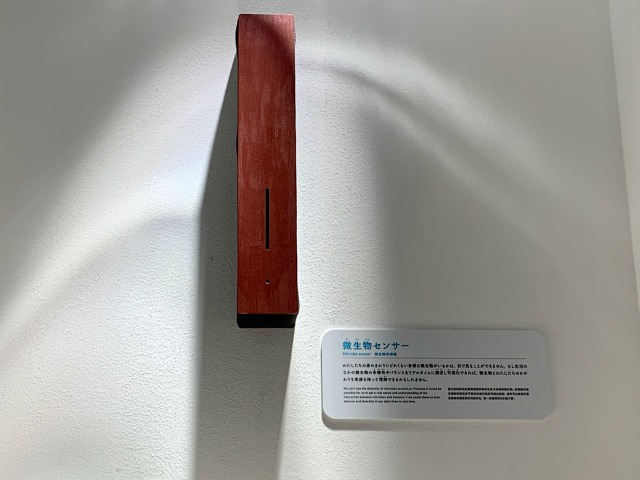