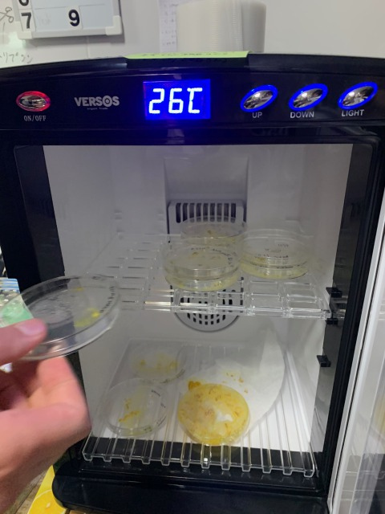
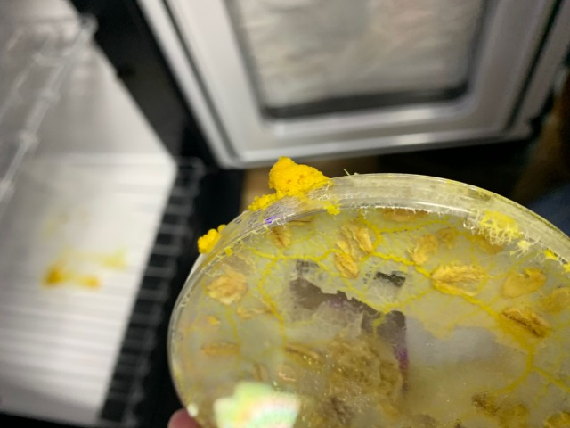
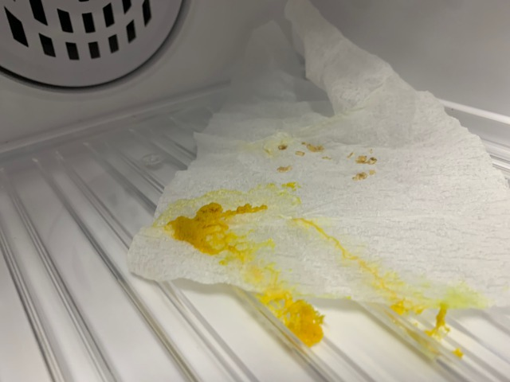
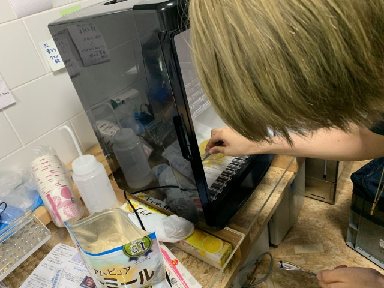
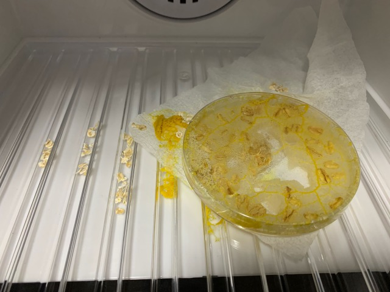

### 25th April, Mon

 They are moving faster than I had imagined.
 Some of them are trying to escape from their petri dishes.
 
 
 
 

  Try placing oatmeal in the incubator as well for the escaped slime mold.

 
 

