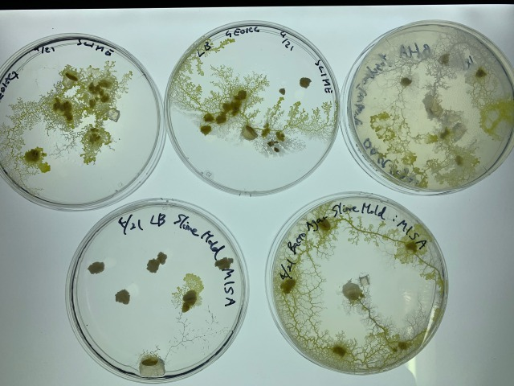
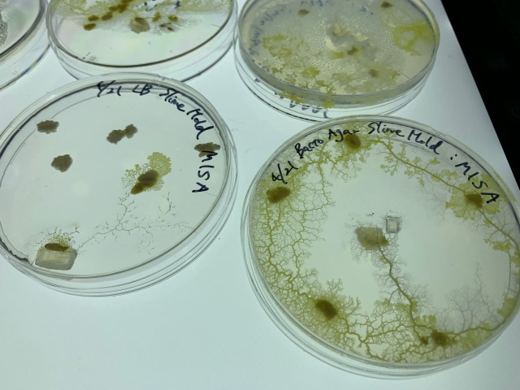
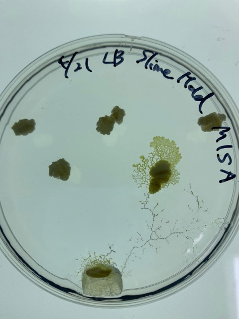
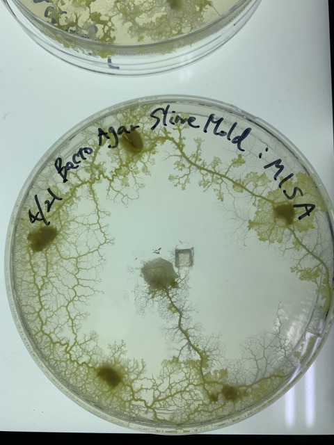
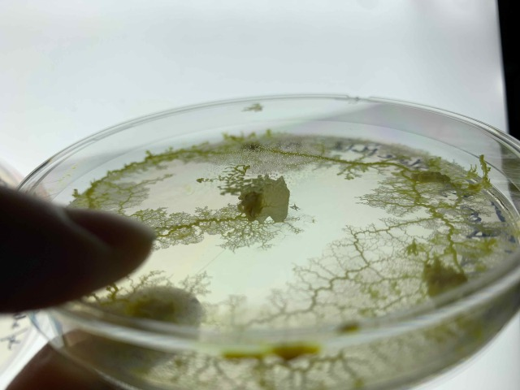

### 25th April, Mon

 They are moving faster than I had imagined.
 Some of them are trying to escape from their petri dishes.
 
 
 
 
 
 Try placing oatmeal in the incubator as well for the escaped slime mold.

 
 

 It seems like that slime mold like LB medium, because the movement appears to be slower in the case of LB.

 
 

 Their footprints are so beautiful.

  
 ↑They found the first oatmeal:) 

 
 

