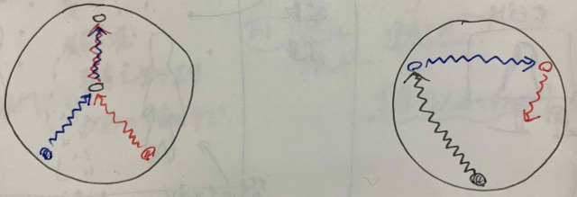

### 26th April, Tue

  They still seem to have a passion for moving on. 
  And round and shiny objects appear to be formed.

  
  

  When they have eaten their fill, the food is gone.
  

  ### We made different patterns and transplanted them!
  

  - My sketch 
  
  
  - My prediction 
  
  
  - What I put them down 
  
  

