### 21th April, Thu

We began to cultivate slime mold!!

They came from America. 
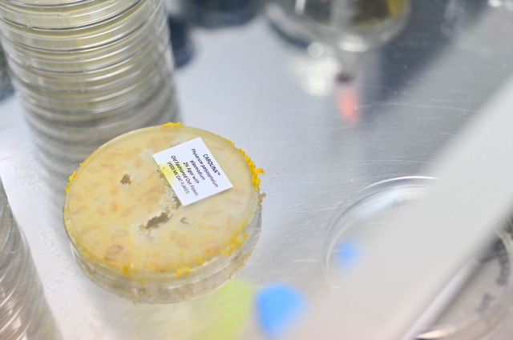

**1. Preparing a special incubator for them** 
We stuck up some cardboard and darkened the room. 
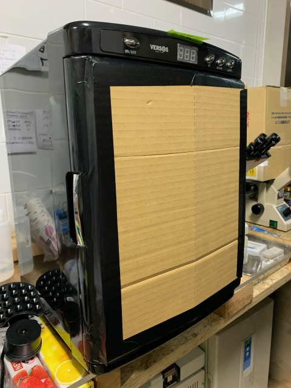

**2. Preparing their food** 
They like to eat oatmeal. 
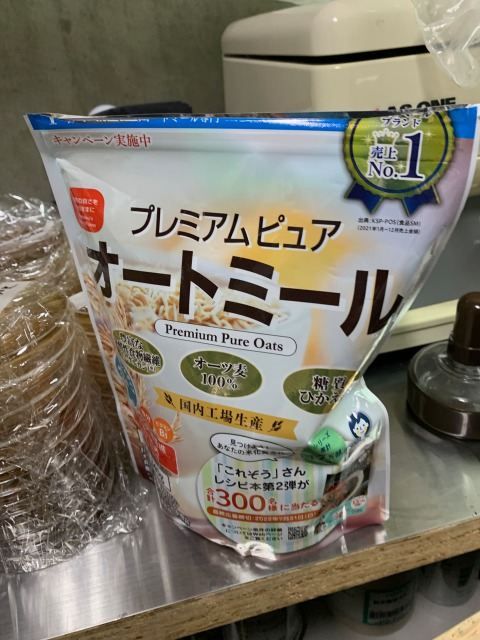

**3. Preparing medium** 
We prepared two types: bactu agar and Gelrite.
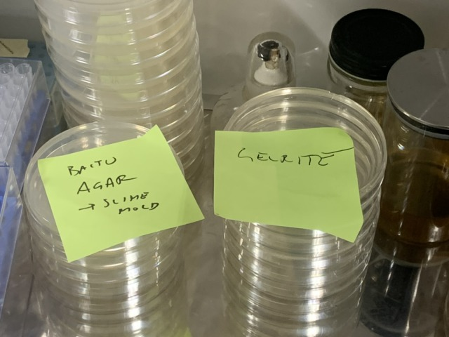

**4. Sterilizing tools** 
Keep tools in ethanol. 
Before use, further sterilize with an alcohol lamp. 
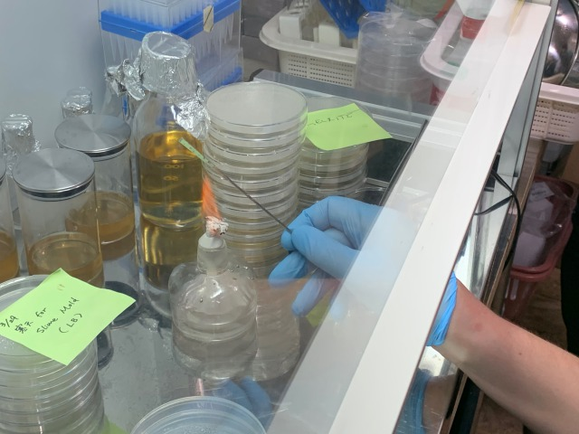 
※Be careful not to get too hot or the organisms will die. 
To ensure that it is not hot, it is better to touch the agar without anything before touching the organism.

**5. Labelling your patri dishes** 

**6. Transplanting slime mold** 
Cut the piece and transfer it to the petri dishe. 
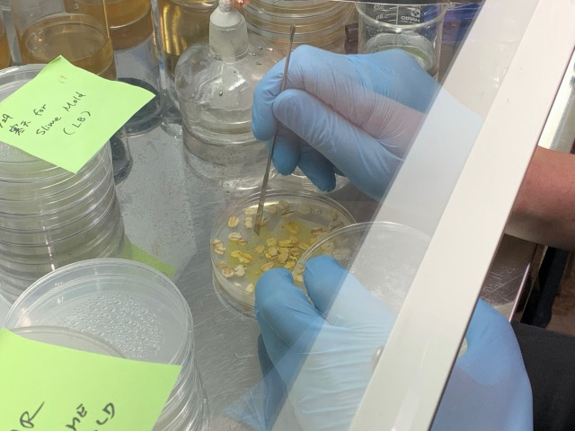
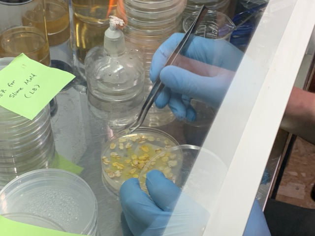

**7. Placing oatmeals** 
Place as many oatmeal pieces as you like where you want. 
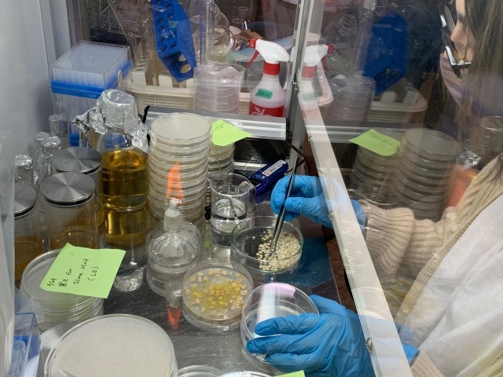
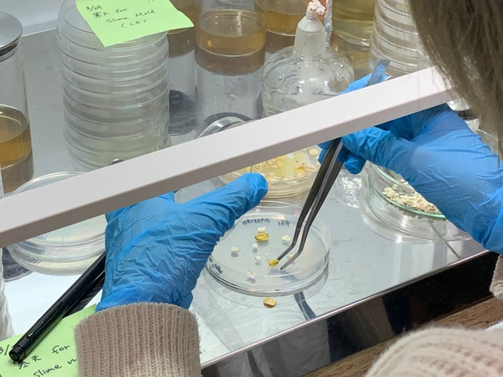

**8. Can't wait to see what happens!** 
Put them into the incubator. 
Keep the tape off so that they can breathe. 
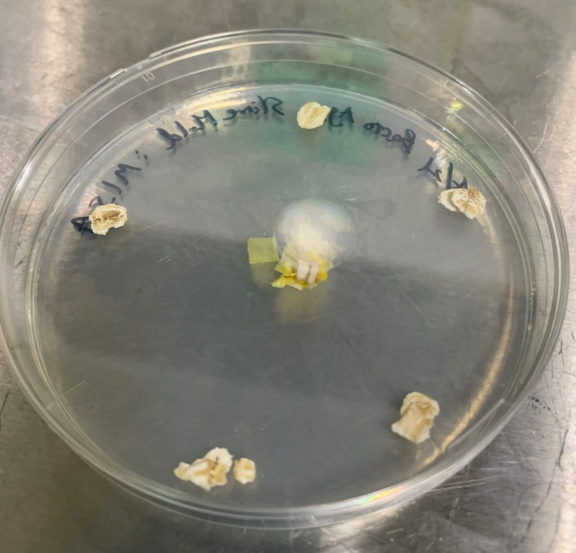
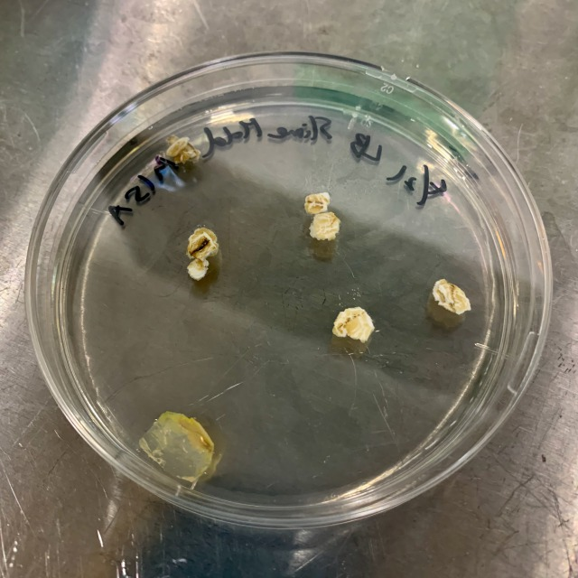

***

[- 25th April](0425/index.md) 
[- 26th April](0426/index.md) 
[- 27th April](0427/index.md)