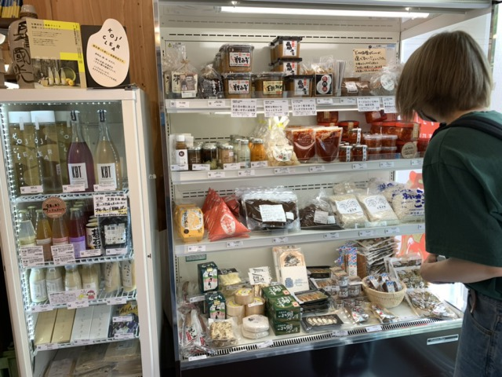
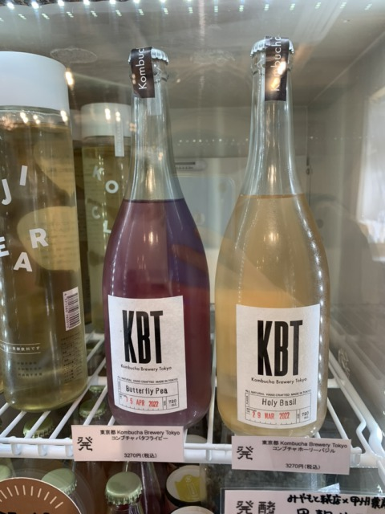
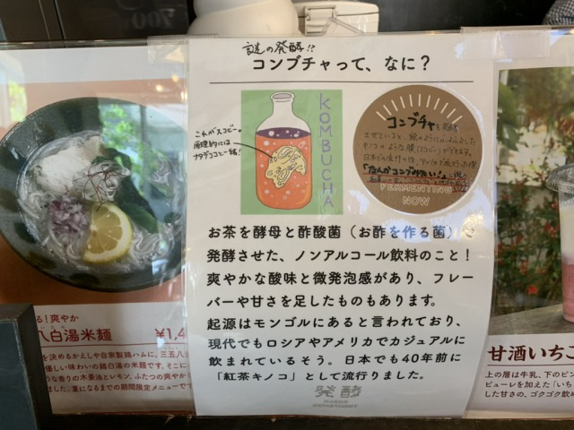
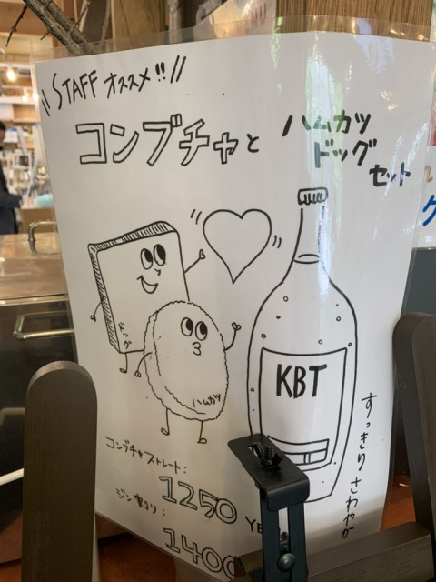

### 25th April, Fri

We Visited "Hakko department" produdced by [Hiraku Ogura (fermentation designer)](https://hirakuogura.com/?page_id=5381)!!

- **Inside the store** 
Selected fermented foods from all over the country are available for purchase. 

  They have also SCOBY tea!! 1 bottle 3270 yen...
  
  
  

- **Feature** 
In the store, some of the pickles are fermented and made. In particular, Aomori's ["Godo"](https://hirakuogura.com/?p=12001) is rarely sold outside of Aomori Prefecture, and Hakko department receives the bacteria from Aomori to make it. The company is currently developing the product for sale. 

↑The one at the far end is "Godo".

- **Lunch** 

  I ordered hashed meat with rice and [Goishi-cha](http://goishicha.jp/).
   
  ↑There is "Rakkyo" on the top. 
   
  ↑Goishi-cha is a fermented tea and full of plant lactic acid bacteria.