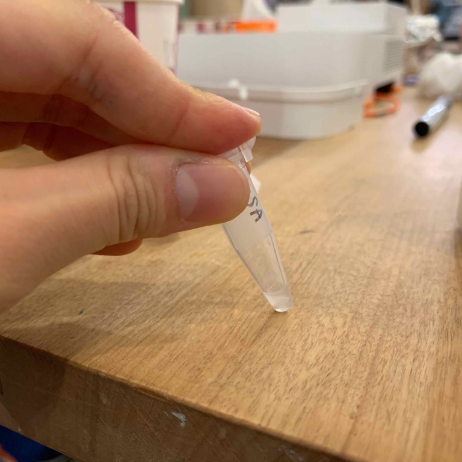

### 26th April, Tue
### DNA extraction from salva

[→BentoLab protocol](https://bento.bio/protocol/biotechnology-101/dna-extraction-from-saliva/) 
※Before the experiment, you shold read the protocol and keep the track of th e flow.  
実験前に流れを把握しておくこと。

 
 

**1. Prepare the Sample Tubes チューブを用意** 
You will use 1.5 mL tubes to extract the DNA samples from saliva. 
To start, prepare each tube by labelling them with a permanent marker. 
唾液からDNAサンプルを抽出するのに、1.5mlのチューブを用意する。 
油性マジックで日付と名前を事前にラベリングしておく。 
 

**2. Prepare Saline Solution うがい液を用意** 
You will need salt water (saline solution) as a mouthwash to collect your cheek cells. The measurements do not need to be exact. A pinch of salt for a small sip of water is a good rule of thumb. 
ほっぺたの細胞からDNAを集めるために、塩水でうがい液を用意。塩はひとつまみでOK。 
このとき、水が多すぎるとうまくいかないので、ほんの一口の水でOK!! 

**3. Rinsing your mouth うがいする** 
Rinse your inner cheeks vigorously for 30-60 seconds. 
30~60秒うがいする。 
（結構長い。）

**4. Transfer your sample into the microcentrifuge tube 唾液をチューブに移動する** 
Fill it up to the 1.5 mL mark. 
チューブの1.5mlマークまで唾液を入れる。 

**5. Centrifuge 遠心分離機にかける** 
It is time to use the centrifuge. This will use gravitational force to concentrate the sample. 
Put the centrifuge tube with your saliva sample into the centrifuge. Make sure to balance the centrifuge with another sample or with another counter weight. 
If you only have one sample, the easiest way to balance the centrifuge is to fill another tube with water and use it as a balancing tube. Using the centrifuge in an unbalanced way is dangerous and will break the device. 
サンプルを遠心分離機に設置する際、くれぐれもバランスに注意すること。もしバランスが悪いと機器が壊れたりして危険。サンプルが１つの場合は、反対側に水を入れたチューブを設置する。チューブの向きにも注意。 
 
 

Set the speed to 4,000G and spin for 90 seconds. 
4,000G、90秒でセットし、スタート。 
※It's quite loud! 結構大きな音がする！ 
 
 

**6. Recovering the Pellet 遠心分離機にかける** 
All the cheek cells should now be concentrated in a small white ball at the bottom of the tube. This is called a pellet. The remaining liquid, called the supernatant, should be clear. = decanting 
In this step, you will remove the supernatant, so only the white pellet remains. 
チューブの下の方に、白い塊として頬の細胞がくっついている。＝ペレット 
ペレットの中にDNAがあるので、ペレット以外の上澄み液は捨てる。=デカントする 
 **< New to me > **
 - pellet: 小さな塊の形状 
 - supernatant: 上澄み液 
 
 

**7. Resuspending the Pellet ペレットを再度液に馴染ませる(爪ではじく！)** 
A white pellet should be about the size of a matchstick head. 
If it is smaller than a matchstick head, you may not have enough cells. In that case, go back to concentrate additional cheek cells from saliva.  
Once you have a large enough pellet, you can resuspend the cells into the remaining liquid that is still in the tube by **flicking** it. The cells of the pellet are now resuspended in the liquid. 
もしペレットの量が少なかったらもう一度うがいに戻って細胞を追加する。量が十分なら、チューブを爪で弾いたり机に叩いて、ペレットと少量残った液体を再度ミックスする。 
 
 

**8. Transfer to PCR　tube PCRチューブに液体を移動させる** 
