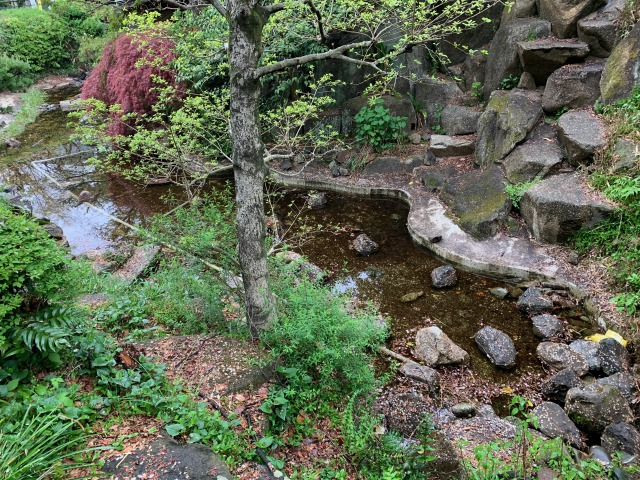
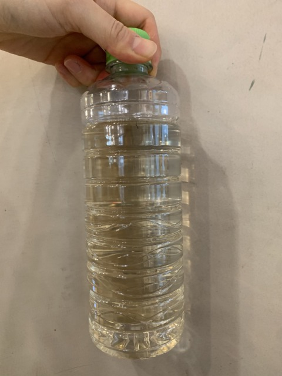
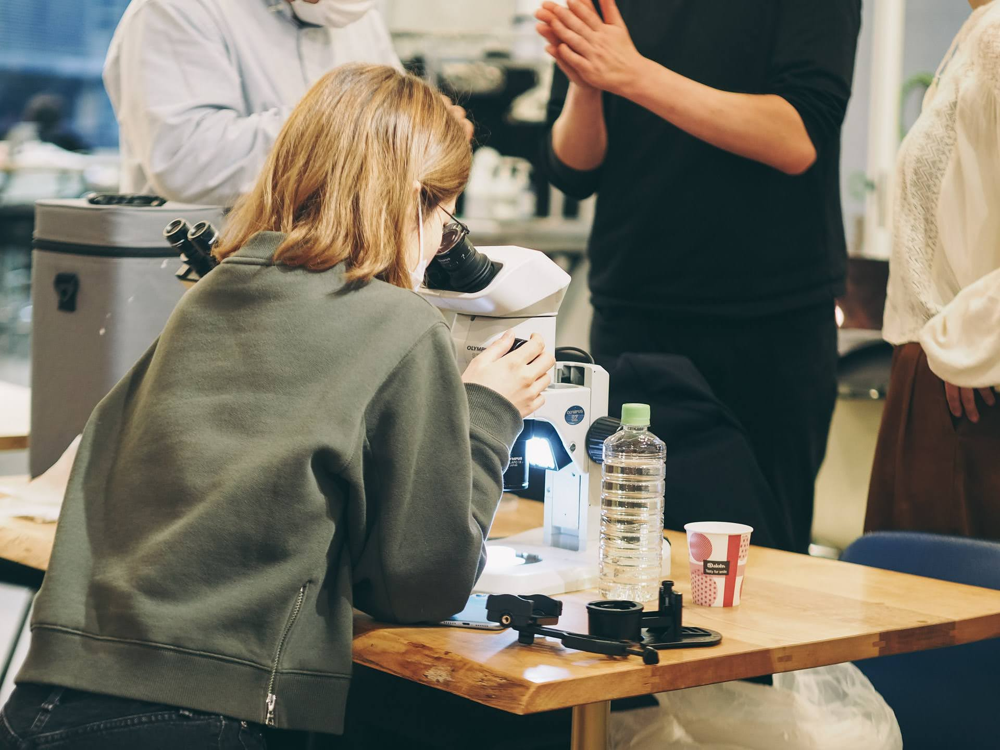
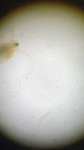

### 14th April, Thu

- I got some microorganisms in the pond at the park near from the lab.

  
  

- Under the microscope...
   
   
  Few moving organisms were found.
  This is a park pond in the city center and the water may have been disinfected.
  Alternative acquisition methods should be considered.