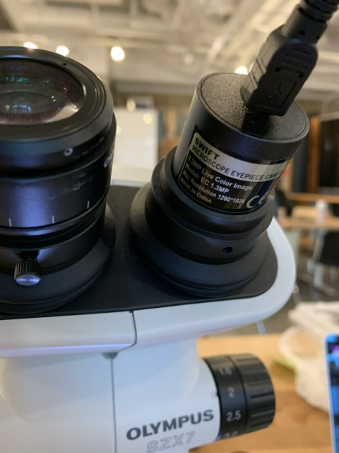
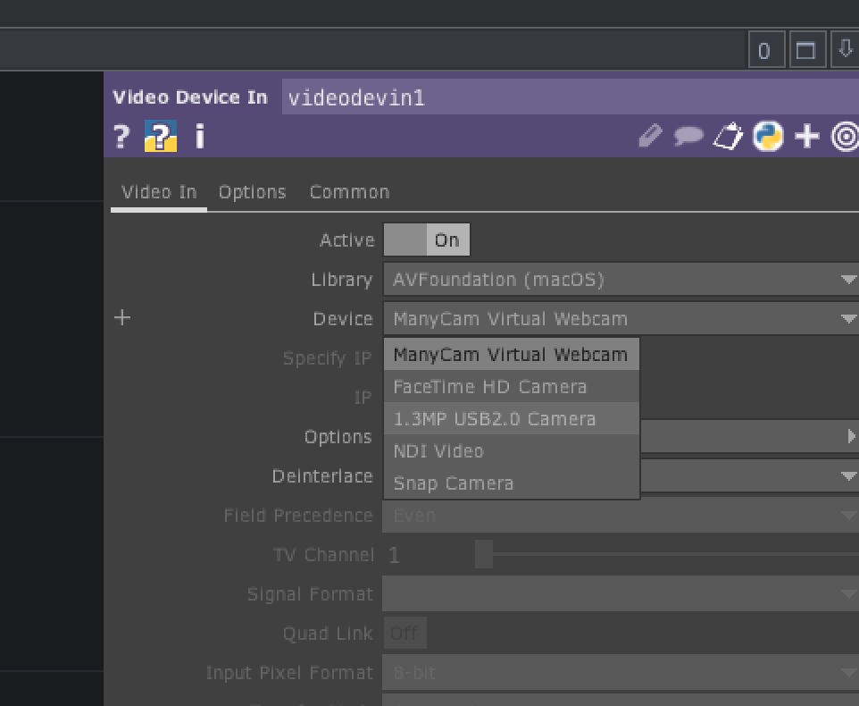
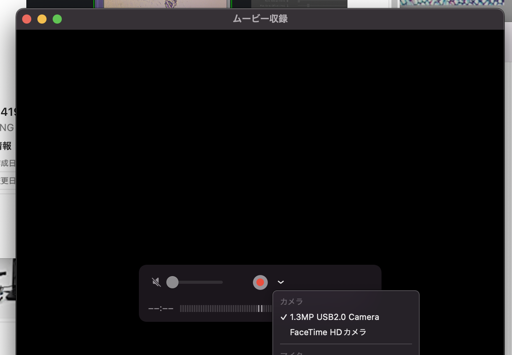
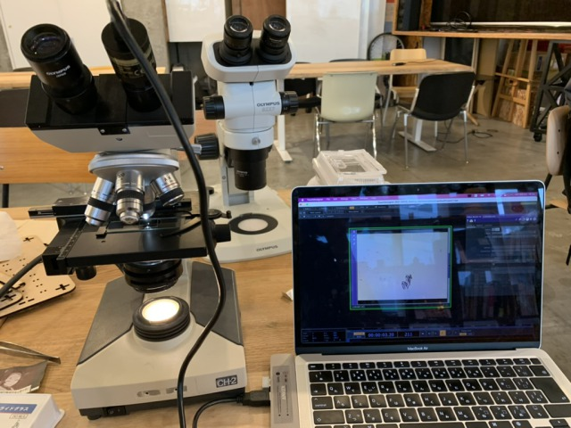
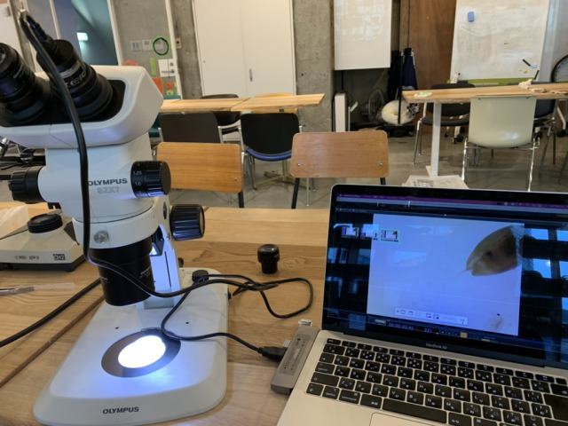

### 19th April, Tue

I tried to see if SWIFT webcam would fit the microscope. 

→[SWIFT webcam](https://www.amazon.co.jp/gp/product/B07Z8LKKDZ?ie=UTF8&linkCode=sl1&tag=biohackerjp-22&linkId=477b0c42a3667df859f84f0964bba138&language=ja_JP&ref_=as_li_ss_tl&th=1)

after connecting USB to your PC, choose "1.3MP USB2.0 Camera" for the input.

↑TouchDesigner

↑QuickTime

With both microscopes, I was able to view the images on the PC.

↑Olympus CH2 microscope

↑Olympus SZX7 stereomicroscope

Maybe I will use SZX7. 
Note that if the magnification is increased too much, the field of view will be narrowed and the number of visible objects will be reduced. 

↑The eyepiece is 20x and objective lens is 8~10x.