### 27th April, Wed

I made black medium for E.coli. 
Beacuse E.coli is white, I wanted them to be visible. 

大腸菌用に黒い培地づくり。 
大腸菌は白いので、見やすくするために黒い培地にする。 

*Recipe* 
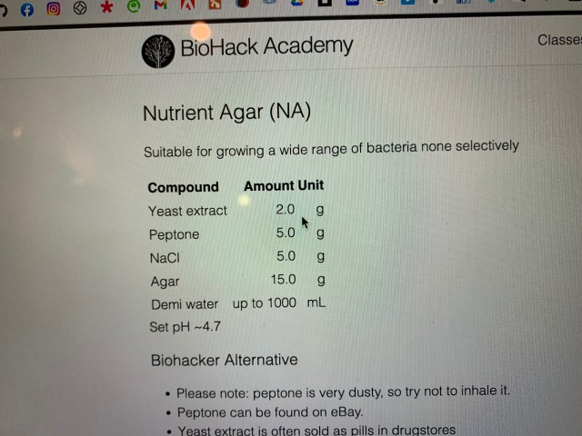 
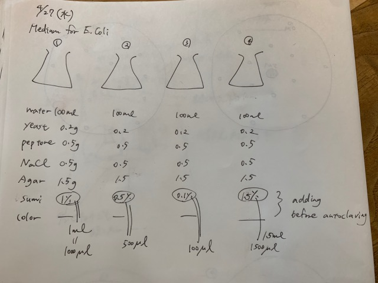 

When it comes to black, it's sumi ink! 
So I made 4 patterns of medium with different concentrations of black ink. 
(0.1%, 0.5%, 1.0%, and 1.5% for 100 ml solution) 
I added sumi ink before autoclaving. 

黒といえば墨汁なので、墨汁の濃度別に４パターンの培地を作る。 
（100mlの溶液に対して、0.1%, 0.5%, 1.0%, 1.5%の４種類） 
墨汁はオートクレイブ前に入れておく。 

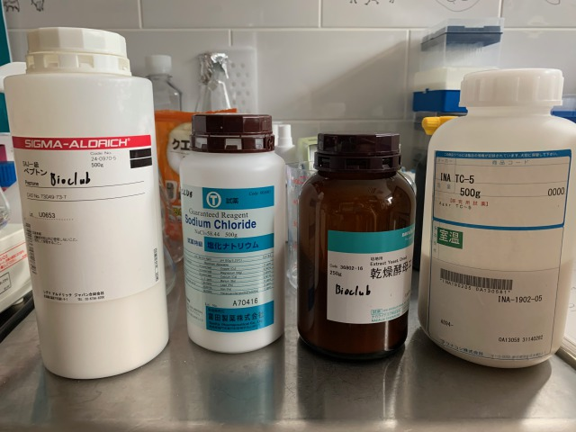 
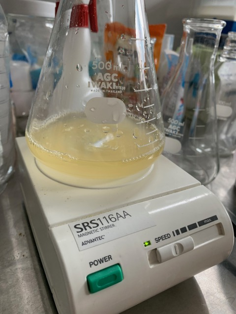 
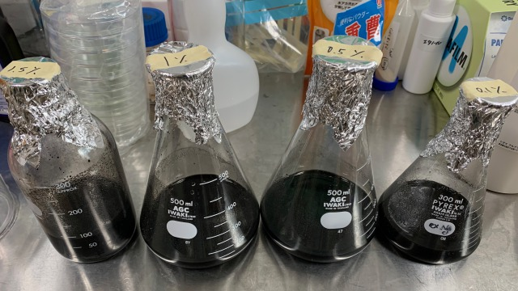 

After making four types, put the bottles into autoclave. 

４種類作ったら、オートクレイブへ。 

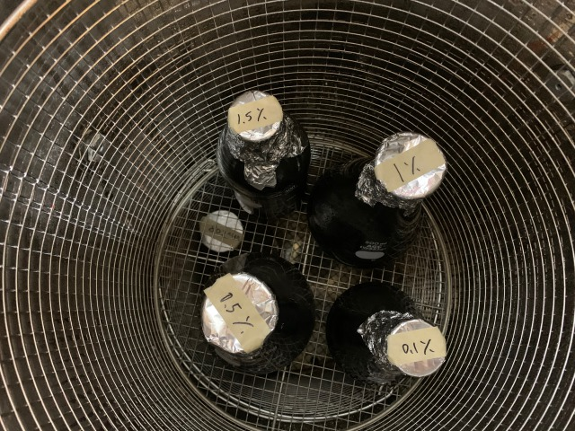 

When I tried to pour the liquid into each petri dish, the liquid began to solidify immediately. 
Regardless of the ink density, the medium became uneven. The ink has a resin component. Is it because of the resin...? 

petri dishに注ごうとしたところ、液体が即刻固まり始めてしまった。> 
インクの濃度に関係なく、培地がムラになってしまった。> 
墨汁には、レジンの成分が入っている。レジンのせいだろうか・・？> 

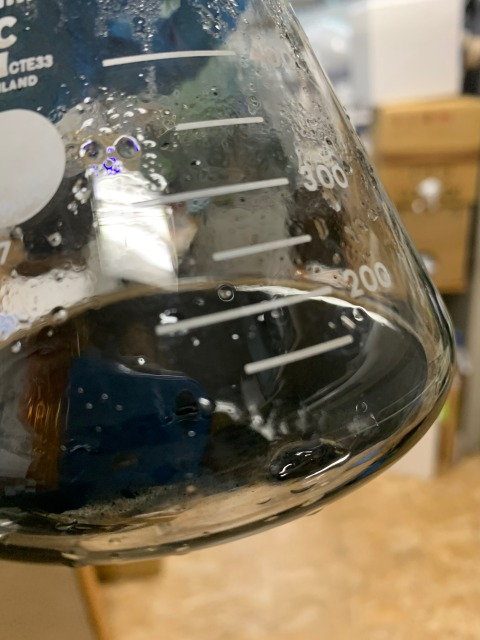 
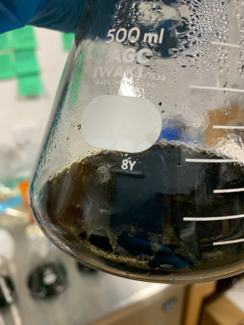 
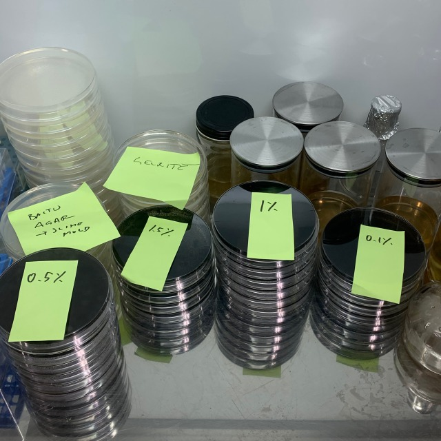 
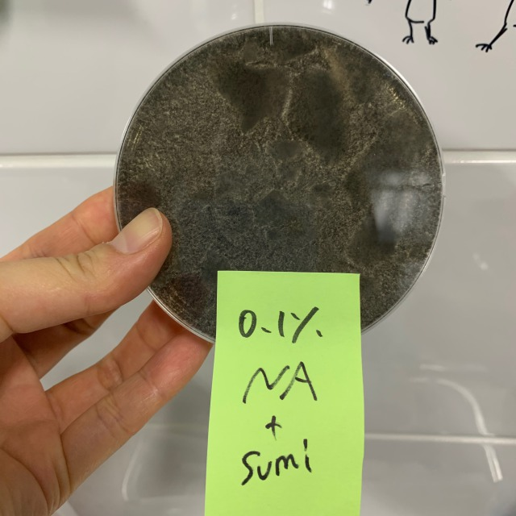 
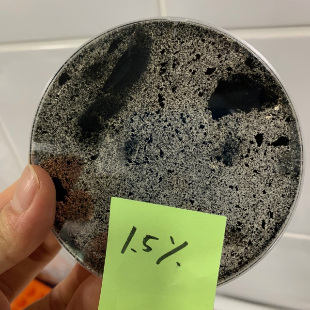 