### 28th April, Thu

Let's culture E.coli! 
大腸菌を培養してみよう！

(1) First, warm the incubator to 30°C. 
※If the temperature is too high, unidentified bacteria other than E. coli may be generated, so keep the temperature at about 30°C. 

まず、インキュベーターを30度に温めておく。 
※高温になり過ぎると、大腸菌以外の正体不明な細菌が発生する可能性があるので30度くらいにしておく。 

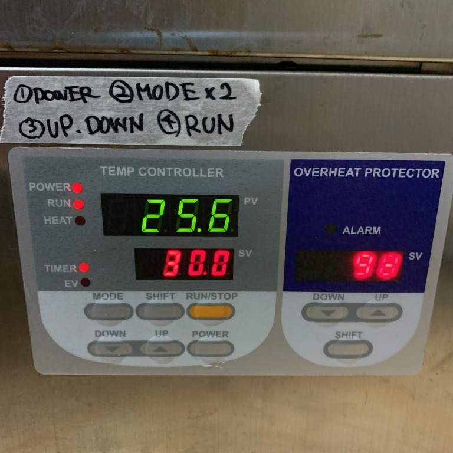 

(2)Then, prepare sterile water. 
Don't bother with autoclave, you can do it in the microwave. 
Fill a glass jar with water, loosen the lid, and heat it in the microwave for 2 minutes. At the end, you will hear a pshooing sound and the lid will rattle. 
Be careful, it's hot! 

滅菌した水を用意する。(distilled water : DW) 
オートクレイブをわざわざしなくても、電子レンジでできる。 
ガラス瓶に水を入れ、蓋をゆるめて、電子レンジで2分加熱。最後はプシューとか蓋がカタカタいう音がする。 
熱いので注意！ 

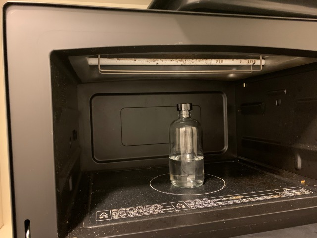 
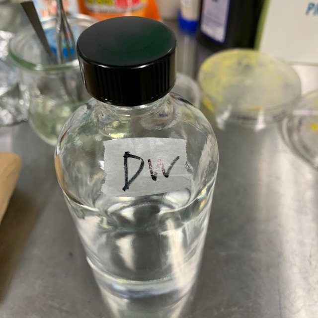 

(3)E. coli to the medium! 
First, revive the E. coli. 
Add 100 microliters of DW to the freeze-dried E. coli and shaker for 1 minute. 

大腸菌を培地へ！ 
まず大腸菌をリヴァイブする。 
フリーズドライした大腸菌に、100μリットルのDWを入れ、１分間シェイカーにかける。 

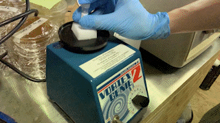 

Stroke into the medium using an inoculation loop. 
※As much as possible, do not scrape the medium. 
※You want a single colony here. As you stroke, the number of bacteria attached to the loop gradually decreases, so it is easy to make a single colony. 

イノキュレーションループを使い、培地にストロークする。 
※なるべく培地を削らないように。 
※ここでは、シングルコロニーが欲しい。ストロークすると、だんだんループについてる細菌が少なくなるので、シングルコロニーができやすい。 

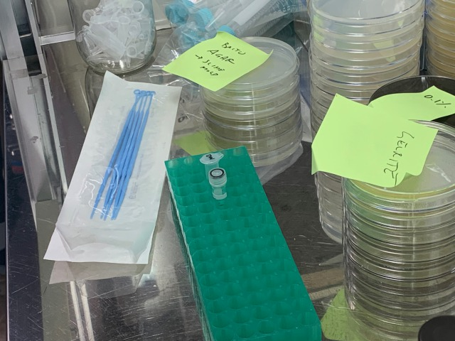 
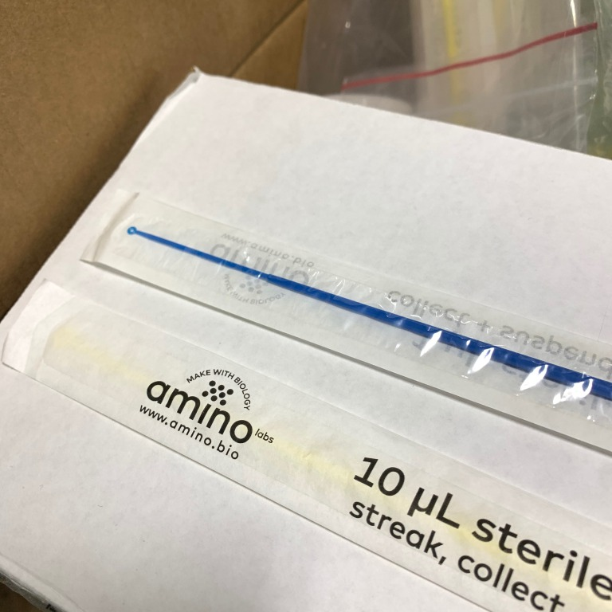 
↑inoculation loop 

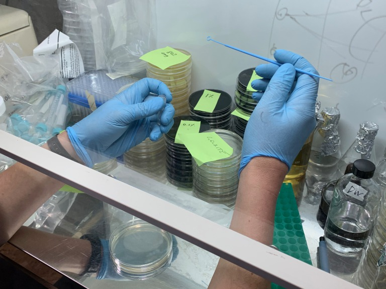 
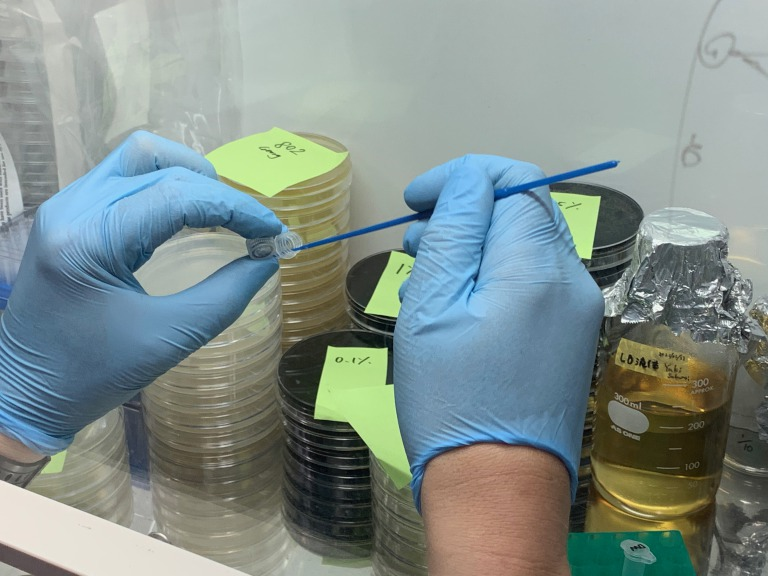 
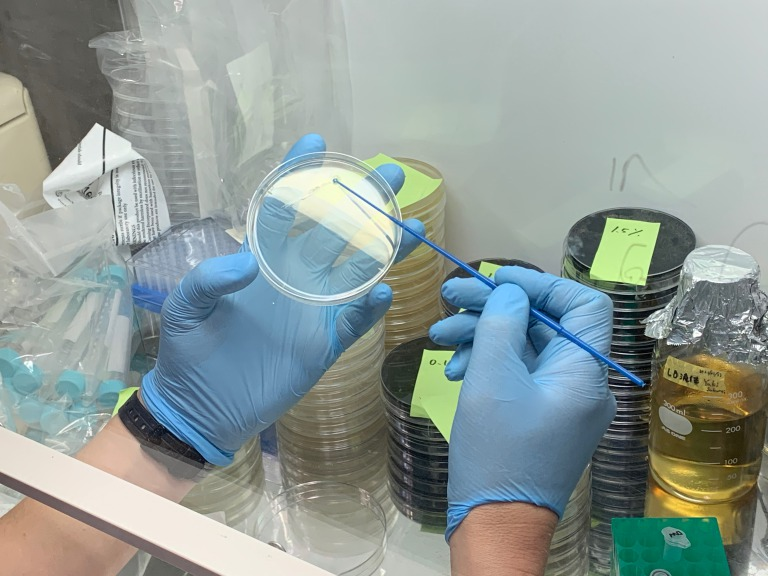 
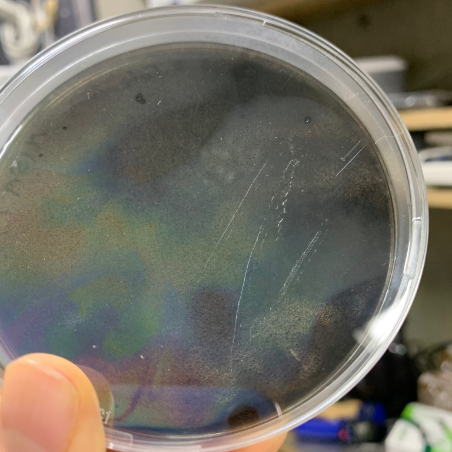 

Use a spreader to spread the entire medium. 
Put a few drops into the medium with a pipette, and then spread it by turning the petri dish. 

培地全体に広げるときは、スプレッダーを使う。 
ピペットで数滴培地に垂らし、その後シャーレを回すようにして広げる。 

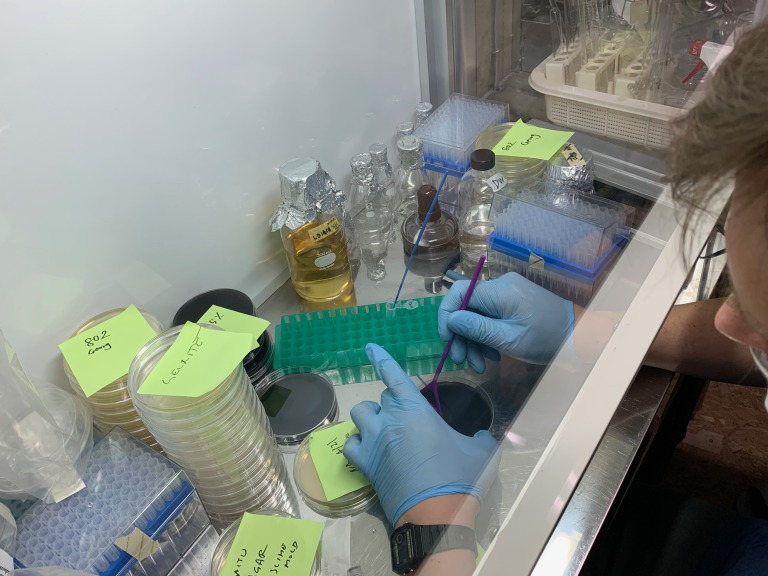 
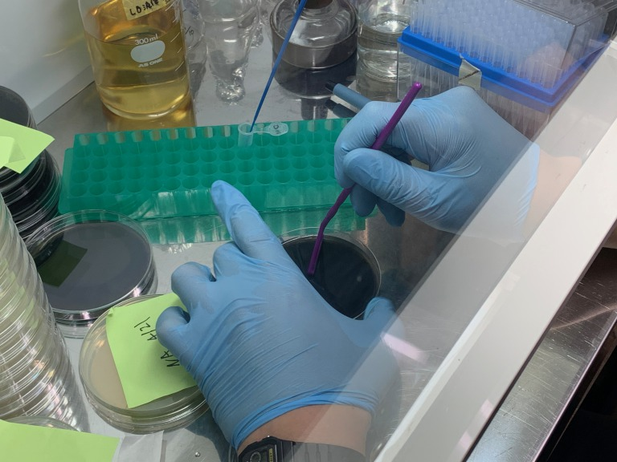 

### 30th April, Sat

It has grown up a little. 
少し育ってきた。

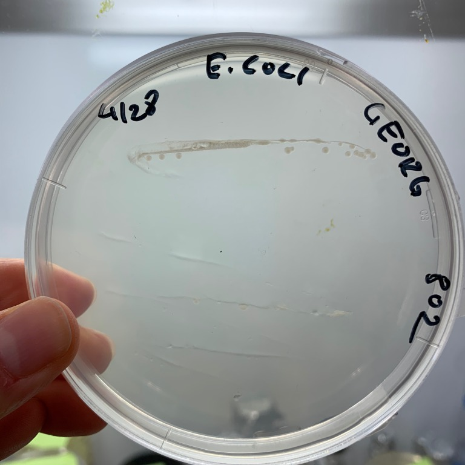 
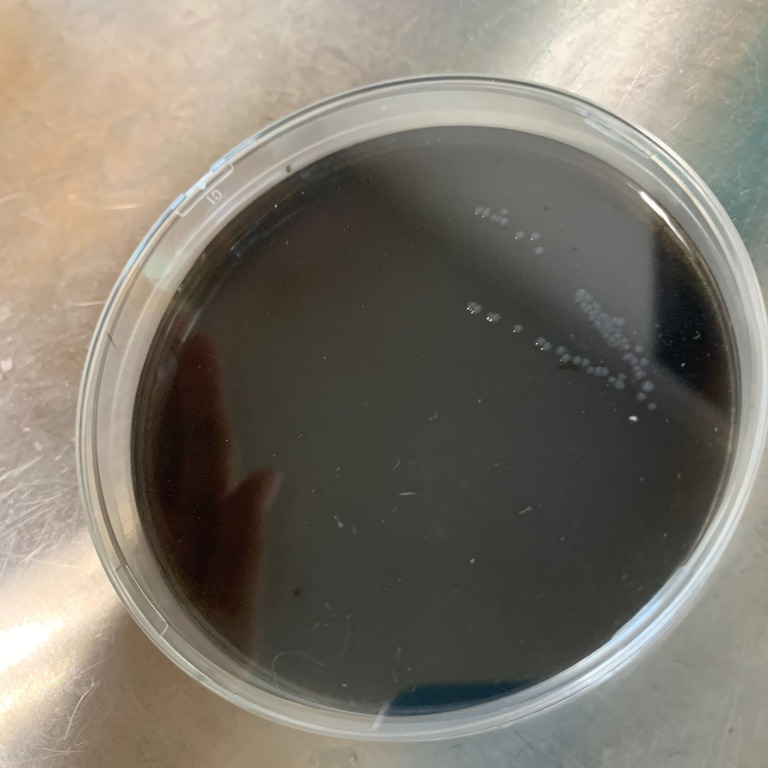 
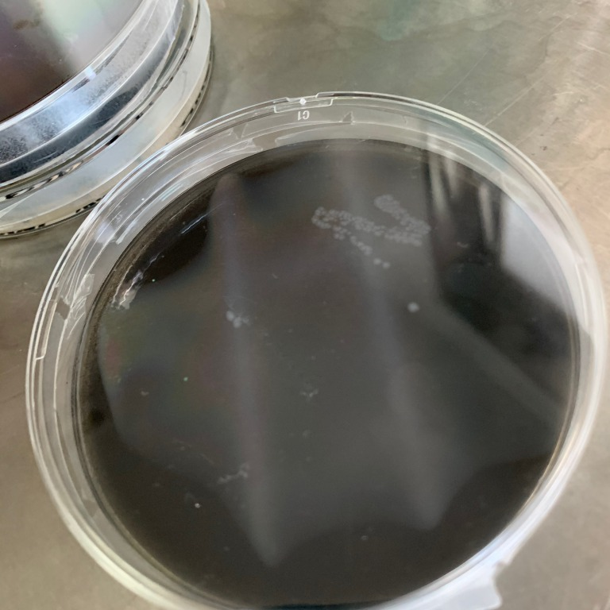 
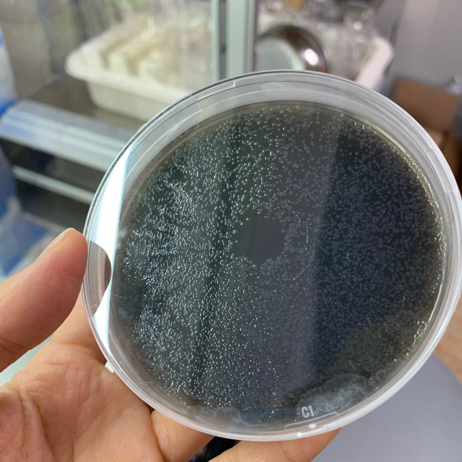
