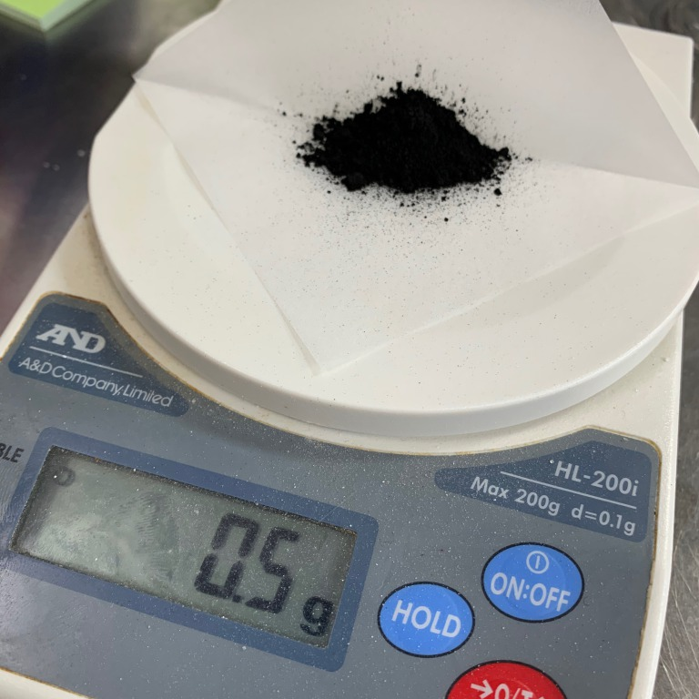

### 2th May, Mon

Last time I put sumi ink before autoclave and it didn't work, so this time I will try another 4 methods.
1. Add activated carbon powder before autoclave. (0.5g)
2. Add activated carbon powder before autoclave (1.0g) 
3. Add ink solution after autoclave (1% concentration: 1ml for 100ml solution)
4. Add activated carbon powder after autoclave (0.5g) (0.5g)

前回は墨汁をオートクレイブ前に入れてうまくいかなかったので、今回は別の４つの方法を試してみる。
1. 活性炭パウダーをオートクレイブ前に入れる。(0.5g)
2. 活性炭パウダーをオートクレイブ前に入れる。(1.0g)
3. 墨汁をオートクレイブ後に入れる。(濃度1% : 100ml溶液に対して１ml)
4. 活性炭パウダーをオートクレイブ後に入れる。(0.5g)

 

 
↑chacoal powder
 
 

#### Result 結果
**(1) Add activated carbon powder before autoclave. (0.5g) **
活性炭パウダーをオートクレイブ前に入れる。(0.5g)

I think this is the best way to do it, because it came out nice and even! 
ムラなく綺麗にできたので、これが一番良い方法だと思う！ 
 
 

**(2) Add activated carbon powder before autoclave (1.0g)  **
活性炭パウダーをオートクレイブ前に入れる。(1.0g)

Some of them were nicely done, but I think powder volume was too much, so some of them were not even. 
綺麗にできたのもあるけど、パウダーが多すぎて一部村になってしまった。 
 
 

 
↑some of them were not even like this.

**(3) Add ink solution after autoclave (1% concentration: 1ml for 100ml solution) **
墨汁をオートクレイブ後に入れる。(濃度1% : 100ml溶液に対して１ml)

This method also worked well. Even the ink was added after autoclave, no contamination occurred. 
この方法もうまくいった。墨汁はオートクレイブ後に入れても、特にコンタミは起きなかった。 
 
 

**(4) Add activated carbon powder after autoclave (0.5g) (0.5g) **
活性炭パウダーをオートクレイブ後に入れる。(0.5g)

この方法もうまくいったかのように見えた。でも、しばらく経つと別の微生物が発生してしまった。 
活性炭パウダーはオートクレイブ”前”に入れないとダメ、ということがわかった。 
 
 

 
↑This is beautiful, but what the hell...? 
これはこれで綺麗だけど、一体なんなんだろう・・？