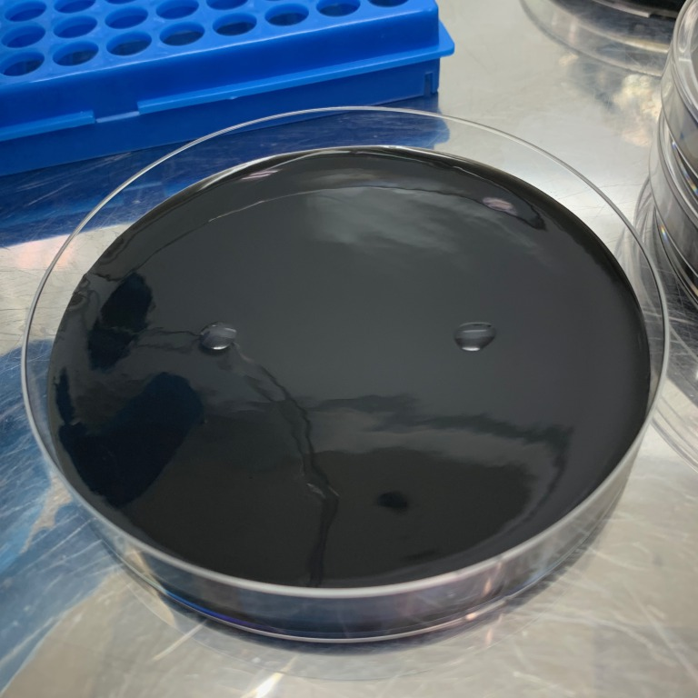

### 12th May, Thu
#### Culturing E.coli for my project

 

Take 100 µl of LB liquid medium, put the E. coli I have been culturing in it, and mix it with a shaker. 
LBの液体培地を100μリットル取り、今まで培養してきた大腸菌を中に入れて、シェイカーで混ぜる。 
 
 

From the liquid I have made, take 8 microliters with a dropper and drip it into a petri dish. 
Drip as many drops into the petri dish as the number of answer choices. 
(If there are 2 choices, 2 drops.) 

作った液体から、8μリットルスポイトで取り、シャーレに垂らす。 
回答の選択肢の数だけ、シャーレに垂らす。 
（選択肢が2個なら、2滴。） 
 
 
 