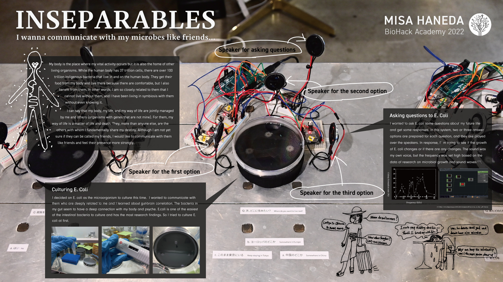
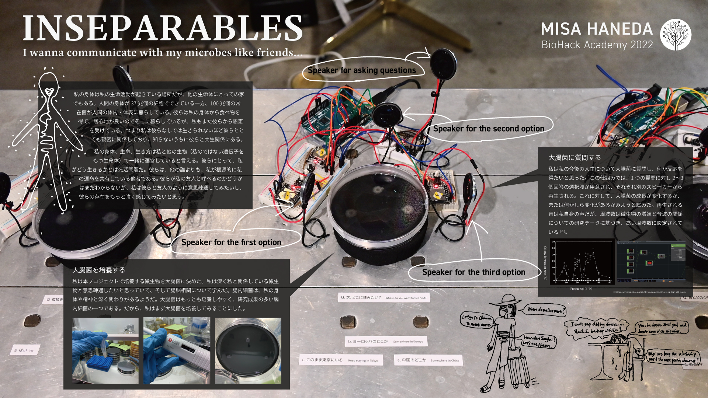
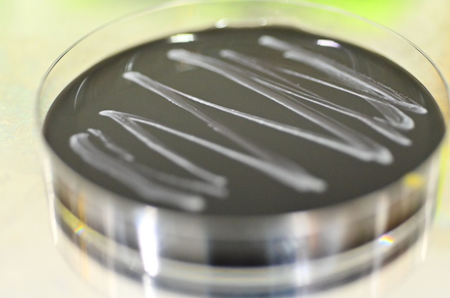

## final project
[→previous explorations](previous/index.md)

**project name : "菌卜" divination by your own microbe** 
I decided that my final project would be about communicating with E.coli!

 
*presentation in English* 

- [27th, April : Making black medium part.1](0427/index.md)
- [28th, April : Begining to culture E.coli](0428/index.md)
- [1th, May ~ : Making seperate speakers](speaker/index.md)
- [2th, May : Making black medium part.2](0502/index.md)
- [11th, May ~ : Making incubator at home](incubator/index.md)
- [12th, May : Culturing E.coli for my project](0512/index.md)

- [4th & 5th, June : Talk & exhibition day!](0604/index.md)

[→My final presentation slides](https://docs.google.com/presentation/d/126RJC8qZFrV-dR9doajKyNnkbdTmzBI5QYv4yGhiFTE/edit?usp=sharing) 
[→Each final presentation video in Japanese](https://vimeo.com/showcase/9584495) 
[→Bills of Materials](bom/index.md) 

