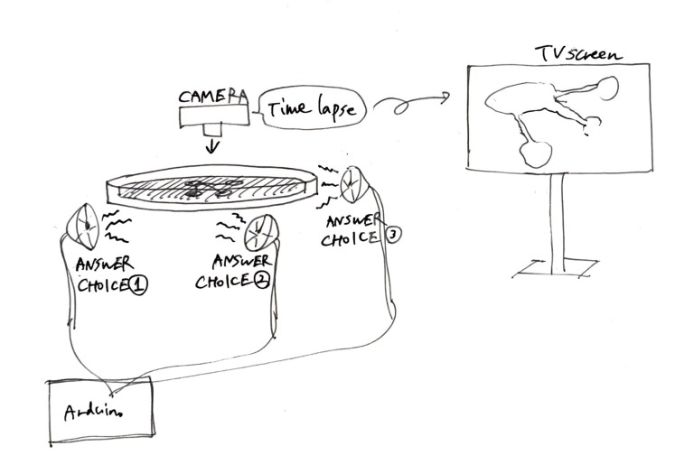
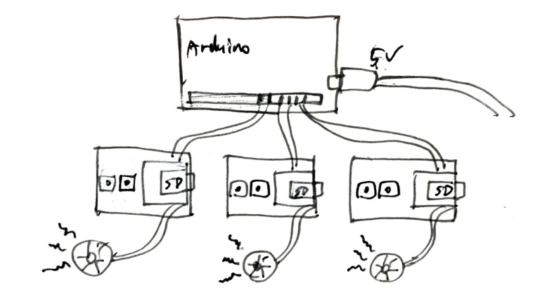

### 1th May ~
#### Making seperate speakers

こういう感じで、大腸菌に話しかけるスピーカーを作りたい。
 
 

Arduinoと、DFPlayerを使うことにする。
[DFPlayer Official site 公式サイト](https://wiki.dfrobot.com/DFPlayer_Mini_SKU_DFR0299#Sample_Code)

Arduinoに、DFPlayerのライブラリをインポートする。
[DFPlayer library](https://github.com/DFRobot/DFRobotDFPlayerMini)
