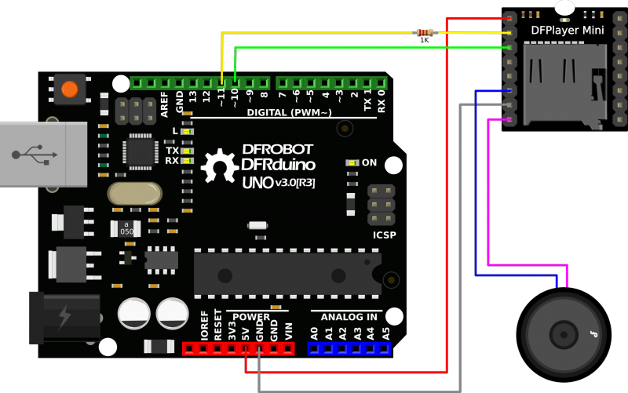

### 1th May ~
#### Making seperate speakers

I would like to build speakers talking to E. coli like these sketches. 
こういう感じで、大腸菌に話しかけるスピーカーを作りたい。 
 
 

This time, I will use Arduino and DFPlayer mini. 
Arduinoと、DFPlayer miniを使うことにする。 
[DFPlayer Official site 公式サイト](https://wiki.dfrobot.com/DFPlayer_Mini_SKU_DFR0299#Sample_Code) 
The wiring looks like this. 
配線はこんな感じ。
 

To use DFPlayer mini, you have to import the libraries. 
DFPlayerのライブラリをインポートする。 
[DFPlayer library](https://github.com/DFRobot/DFRobotDFPlayerMini) 
 

After downlaiding ZIP file, unzip it. 
download ZIPしたら、ZIPを解凍する。

Add the unzip folder to your Arduino libraries folder. 
自分のPC内で、Arduino > Libraries　に、解凍したフォルダを追加すればOK。 
 

